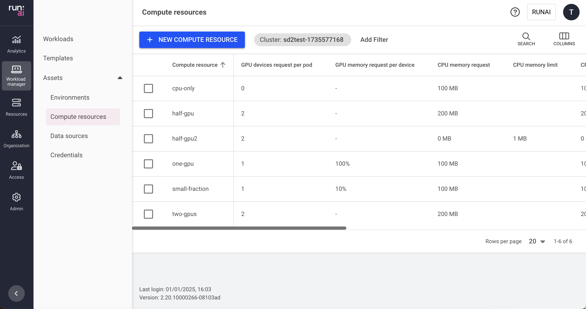

This article explains what compute resources are and how to create and use them.

Compute resources are one type of workload asset. A compute resource is a template that simplifies how workloads are submitted and can be used by AI practitioners when they submit their workloads.

A compute resource asset is a preconfigured building block that encapsulates all the specifications of compute requirements for the workload including:

* GPU devices and GPU memory  
* CPU memory and CPU compute

## Compute resource table

The Compute resource table can be found under **Compute resources** in the Run:ai UI.

The Compute resource table provides a list of all the compute resources defined in the platform and allows you to manage them.

The Compute resource table consists of the following columns:

| Column | Description |
| :---- | :---- |
| Compute resource | The name of the compute resource |
| Description | A description of the essence of the compute resource |
| GPU devices request per pod | The number of requested physical devices per pod of the workload that uses this compute resource |
| GPU memory request per device | The amount of GPU memory per requested device that is granted to each pod of the workload that uses this compute resource |
| CPU memory request | The minimum amount of CPU memory per pod of the workload that uses this compute resource |
| CPU memory limit | The maximum amount of CPU memory per pod of the workload that uses this compute resource |
| CPU compute request | The minimum number of CPU cores per pod of the workload that uses this compute resource |
| CPU compute limit | The maximum number of CPU cores per pod of the workload that uses this compute resource |
| Scope | The [scope](./overview.md#asset-scope) of this compute resource within the organizational tree. Click the name of the scope to view the organizational tree diagram |
| Workload(s) | The list of workloads associated with the compute resource |
| Template(s) | The list of workload templates that use this compute resource |
| Created by | The name of the user who created the compute resource |
| Creation time | The timestamp for when the rule was created |
| Cluster | The cluster that the compute resource is associated with |

### Workloads associated with the compute resource

Click one of the values in the Workload(s) column to view the list of workloads and their parameters.

| Column | Description |
| :---- | :---- |
| Workload | The workload that uses the compute resource |
| Type | (Workspace/Training/Inference) |
| Status | Represents the workload lifecycle. see the full list of [workload status](../../../platform-admin/workloads/workload-overview.md#workloads-status) |

### Customizing the table view

* Filter - Click ADD FILTER, select the column to filter by, and enter the filter values  
* Search - Click SEARCH and type the value to search by  
* Sort - Click each column header to sort by  
* Column selection - Click COLUMNS and select the columns to display in the table

## Adding new compute resource

To add a new compute resource:

1. Go to the Compute resource table  
2. Click **+NEW COMPUTE RESOURCE**  
3. Select under which cluster to create the compute resource  
4. Select a [scope](./overview.md#asset-scope)  
5. Enter a **name** for the compute resource. The name must be unique.  
6. Optional: Provide a **description** of the essence of the compute resource  
7. Set the resource types needed within a single node  
   (The Run:ai scheduler tries to match a single node that complies with the compute resource for each of the workload’s pods)  
    * **GPU**  
        * **GPU devices per pod**  
        The number of devices (physical GPUs) per pod  
       (for example, if you requested 3 devices per pod and the running workload using this compute resource consists of 3 pods, there are 9 physical GPU devices used in total)  

        !!! Note  
            * You can insert a whole number of devices (0; 1; 2; 3; …)  
            * When setting it to zero, the workload using this computer resource neither requests or uses GPU resources while running  
            * Only when setting it to 1, a fraction of a GPU memory can be requested  
            * When setting a number higher than 1, the entire GPU memory of the devices is used by the running workloads  
        
        * **GPU memory per device**  
            * Select the memory request format  
                * **% (of device) -** Fraction of a GPU device’s memory  
                * **MB (memory size) -** An explicit GPU memory unit  
                * **GB (memory size) -** An explicit GPU memory unit  
                * **Multi-instance GPU (MIG)** - MIG profile  
            * Set the memory **Request -** The minimum amount of GPU memory that is provisioned per device. This means that any pod of a running workload that uses this compute resource, receives this amount of GPU memory for each device(s) the pod utilizes  
            * Optional: Set the memory **Limit** - The maximum amount of GPU memory that is provisioned per device. This means that any pod of a running workload that uses this compute resource, receives **at most** this amount of GPU memory for each device(s) the pod utilizes.  
            To set a Limit, first enable the limit toggle. The limit value must be equal to or higher than the request.  
        !!! Note  
            * GPU memory limit is disabled by default. If you cannot see the **Limit** toggle in the compute resource form, then it must be enabled by your Administrator, under General Settings → Resources → GPU resource optimization  
            * When a **Limit** is set and is bigger than the **Request**, the scheduler allows each pod to reach the maximum amount of GPU memory in an opportunistic manner (only upon availability).  
            * If the GPU Memory Limit is bigger that the Request the pod is prone to be killed by the Run:ai toolkit (out of memory signal). The greater the difference between the GPU memory used and the request, the higher the risk of being killed  
            * If GPU resource optimization is turned off, the minimum and maximum are in fact equal  
    
    * **CPU**  
        * **CPU compute per pod**  
            * Select the units for the CPU compute (Cores / Millicores)  
            * Set the CPU compute **Request -** the minimum amount of CPU compute that is provisioned per pod. This means that any pod of a running workload that uses this compute resource, receives this amount of CPU compute for each pod.  
            * Optional: Set the CPU compute **Limit** - The maximum amount of CPU compute that is provisioned per pod. This means that any pod of a running workload that uses this compute resource, receives **at most** this amount of CPU compute.  
            To set a Limit, first enable the limit toggle. The limit value must be equal to or higher than the request.  
            By default, the limit is set to “Unlimited” - which means that the pod may consume all the node's free CPU compute resources.  
        * **CPU memory per pod**  
            * Select the units for the CPU memory (MB / GB)  
            * Set the CPU memory **Request -** The minimum amount of CPU memory that is provisioned per pod. This means that any pod of a running workload that uses this compute resource, receives this amount of CPU memory for each pod.  
            * Optional: Set the CPU memory **Limit** - The maximum amount of CPU memory that is provisioned per pod. This means that any pod of a running workload that uses this compute resource, receives **at most** this amount of CPU memory.  
            To set a Limit, first enable the limit toggle. The limit value must be equal to or higher than the request.  
            By default, the limit is set to “Unlimited” - Meaning that the pod may consume all the node's free CPU memory resources.  
        !!! Note  
            If the CPU Memory **Limit** is bigger that the **Request** the pod is prone to be killed by the operating system (out of memory signal). The greater the difference between the CPU memory used and the request, the higher the risk of being killed.  

8. Optional: More settings  
    * **Increase shared memory size**  
    When enabled, the shared memory size available to the pod is increased from the default 64MB to the node's total available memory or the CPU memory limit, if set above.  
    * **Set extended resource(s)**  
    Click **+EXTENDED RESOURCES** to add resource/quantity pairs. For more information on how to set extended resources, see the [Extended resources](https://kubernetes.io/docs/tasks/configure-pod-container/extended-resource/) and [Quantity](https://kubernetes.io/docs/reference/kubernetes-api/common-definitions/quantity/) guides  
9. Click **CREATE COMPUTE RESOURCE**

    !!! Note
        It is also possible to add compute resources directly when creating a specific Workspace, training or inference workload.

## Editing a compute resource

To edit a compute resource:

1. Select the compute resource from the table  
2. Click **RENAME** to edit its name and description

!!! Note
    Additional fields can be edited using the [API](https://api-docs.run.ai/2.18/tag/Compute).

## Copying & editing a compute resource

To copy & edit a compute resource:

1. Select the compute resource you want to duplicate  
2. Click **COPY & EDIT**  
3. Update the compute resource and click **CREATE COMPUTE RESOURCE**

## Deleting a compute resource

1. Select the compute resource you want to delete  
2. Click **DELETE**  
3. On the dialog, click **DELETE** to confirm the deletion  

!!! Note 
    It is not possible to delete a compute resource being used by an existing workload and template.

## Using API

Go to the [Compute resources](https://app.run.ai/api/docs#tag/Compute) API reference to view the available actions