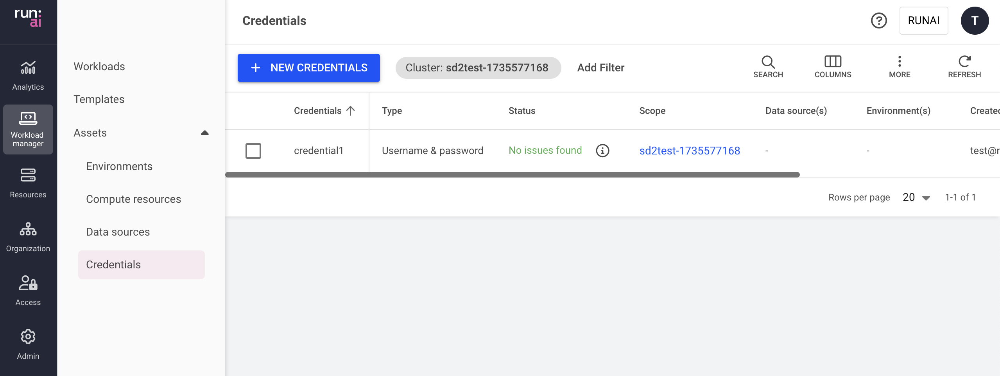

This article explains what credentials are and how to create and use them.

Credentials are a workload asset that simplify the complexities of Kubernetes secrets. They consist of and mask sensitive access information, such as passwords, tokens, and access keys, which are necessary for gaining access to various resources.

Credentials are crucial for the security of AI workloads and the resources they require, as they restrict access to authorized users, verify identities, and ensure secure interactions. By enforcing the protection of sensitive data, credentials help organizations comply with industry regulations, fostering a secure environment overall.

Essentially, credentials enable AI practitioners to access relevant protected resources, such as private data sources and Docker images, thereby streamlining the workload submission process.

## Credentials table

The Credentials table can be found under __Credentials__ in the Run:ai User interface.

The Credentials table provides a list of all the credentials defined in the platform and allows you to manage them.

The Credentials table comprises the following columns:

| Column | Description |
| --- | --- |
| Credentials | The name of the credentials |
| Description | A description of the credentials |
| Type | The type of credentials, e.g., Docker registry |
| Status | The different lifecycle phases and representation of the credentials’ condition |
| Scope | The [scope](./overview.md#asset-scope) of this compute resource within the organizational tree. Click the name of the scope to view the organizational tree diagram |
| Kubernetes name | The unique name of the credentials Kubernetes name as it appears in the cluster |
| Environment(s) | The environment(s) that are associated with the credentials |
| Data source(s) | The private data source(s) that are accessed using the credentials |
| Created by | The user who created the credentials |
| Creation time | The timestamp of when the credentials were created |
| Cluster | The cluster with which the credentials are associated |

### Credentials status

The following table describes the credentials’ condition and whether they were created successfully for the selected [scope](overview.md#asset-scope).

| Status | Description |
| --- | --- |
| No issues found | No issues were found while creating the credentials (this status may change while propagating the credentials to the selected scope) |
| Issues found | Issues found while propagating the credentials |
| Issues found | Failed to access the cluster |
| Creating… | Credentials are being created |
| Deleting… | Credentials are being deleted |
| No status | When the credentials’ scope is an account, or the current version of the cluster is not up to date, the status cannot be displayed |

### Customizing the table view

*   Filter - Click ADD FILTER, select the column to filter by, and enter the filter values
*   Search - Click SEARCH and type the value to search by
*   Sort - Click each column header to sort by
*   Column selection - Click COLUMNS and select the columns to display in the table
*   Refresh - Click REFRESH to update the table with the latest data

## Adding new credentials

Creating credentials is limited to [specific roles](./overview.md#who-can-create-an-asset).

To add a new credential:

1.  Go to the Credentials table:
2.  Click __+NEW CREDENTIALS__
3.  Select the credential type from the list  
    Follow the step-by-step guide for each credential type:

### Docker registry

These credentials allow users to authenticate and pull images from a Docker registry, enabling access to containerized applications and services.

After creating the credentials, it is used automatically when pulling images.

1.  Select a [scope](./overview.md#asset-scope).
2.  Enter a name for the credential. The name must be unique.
3.  Optional: Provide a description of the credentials
4.  Set how the credential is created
    *   __Existing secret__ (in the cluster)  
        This option applies when the purpose is to create credentials based on an existing secret
        *   Select a secret from the list (The list is empty if no secrets were created in advance)
    *   __New secret__ (recommended)  
        A new secret is created together with the credentials. New secrets are not added to the list of existing secrets.
        *   Enter the __username__, __password__, and __Docker registry URL__
5.  Click __CREATE CREDENTIALS__

After the credentials are created, check their status to monitor their proper creation across the selected scope.

### Access key

These credentials are unique identifiers used to authenticate and authorize access to cloud services or APIs, ensuring secure communication between applications. They typically consist of two parts:

*   An access key ID
*   A secret access key

The purpose of this credential type is to allow access to restricted data.

1.  Select a [scope](./overview.md#asset-scope).
2.  Enter a name for the credential. The name must be unique.
3.  Optional: Provide a __description__ of the credential
4.  Set how the credential is created
    *   __Existing secret__ (in the cluster)  
        This option applies when the purpose is to create credentials based on an existing secret
        *   Select a secret from the list (The list is empty if no secrets were created in advance)
    *   __New secret__ (recommended)  
        A new secret is created together with the credentials. New secrets are not added to the list of existing secrets.
        *   Enter the __Access key__ and __Access secret__
5.  Click __CREATE CREDENTIALS__

After the credentials are created, check their status to monitor their proper creation across the selected scope.

### Username & password

These credentials require a username and corresponding password to access various resources, ensuring that only authorized users can log in.

The purpose of this credential type is to allow access to restricted data.

1.  Select a [scope](./overview.md#asset-scope)
2.  Enter a name for the credential. The name must be unique.
3.  Optional: Provide a description of the credentials
4.  Set how the credential is created
    *   __Existing secret__ (in the cluster)  
        This option applies when the purpose is to create credentials based on an existing secret
        *   Select a secret from the list (The list is empty if no secrets were created in advance)
    *   __New secret__ (recommended)  
        A new secret is created together with the credentials. New secrets are not added to the list of existing secrets.
        *   Enter the __username__ and __password__
5.  Click __CREATE CREDENTIALS__

After the credentials are created, check their status to monitor their proper creation across the selected scope.

### Generic secret

These credentials are a flexible option that consists of multiple keys & values and can store various sensitive information, such as API keys or configuration data, to be used securely within applications.

The purpose of this credential type is to allow access to restricted data.

1.  Select a [scope](./overview.md#asset-scope)
2.  Enter a name for the credential. The name must be unique.
3.  Optional: Provide a description of the credentials
4.  Set how the credential is created
    *   __Existing secret__ (in the cluster)  
        This option applies when the purpose is to create credentials based on an existing secret
        *   Select a secret from the list (The list is empty if no secrets were created in advance)
    *   __New secret__ (recommended)  
        A new secret is created together with the credentials. New secrets are not added to the list of existing secrets.
        *   Click __+KEY & VALUE__ - to add key/value pairs to store in the new secret
5.  Click __CREATE CREDENTIALS__

## Editing credentials

To rename a credential:

1.  Select the credential from the table
2.  Click __Rename__ to edit its name and description

## Deleting credentials

To delete a credential:

1.  Select the credential you want to delete
2.  Click __DELETE__
3.  In the dialog, click __DELETE__ to confirm

!!! Note
      Credentials cannot be deleted if they are being used by a workload and template.

## Using credentials

You can use credentials (secrets) in various ways within the system

### Access private data sources

To access private data sources, attach credentials to data sources of the following types: [Git](./datasources.md#git), [S3 Bucket](./datasources.md#s3-bucket)

### Use directly within the container

To use the secret directly from within the container, you can choose between the following options

1. Get the secret mounted to the file system by using the [Generic secret](./datasources.md#secret) data source
2. Get the secret as an environment variable injected into the container. There are two equivalent ways to inject the environment variable.

      a. By adding it to the Environment asset. 
      b. By adding it ad-hoc as part of the workload.

---
## Creating secrets in advance

Add secrets in advance to be used when creating credentials via the Run:ai UI.

Follow the steps below for each required scope:

=== "Cluster scope"
    1.  Create the secret in the Run:ai namespace (runai)
    2.  To authorize Run:ai to use the secret, label it: `run.ai/cluster-wide: "true"`
    3.  Label the secret with the correct credential type:
        1.  Docker registry - `run.ai/cluster-wide: "docker-registry"`
        2.  Access key - `run.ai/cluster-wide: "access-key"`
        3.  Username and password - `run.ai/cluster-wide: "password"`
        4.  Generic secret - `run.ai/cluster-wide: "generic"` ֿ

=== "Department scope"

    1.  Create the secret in the Run:ai namespace (runai)
    2.  To authorize Run:ai to use the secret, label it: `run.ai/department: "<name of department>"`
    3.  Label the secret with the correct credential type:
        1.  Docker registry - `run.ai/cluster-wide: "docker-registry"`
        2.  Access key - `run.ai/cluster-wide: "access-key"`
        3.  Username and password - `run.ai/cluster-wide: "password"`
        4.  Generic secret - `run.ai/cluster-wide: "generic"`

=== "Project scope"

    1.  Create the secret in the project’s namespace
    2.  Label the secret with the correct credential type:
        1.  Docker registry - `run.ai/cluster-wide: "docker-registry"`
        2.  Access key - `run.ai/cluster-wide: "access-key"`
        3.  Username and password - `run.ai/cluster-wide: "password"`
        4.  Generic secret - `run.ai/cluster-wide: "generic"`

The secret is now displayed for that scope in the list of existing secrets.

 
## Using API

To view the available actions, go to the [Credentials](https://app.run.ai/api/docs#tag/Credentials) API reference