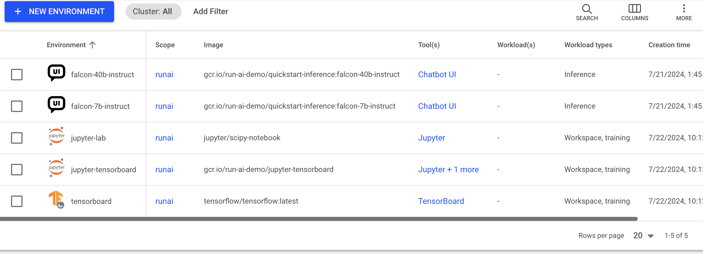

  
This article explains what environments are and how to create and use them.

Environments are one type of [workload asset](overview.md). An environment consists of a configuration that simplifies how workloads are submitted and can be used by AI practitioners when they submit their workloads.

An environment asset is a preconfigured building block that encapsulates aspects for the workload such as:

* Container image and container configuration  
* Tools and connections  
* The type of workload it serves

## Environments table

The Environments table can be found under __Workload manager__ in the Run:ai platform.

The Environment table provides a list of all the environment defined in the platform and allows you to manage them.

The Environments table consists of the following columns:

| Column | Description |
| :---- | :---- |
| Environment | The name of the environment |
| Description | A description of the environment |
| Scope | The [scope](overview.md#asset-scope) of this environment within the organizational tree. Click the name of the scope to view the organizational tree diagram |
| Image | The application or service to be run by the workload |
| Workload Architecture | This can be either standard for running workloads on a single node or distributed for running distributed workloads on multiple nodes |
| Tool(s) | The tools and connection types the environment exposes |
| Workload(s) | The list of existing workloads that use the environment |
| Workload types | The workload types that can use the environment (Workspace/ Training / Inference) |
| Template(s) | The list of workload templates that use this environment |
| Created by | The user who created the environment. By default Run:ai UI comes with [preinstalled environments created by Run:ai](#environments-created-by-run:ai) created by Run:ai  |
| Creation time | The timestamp of when the environment was created |
| Last updated | The timestamp of when the environment was last updated |
| Cluster | The cluster with which the environment is associated |

### Tools associated with the environment

Click one of the values in the tools column to view the list of tools and their connection type.

| Column | Description |
| :---- | :---- |
| Tool name | The name of the tool or application AI practitioner can set up within the environment. |
| Connection type | The method by which you can access and interact with the running workload. It's essentially the "doorway" through which you can reach and use the tools the workload provide. (E.g node port, external URL, etc) |

### Workloads associated with the environment

Click one of the values in the Workload(s) column to view the list of workloads and their parameters.

| Column | Description |
| :---- | :---- |
| Workload | The workload that uses the environment |
| Type | The workload type (Workspace/Training/Inference) |
| Status | Represents the workload lifecycle. See the full list of [workload status](../../../Researcher/workloads/overviews/managing-workloads.md#workload-status) |

### Customizing the table view

* Filter - Click ADD FILTER, select the column to filter by, and enter the filter values  
* Search - Click SEARCH and type the value to search by  
* Sort - Click each column header to sort by  
* Column selection - Click COLUMNS and select the columns to display in the table  
* Download table - Click MORE and then Click Download as CSV. Export to CSV is limited to 20,000 rows.

## Environments created by Run:ai

When installing Run:ai, you automatically get the environments created by Run:ai to ease up the onboarding process and support different use cases out of the box.  
These environments are created at the [scope](./overview.md#asset-scope) of the account.

| Environment | Image |
| ----- | ----- |
| Jupiter-lab | jupyter/scipy-notebook |
| jupyter-tensorboard | gcr.io/run-ai-demo/jupyter-tensorboard |
| tensorboard | tensorflow/tensorflow:latest |
| llm-server | rrunai.jfrog.io/core-llm/runai-vllm:v0.6.4-0.10.0 |
| chatbot-ui | runai.jfrog.io/core-llm/llm-app |
| gpt2 | runai.jfrog.io/core-llm/quickstart-inference:gpt2-cpu |

## Adding a new environment

Environment creation is limited to [specific roles](overview.md#who-can-create-an-asset)

To add a new environment:

1. Go to the Environments table  
2. Click __+NEW ENVIRONMENT__  
3. Select under which cluster to create the environment  
4. Select a [scope](overview.md#asset-scope)  
5. Enter a __name__ for the environment. The name must be unique.  
6. Optional: Provide a __description__ of the essence of the environment  
7. Enter the __Image URL__  
   If a token or secret is required to pull the image, it is possible to create it via [credentials of type docker registry](./credentials.md#docker-registry). These credentials are automatically used once the image is pulled (which happens when the workload is submitted)  
8. Set the __image pull policy__ - the condition for when to pull the image from the registry  
9. Set the workload architecture:  
    * __Standard__  
    Only standard workloads can use the environment. A standard workload consists of a single process.  
    * __Distributed__  
    Only distributed workloads can use the environment. A distributed workload consists of multiple processes working together. These processes can run on different nodes.  
      * Select a framework from the list.  
10. Set the workload type:  
    * __Workspace__  
    * __Training__  
    * __Inference__  
      * When inference is selected, define the __endpoint__ of the model by providing both the protocol and the container’s serving port  
11. Optional: Set the connection for your __tool(s)__. The tools must be configured in the image. When submitting a workload using the environment, it is possible to connect to these tools  
    * Select the tool from the list (the available tools varies from IDE, experiment tracking, and more, including a custom tool for your choice)  
    * Select the connection type  
        * __External URL__  
            * __Auto generate__  
              A unique URL is automatically created for each workload using the environment  
            * __Custom URL__  
              The URL is set manually  
        * __Node port__  
            * __Auto generate__  
              A unique port is automatically exposed for each workload using the environment  
            * __Custom URL__  
              Set the port manually  
        * Set the __container port__  
12. Optional: Set a __command and arguments__ for the container running the pod  
    * When no command is added, the default command of the image is used (the image entrypoint)  
    * The command can be modified while submitting a workload using the environment  
    * The argument(s) can be modified while submitting a workload using the environment  
13. Optional: __Set the environment variable(s)__  
    * Click __+ENVIRONMENT VARIABLE__
    * Enter a __name__
    * Select the __source__ for the environment variable
      * __Custom__
        * Enter a __value__ 
        * Leave __empty__
        * Add __instructions__ for the expected value if any
      * __Credentials__ - Select existing credentials as the environment variable
        * Select a __credential name__  
            To add new credentials to the credentials list, and for additional information, see [Credentials](./credentials.md).
        * Select a __secret key__ 
    * The environment variables can be modified and new variables can be added while submitting a workload using the environment
14. Optional: Set the container’s __working directory__ to define where the container’s process starts running. When left empty, the default directory is used.  
15. Optional: Set where the UID, GID and supplementary groups are taken from, this can be:  
    * __From the image__  
    * __From the IdP token__ (only available in an SSO installations)  
    * __Custom__ (manually set) - decide whether the submitter can modify these value upon submission.
       * Set the __User ID (UID)__, __Group ID (GID)__ and the supplementary groups that can run commands in the container
         * Enter __UID__
         * Enter __GID__
         * Add __Supplementary groups__ (multiple groups can be added, separated by commas)  
         * Disable __Allow the values above to be modified within the workload__ if you want the above values to be used as the default
16. Optional: Select __Linux capabilities__ - Grant certain privileges to a container without granting all the privileges of the root user. 
17. Click __CREATE ENVIRONMENT__

!!! Note
    It is also possible to add environments directly when creating a specific workspace, training or inference workload.

## Editing an environment

To edit an environment:

1. Select the environment you want to edit
2. Click __Edit__
3. Click __SAVE ENVIRONMENT__

!!! Note
    * The already bound workload that is using this asset will not be affected.
    * llm-server and chatbot-ui environments cannot be edited. 

## Copying an environment 

To make a copy of an existing environment:

1. Select the environment you want to copy
2. Click __MAKE A COPY__
4. Enter a __name__ for the environment. The name must be unique.
5. Update the environment
6. Click __CREATE ENVIRONMENT__ 

## Deleting an environment

To delete an environment:

1. Select the environment you want to delete  
2. Click __DELETE__  
3. On the dialog, click __DELETE__ to confirm

!!! Note
    The already bound workload that is using this asset will not be affected.

## Using API

Go to the [Environment](https://app.run.ai/api/docs#tag/Environment) API reference to view the available actions

