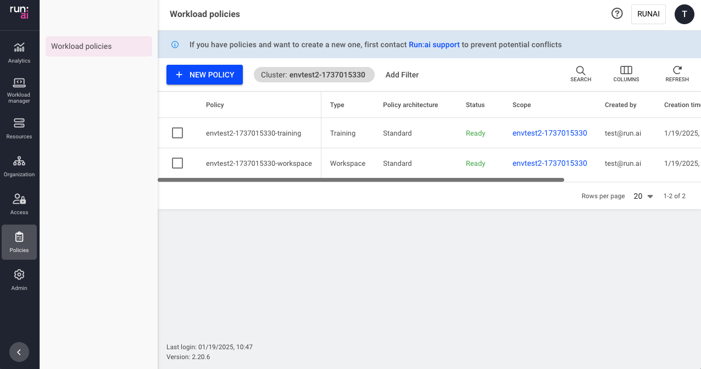

This article explains the procedure to manage workload policies.

## Workload policies table

The Workload policies table can be found under **Policies** in the Run:ai platform.

!!! Note
    Workload policies are disabled by default. If you cannot see Workload policies in the menu, then it must be enabled by your administrator, under General settings → Workloads → Policies

The Workload policies table provides a list of all the policies defined in the platform, and allows you to manage them.

The Workload policies table consists of the following columns:

| Column | Description |
| :---- | :---- |
| Policy | The policy name which is a combination of the policy scope and the policy type |
| Type | The policy type is per Run:ai workload type. This allows administrators to set different policies for each [workload type](../workload-overview.md). |
| Status | Representation of the policy lifecycle (one of the following - “Creating…”, “Updating…”, “Deleting…”, Ready or Failed) |
| Scope | The scope the policy affects. Click the name of the scope to view the organizational tree diagram. You can only view the parts of the organizational tree for which you have permission to view. |
| Created by | The user who created the policy |
| Creation time | The timestamp for when the policy was created |
| Last updated | The last time the policy was updated |

### Customizing the table view

* Filter - Click ADD FILTER, select the column to filter by, and enter the filter values  
* Search - Click SEARCH and type the value to search by  
* Sort - Click each column header to sort by  
* Column selection - Click COLUMNS and select the columns to display in the table  
* Refresh - Click REFRESH to update the table with the latest data

## Adding a policy

To create a new policy:

1. Click __+NEW POLICY__  
2. Select a __scope__  
3. Select the __workload type__  
4. Click __+POLICY YAML__  
5. In the __YAML editor__ type or paste a YAML policy with defaults and rules.  
    You can utilize the following references and examples:  
   * [Policy YAML reference](./policy-reference.md)  
   * [Policy YAML examples](./policy-examples.md)  
6. Click __SAVE POLICY__

## Editing a policy

1. Select the policy you want to edit  
2. Click __EDIT__  
3. Update the policy and click __APPLY__  
4. Click __SAVE POLICY__

## Troubleshooting

Listed below are issues that might occur when creating or editing a policy via the YAML Editor:

| Issue | Message | Mitigation |
| :---- | ----- | :---- |
| Cluster connectivity issues | There's no communication from cluster “cluster_name“. Actions may be affected, and the data may be stale. | Verify that you are on a network that has been allowed access to the cluster. Reach out to your cluster administrator for instructions on verifying the issue. |
| Policy can’t be applied due to a rule that is occupied by a different policy | Field “field_name” already has rules in cluster: “cluster_id” | Remove the rule from the new policy or adjust the old policy for the specific rule. |
| Policy is not visible in the UI | - | Check that the policy hasn’t been deleted. |
| Policy syntax is no valid | Add a valid policy YAML;json: unknown field "field_name" | For correct syntax check the [Policy YAML reference](./policy-reference.md) or the [Policy YAML examples](./policy-examples.md). |
| Policy can’t be saved for some reason | The policy couldn't be saved due to a network or other unknown issue. Download your draft and try pasting and saving it again later. | Possible cluster connectivity issues. Try updating the policy once again at a different time. |
| Policies were submitted before version 2.18, you upgraded to version 2.18 or above and wish to submit new policies | If you have policies and want to create a new one, first contact Run:ai support to prevent potential conflicts | Contact Run:ai support. R&D can migrate your old policies to the new version. |

## Viewing a policy

To view a policy:

1. Select the policy for which you want to view its [policies](./overview.md).  
2. Click __VIEW POLICY__  
3. In the Policy form per workload section, view the workload rules and defaults:  
    * __Parameter__  
      The workload submission parameter that Rules and Defaults are applied to  
    * __Type__ (applicable for data sources only)  
      The data source type (Git, S3, nfs, pvc etc.)  
    * __Default__  
      The default value of the Parameter  
    * __Rule__  
      Set up constraint on workload policy field  
    * __Source__  
      The origin of the applied policy (cluster, department or project)  

!!! Note  
    Some of the rules and defaults may be derived from policies of a parent cluster and/or department. You can see the source of each rule in the policy form. For more information, check the [Scope of effectiveness documentation](./overview.md#scope-of-effectiveness)

## Deleting a policy

1. Select the policy you want to delete  
2. Click __DELETE__  
3. On the dialog, click __DELETE__ to confirm the deletion

## Using API

Go to the [Policies](https://app.run.ai/api/docs#tag/Policy) API reference to view the available actions.

