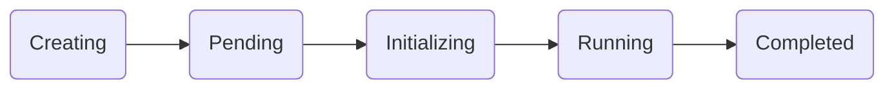

Run:ai *Workloads* is specifically designed and optimized for AI and data science workloads, enhancing Kubernetes management of containerized applications. Run:ai augments Kubernetes workloads with additional resources crucial for AI pipelines (for example, Compute resources, networking, and storage).

Runai is an open platform and supports three types of workloads each with a different set of features:

* Run:ai native workloads.
* Third party integrations.
* Typical Kubernetes workloads.

### Run:ai native workloads

Run:ai native workloads are workloads (trainings, workspaces, deployments) that are fully controlled by Run:ai. Run: workloads are the most comprehensive and include *Third party integrations* and *Typical Kubernetes* workload types. Specific characteristics of Run: ai native workloads include:

1. Submitting of workloads via UI/CLI.
2. Workload control (delete/stop/connect).
3. Workload policies (default rules for all policies, specific workload policies, and enforcing of those rules).
4. Scheduling rules.
5. Role based access control.

### Third party integrations

Third party integrations are tools that Run:ai supports and manages. These are tools that are typically used to build workloads for specific purposes. Third party integrations also include *Typical Kubernetes* workloads. Specific characteristics of third party tool support include:

1. Smart gang scheduling (workload aware).
2. Specific workload aware visibility so that different kinds of pods are identified as a single workload (for example, GPU Utilization, workload view, dashboards).

For more information, see [Supported integrations](#third-party-integrations).

### Typical Kubernetes workloads

Typical Kubernetes workloads are any kind of workload built for Kubernetes. The Run:ai platform allows you to submit standard Kubernetes CRDs. Specific characteristics of *Typical Kubernetes* workloads that Run:ai can manage include:

1. Fairness
2. Nodepools
3. Bin packing/spread
4. Fractions
5. Overprovisioning

## Workloads View

Run:ai makes it easy to run machine learning workloads effectively on Kubernetes. Run:ai provides both a UI and API interface that introduces a simple and more efficient way to manage machine learning workloads, which will appeal to data scientists and engineers alike.

The Workloads table provides:

* Changing of the layout of the *Workloads* table by pressing *Columns* to add or remove columns from the table.
* Download the table to a CSV file by pressing *More*, then pressing *Download as CSV*.
* Search for a workload by pressing *Search* and entering the name of the workload.
* Advanced workload management.
* Added workload statuses for better tracking of workload flow.

To create new workloads, press [*New Workload*](./overviews/managing-workloads.md#adding-new-workload).

### API Documentation

Access the platform [API documentation](https://app.run.ai/api/docs){target=_blank} for more information on using the API to manage workloads.

## Managing Workloads

You can manage a workload by selecting one from the view. Once selected, you can:

* Run a workload.
* Stop a workload.
* Connect to a workload&mdash;provides a connection to the selected workload's designated tool. Press the item in the column to show the connection URL.
* Delete a workload.
* Copy and edit a workload&mdash;use this function to run another workload based on the selected workload.

    * If the workload was submitted using the UI, then a copy of the original workload form will open allowing you to make changes to the workload properties.
    * If the workload was submitted using the CLI, then a window shows with the original CLI command. Copy the command and make changes to the submission.

* Show details&mdash;provides in-depth information about the selected workload including:

      * Event history&mdash;workload status over time. Use the filter to search through the history for specific events.
      * Metrics&mdash;use the drop down to filter metrics per pod and over time. Select a category from the list below:

          * Throughput&mdash;total of requests per second across all* replica at any given time
          * Latency&mdash;average of time it took to answer any request across all replicas at any given time
          * Number of replicas&mdash;Total number of *all* replicas at any given time
          * GPU compute utilization&mdash;hover over for individual GPU details
          * GPU memory usage&mdash;hover over for individual GPU details
          * CPU usage&mdash;hover over for usage details
          * CPU memory usage&mdash;hover over for usage details
  
      * Logs&mdash;logs of the selected workload. Use the drop down to filter metrics per pod. Use the Download button to download the logs.

### Workloads Status

The *Status* column shows the current status of the workload. The following table describes the statuses presented:

| **Phase Name** | **Description** | **Entry Condition** | **Exit Condition** |
| --- | --- | --- | --- |
| **Creating** |Workload setup is initiated in the cluster. Resources and pods are now provisioning. | A workload is submitted. | A multi-pod group is created.|
| **Pending** | Workload is queued and awaiting resource allocation. | A pod group exists. | All pods are scheduled. |
| **Initializing** | Workload is retrieving images, starting containers, and preparing pods. | All pods are scheduled—handling of multi-pod groups TBD. | All pods are initialized or a failure to initialize is detected. |
| **Running** | Workload is currently in progress with all pods operational. | All pods initialized (all containers in pods are ready). | Job completion or failure. |
| **Degraded** | Pods may not align with specifications, network services might be incomplete, or persistent volumes may be detached. Check your logs for specific details. | **Pending**&mdash;All pods are running but with issues.   **Running**&mdash;All pods are running with no issues. | **Running**&mdash;All resources are OK.  **Completed**&mdash; Job finished with fewer resources. **Failed**&mdash;Job failure or user-defined rules. |
| **Deleting** | Workload and its associated resources are being decommissioned from the cluster. | Deleting of the workload. | Resources are fully deleted. |
| **Stopped** | Workload is on hold and resources are intact but inactive. | Stopping the workload without deleting resources. | Transitioning back to the initializing phase or proceeded to deleting the workload. |
| **Failed** | Image retrieval failed or containers experienced a crash. Check your logs for specific details. | An error occurs preventing the successful completion of the job. | Terminal state. |
| **Completed** | Workload has successfully finished its execution. | The job has finished processing without errors. | Terminal state. |

### Successful flow

A successful flow will follow the following flow chart:

To get the full experience of Run:ai’s environment and platform use the following types of workloads.

* [Workspaces](../../Researcher/workloads/workspaces/overview.md#getting-familiar-with-workspaces)
* [Trainings](../../Researcher/workloads/trainings.md#trainings) (Only available when using the *Jobs* view)
* [Distributed training](../../Researcher/workloads/trainings.md#trainings)
* Deployments.

## Workload-related Integrations

See [Integrations](./integrations.md)
