# Using mlflow with run:ai  
  
**A 10-minute video of a live demo can be found [here](https://youtu.be/EwOW-OBosuY)**

## Description:
This repo details an example of how to integrate run:ai with mlflow.   
It consists of 3 basic steps:
1. create a persistent directory on the NFS 
    + called 'mlflow' in our example
    + to hold the mlflow database and artifact folder.
2. create a docker image with mlflow and jupyter-server-proxy installed
    + jupyter-server-proxy is used to access the mlflow UI
3. run python scripts by submitting jobs to the scheduler, using the created docker image.  

Full content can be found at the github repo [here](https://github.com/run-ai/docs/tree/master/docs/use-cases/runai_mlflow_demo)  

## mlflow intro 

### what does mlflow need?
Two things are needed for mlflow:
1. A Database to store information related to experiment runs
2. An Artifacts folder to store objects related to the runs  

  
  
### how does mlflow work?
#### 1. First we start the server with a CLI command
running either of these commands will automatically create a databse in the local directory, if one doesn’t exist.  
  
~~~bash
mlflow ui
~~~  
  
~~~bash
mlflow server
~~~  
  
we can also choose to specify the location of the database, and artifact folder, as well as the host IP, and port.  

~~~bash
mlflow server \
    --backend-store-uri=sqlite:///abs/path/to/db/mlflow.db \
     --default-artifact-root=/abs/path/to/artifacts \
     --host=0.0.0.0 \
     --port=5000 
~~~  

#### 2. call mlflow commands within the python script  
you’ll want to import mlflow, then set the tracking uri so that mlflow will save everything to the database and artifact folder.  
  
Then you’ll want to start your run, and at the end, you’ll want to end the run.  
  
~~~python
import mlflow

mlflow.set_tracking_uri('0.0.0.0:5000')
mlflow.start_run()

"""
your code here
"""

mlflow.end_run()
~~~  
  
## mlflow with run:ai
### what is needed to run mlflow on run:ai?
1. A persistent directory to keep
    + mlflow database
    + mlflow artifacts folder
2. A docker image with the following installed
    + mlflow
    + jupyterlab*
    + jupyter-server-proxy*
\*needed in order to access the mlflow UI
### creating a persisten directory
#### We need to create an ‘mlflow’ folder on our NFS.  

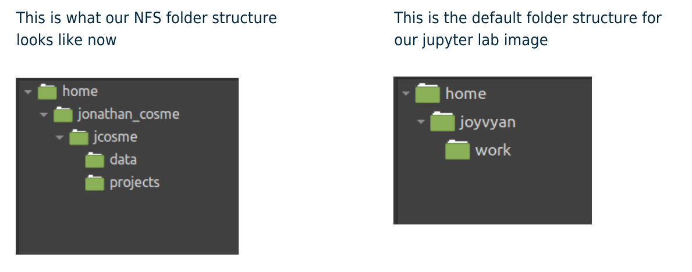  
  
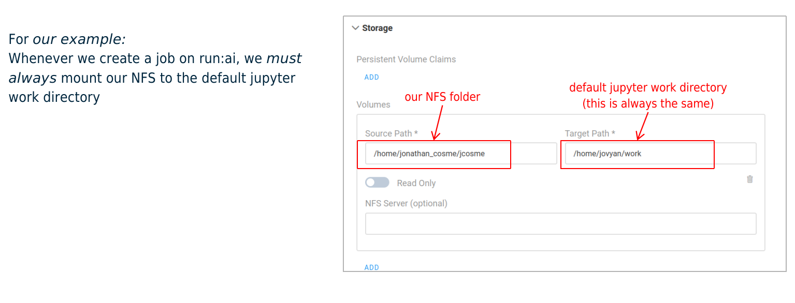  
  
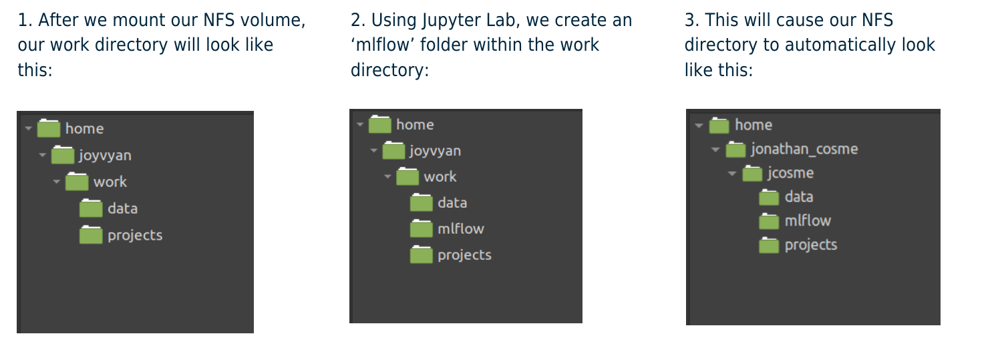  
  
### docker image
The docker image we will use is:  
[jonathancosme/mlflow-ui](https://hub.docker.com/repository/docker/jonathancosme/mlflow-ui)  
This is what is in the dockerfile:  

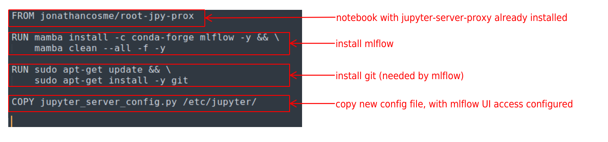   
  
in order to access the mlflow UI, we need to add this entry to the jupyter_server_config.py file, and replace the existing file in the image  

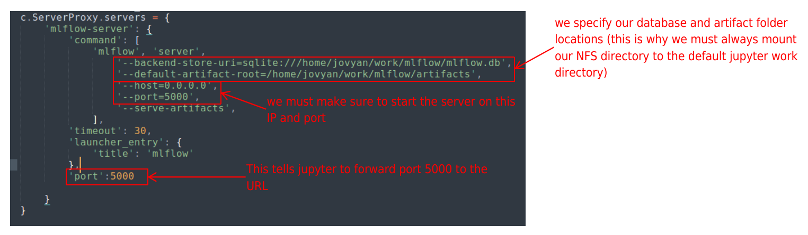  

## accessing the mlflow UI
Create a jupyter interactive job with:
+ image jonathancosme/mlflow-iu
+ mounted NFS folder (with ‘mlflow’ folder) in default jupyter work directory
  
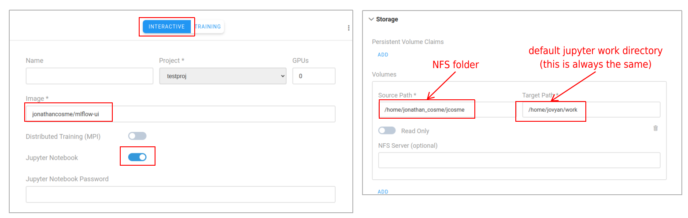  
  
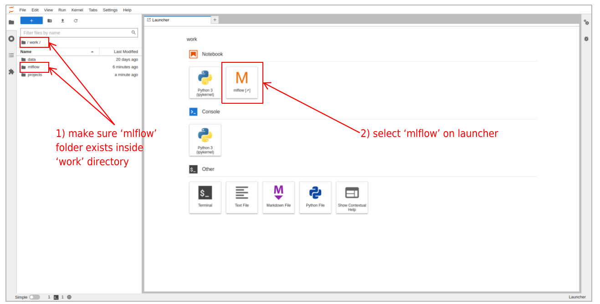  
  
A new tab should appear with the mlflow UI  
  
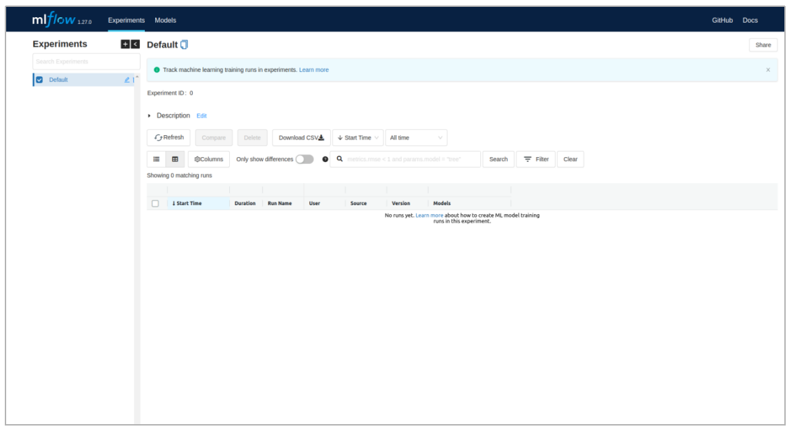  
  
## running mlflow experiments with run:ai
### python scripts  

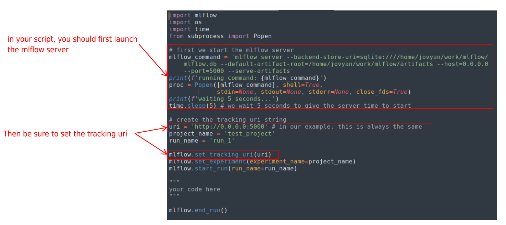  
  
### CLI submission
Our example scrips are located here:  
  
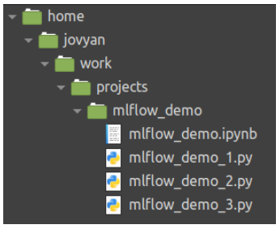  
  
so our CLI command would look like this:  
  
~~~bash
runai submit \
    --project testproj \
    --gpu 0 \
    --job-name-prefix mlflow-demo \
    --image jonathancosme/mlflow-ui \
    --volume /home/jonathan_cosme/jcosme:/home/jovyan/work \
    -- python work/projects/mlflow_demo/mlflow_demo_1.py
~~~  
  
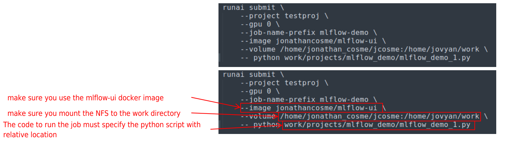 
  
### Example job submission

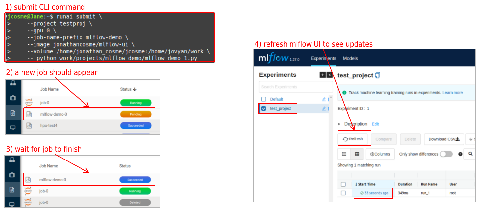 

