# Persistent Environments with Run:ai (using conda/mamba & Jupyter)  
  
**An 18-minute video of a live demo can be found [here](https://youtu.be/F54lfLTBOfY)**  
  
Full content can be found at the github repo [here](https://github.com/run-ai/docs/tree/master/docs/use-cases/runai_persist_envs)  
  
## Background 

### A (specific) frequently asked question  

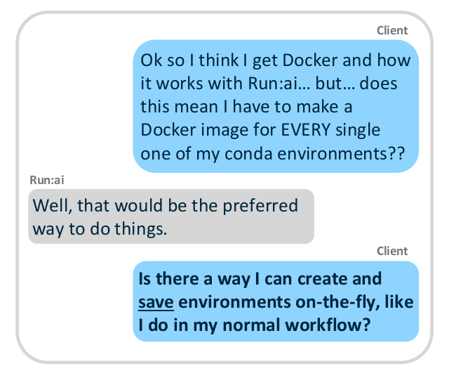  

  
  
## Solution  

### How do we do this?  

#### Conda background  
  
1. When conda is installed, it creates a directory to keep its files.  
2. Whenever a conda environment is created, it is saved inside a directory called “envs,” within the conda directory.  
  
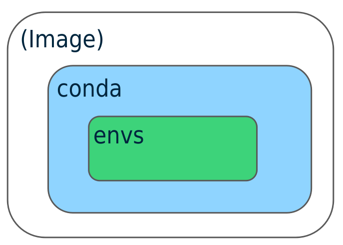  
  
#### The idea  
  
1. Create a folder called “envs” in your NFS  
2. Mount the NFS “envs” folder, to the location of the conda environments folder in your image.  
  
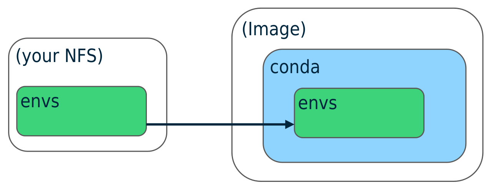  
  
### A note on Jupyter  
  
Many users like to have ‘tiles’ for their environment on Jupyter  
  
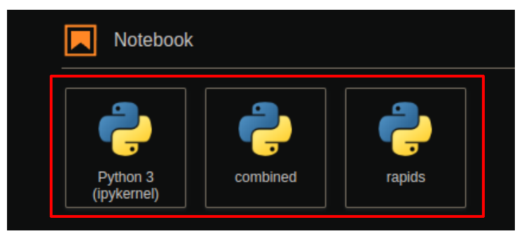  
  
These setting are saved in a folder called ‘kernels’  
  
  
  
We can persist these ‘tiles’ by:  
  
1. Creating a folder called “kernels” in your NFS  
2. Mounting the NFS “kernels” folder, to the location of the kernels folder in your image.  
  
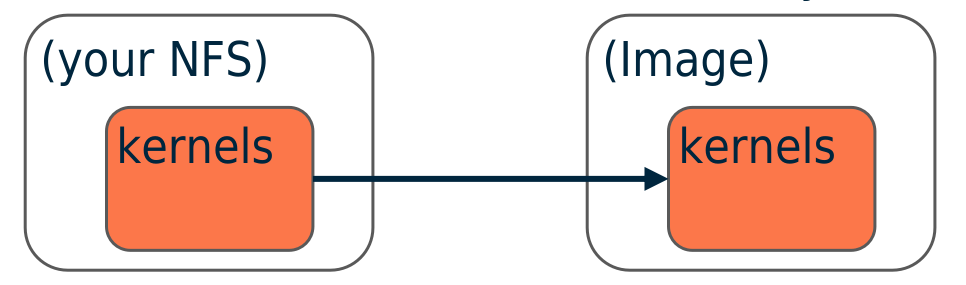  
  
Adding a tile is done with the following sequence of commands, then refreshing the web browser  
  
~~~bash
mamba create -n {your-env-name} ipykernel {your-env-libs}
~~~  
  
~~~bash
conda activate {your-env-name}
~~~  
  
~~~bash
python -m ipykernel install --user --name={your-env-name}
~~~  
  
(If you want to remove the ‘tile’, this command is used)  
  
~~~bash
jupyter kernelspec uninstall {your-env-name}
~~~  
  
### Docker image  
  
The docker image that we will be using throughout this notebook is:  
**jonathancosme/base-notebook-root**\*  
  
It is a slightly modified version of the  
jupyter/base-notebook  
image  
  
You can find more information about jonathancosme/base-notebook-root here:  
https://github.com/jonathancosme/jupyter-base-notebook-root  
  
\*Please note that all our Jupyter images are based off the official Jupyter Docker images.  
The official images do not have root privileges by default.  
In order to successfully mount to the ‘kernels’ and ‘envs’ folders in the Jupyter Lab, root privileges are required.  
We created a custom image that runs root by default.  
You can see how our image differs from the official image on the github.  
  
## Steps
  
1. Create ‘envs’ and ‘kernels’ folder in our NFS  
2. Mount NFS ‘envs’ and ‘kernels’ folders on an interactive Jupyter lab job  
3. Create your environment  
4. Test the environment  
  
### Step 1: Create ‘envs’ and ‘kernels’ folder in our NFS  
  
1.1 Start a Jupyter Lab interactive session, mounting your NFS folder to /home/jovyan/work  
  
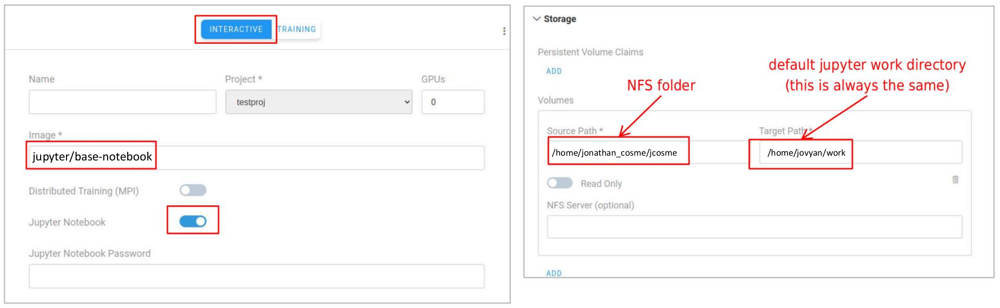  
  
1.2 Navigate to the ‘work’ directory. You should see your files/folders inside.  
  
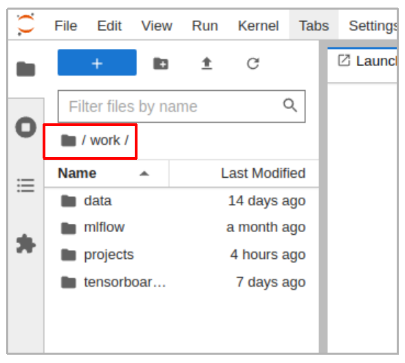  
  
1.3 Select the new folder icon, twice (to create two new folders)  
  
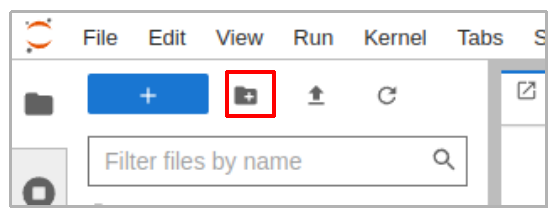  
  
1.4 Rename the folders ‘envs’ and ‘kernels’  
  
  
  
1.5 Delete the job  
  
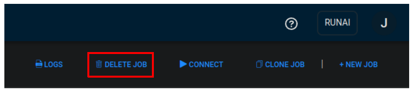  
  
### Step 2: Mount NFS ‘envs’ and ‘kernels’ folders on an interactive Jupyter Lab job  
  
2.1 Start a Jupyter Lab interactive session using the image **jonathancosme/base-notebook-root** (do NOT submit job yet)  
  
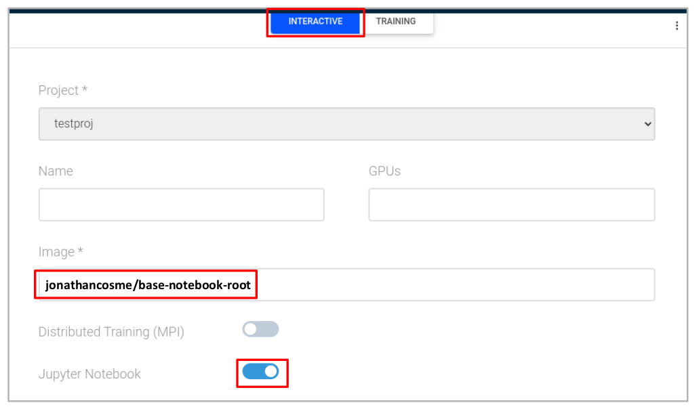  
  
2.2 mounts NFS to  
/home/jovyan/work  
  
2.3 mounts NFS ‘kernels’ folder to  
/home/jovyan/.local/share/jupyter/kernels  
  
2.4 mounts NFS ‘envs’ folder to  
/opt/conda/envs  
  
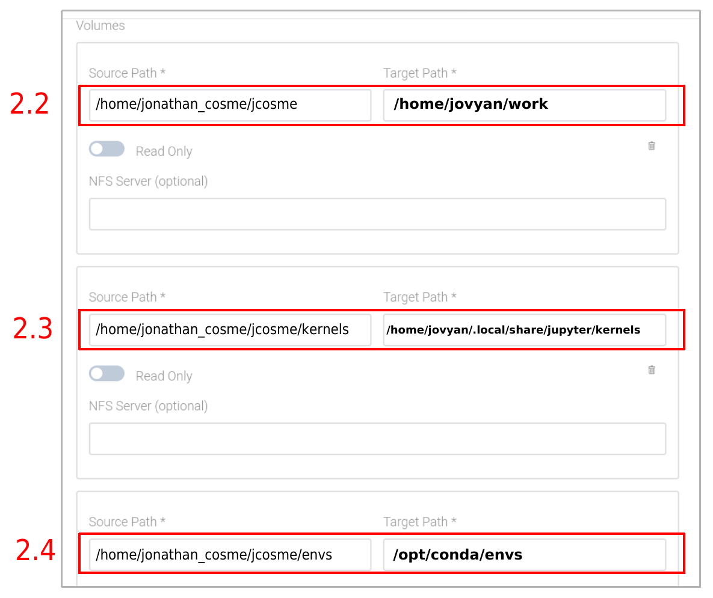  
  
2.5 Submit job  
  
### Step 3: Create your environment  
  
3.1 start a terminal, after connecting to the Jupyter lab interactive job  
  
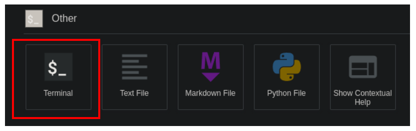  
  
3.2 create an environment using the following format  
(ipykernel must always be installed in an environment to create a tile)  
  
~~~bash
mamba create -n {your-env-name} -c conda-forge ipykernel {your-env-libraries} -y
~~~  
  
  
  
3.3 wait for environment to finish creating.  
**Warning**: depending on your NFS speed, the ‘Executing transaction’ step can take a long time (\~3 minutes for me)  
  
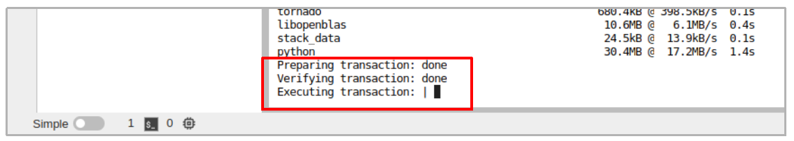  
  
3.4 activate the newly created environment using the following format  
  
~~~bash
conda activate {your-env-name}
~~~  
  
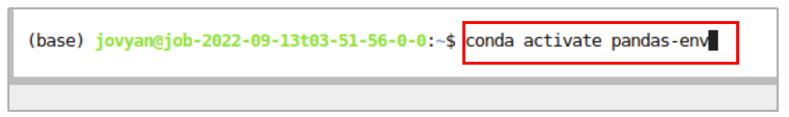  
  
3.5 Create the tile by using the following format  
  
~~~bash
python -m ipykernel install --user --name={your-env-name}
~~~  
  
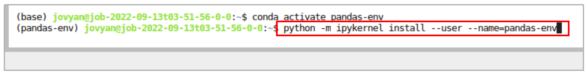  
  
3.6 exit the terminal with the following command  
  
~~~bash
exit
~~~  
  
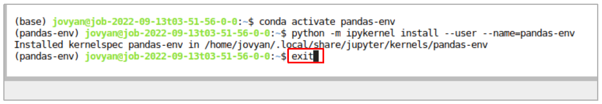  
  
3.7 Refresh the Jupyter Lab tab on your browser  
  
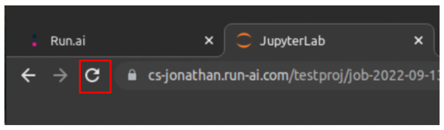  
  
3.8 A tile for your new environment should now be visible  
  
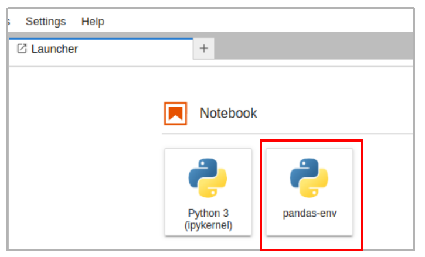  
  
3.9 You can also select the new env is notebooks  
  
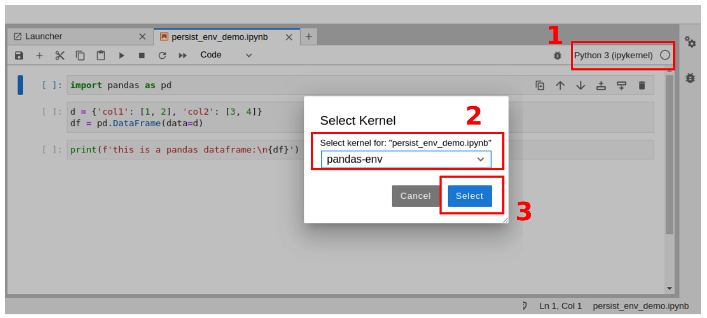  
  
### Step 4: Test the environment  
  
Let’s assume I have this python script....  
  
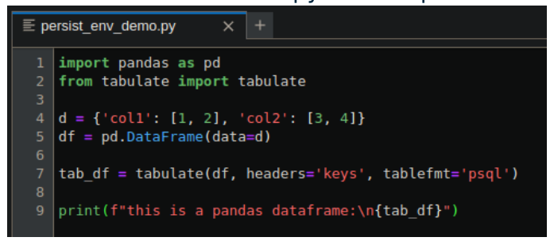  
  
...located here (after mounting my NFS to the Jupyter Lab work directory)  
  
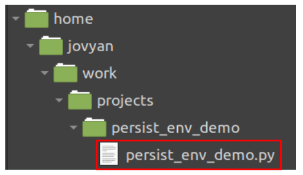  
  
This is the runai CLI command I want to run  
  
~~~bash
runai submit \
	--project testproj \
	--gpu 0 \
	--job-name-prefix persist-env \
	--image jonathancosme/base-notebook-root \
	--volume /home/jonathan_cosme/jcosme:/home/jovyan/work \
	--volume /home/jonathan_cosme/jcosme/envs:/opt/conda/envs \
	--volume /home/jonathan_cosme/jcosme/kernels:/home/jovyan/.local/share/jupyter/kernels \
	-- conda run -n pandas-env python work/projects/persist_env_demo/persist_env_demo.py
~~~  
  
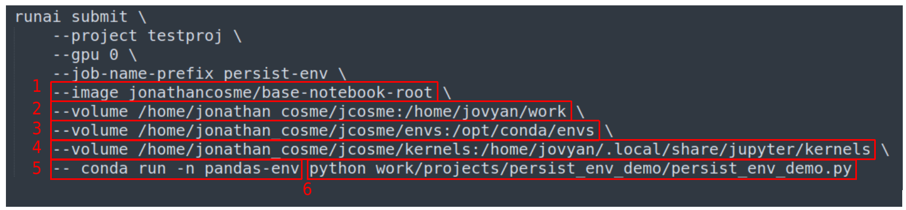  
  
1. Use the image jonathancosme/base-notebook-root
2. Mount NFS to Jupyter work directory
3. Mount NFS ‘envs’ folder to Jupyter conda envs folder
4. Mount NFS ‘kernels’ folder to Jupyter kernels folder
5. Run our command (to follow) in the conda environment named ‘pandas-env’
6. Run our python script  
  

4.1 Run the runai CLI command. You should see a new job in the job list  
  
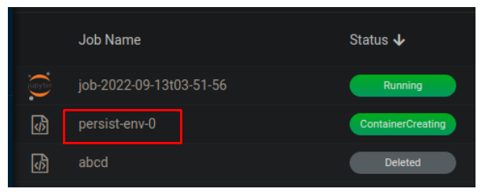  
  
4.2 Wait for the job status to switch to ‘Succeeded’  
  
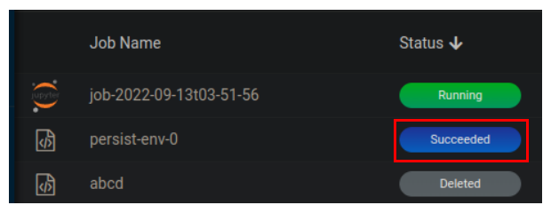  
  
4.3 View the output of the jobs in the Logs tab  
  
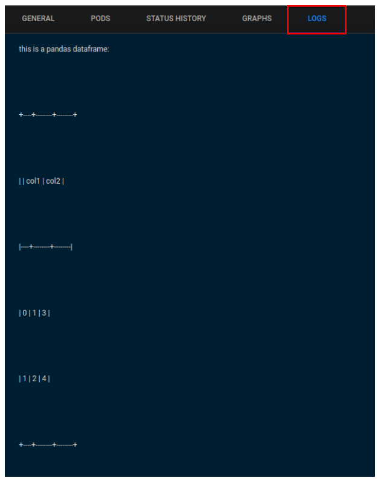  

