# Using Tensorboard with run:ai (ResNet example)
  
**A 14-minute video of a live demo can be found [here](https://vimeo.com/746903607)**

Full content can be found at the github repo [here](https://github.com/run-ai/docs/tree/master/docs/use-cases/runai_tensorboard_demo_with_resnet)  
  
## Description:
This repo details an example of how to integrate run:ai with Tensorboard, using Tensorflow ResNet as an example.   
It consists of 4 basic steps:  

1. create a persistent directory on the NFS 
    + called 'tensorboard_logs' in our example
    + to hold the records from Tensorboard callbacks during Tensorflow training.
2. create a first docker image with Tensorboard and jupyter-server-proxy installed
    + jupyter-server-proxy is used to access the Tensorboard UI
3. create a second docker image with Tensorflow 2.9 and cudatoolkit 11.7 installed
4. run python scripts by submitting jobs to the scheduler, using the created second docker image. Use the created first image to launch the Tensorboard UI, and view progress.  

  
## Tensorboard intro 
  
### what does Tensorboard need?
One thing is needed for Tensorboard:  

1. A logs folder to store objects related to the runs   
  
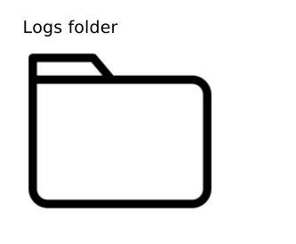  
  
### how does Tensorboard work?
#### 1. To view the Tensorboard UI, we start the server with a CLI command  
  
we can also choose to specify the location of the database, and artifact folder, as well as the host IP, and port.  
  
~~~bash
tensorboard \
     --logdir=/abs/path/to/logs_folder \
     --host=0.0.0.0 \
     --port=6006
~~~  
  
#### 2. In order to write records to the Tensorboard folder, create a Tensorboard callback, and pass it to model.fit()   
**Note:**  
It is not necessary to start the Tensorboard server in order to write records. 
Starting the server is only needed to view the UI.  
 
~~~python
import tensorflow as tf

tb_dir = "/abs/path/to/logs_folder"

"""
code to build and compile your model
"""

tensorboard_callback = tf.keras.callbacks.TensorBoard(
    log_dir=tb_dir)

history = model.fit(train_ds,
                    epochs=5,
                    callbacks=[tensorboard_callback])

~~~  
  
## Tensorboard with run:ai
### what is needed to run mlflow on run:ai?  

1. A persistent directory to keep
    + Tensorboard logs folder
2. A first docker image with the following installed
    + Tensorboard
    + jupyterlab*
    + jupyter-server-proxy*  
3. A second docker image with the following installed 
    + Tensorflow\*\*
    + Keras\*\*  
  
\*needed in order to access the mlflow UI
\*\* needed in order train Tensorflow models (ResNet in our example)  

### Creating a persisten directory
#### We need to create a 'tensorboard_logs' folder on our NFS.  
  
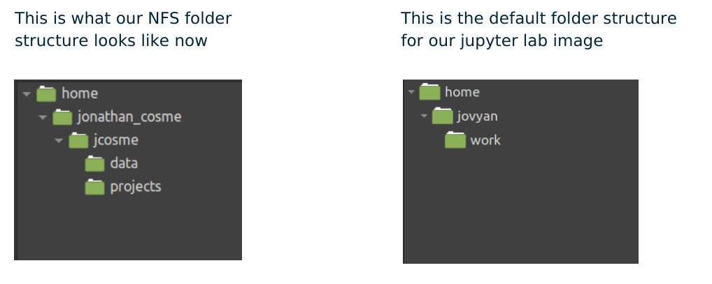  
  
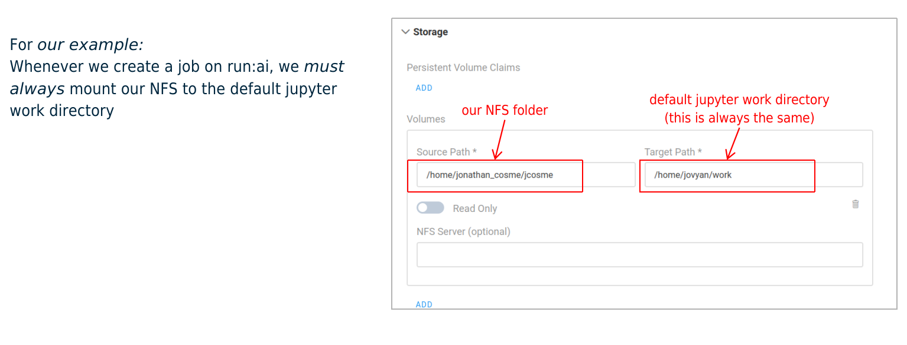  
  
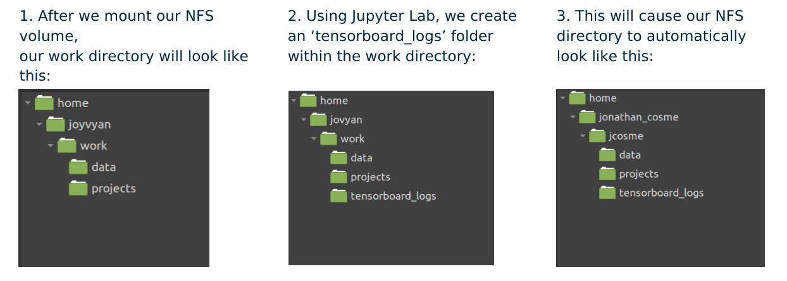  
  
### Docker images
The first docker image we will use is:  
[jonathancosme/tensorboard-ui](https://hub.docker.com/repository/docker/jonathancosme/tensorboard-ui)  
This is what is in the dockerfile:  

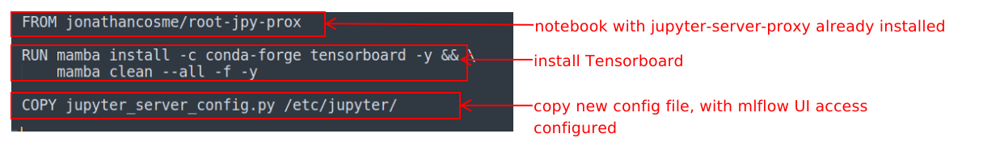   
  
in order to access the Tensorboard UI, we need to add this entry to the jupyter_server_config.py file, and replace the existing file in the image  

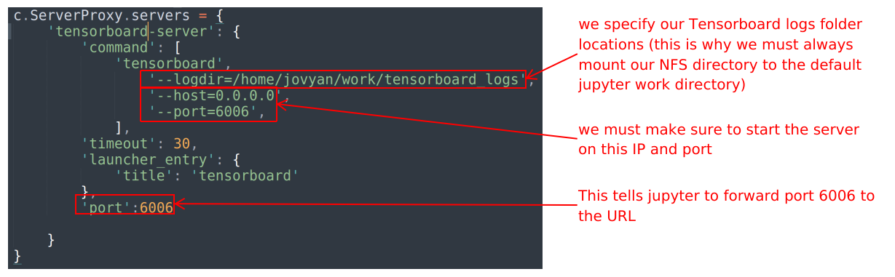  
  
The second docker image we will use is:  
[jonathancosme/keras-nb](https://hub.docker.com/repository/docker/jonathancosme/keras-nb)  
This is what is in the dockerfile:  
  
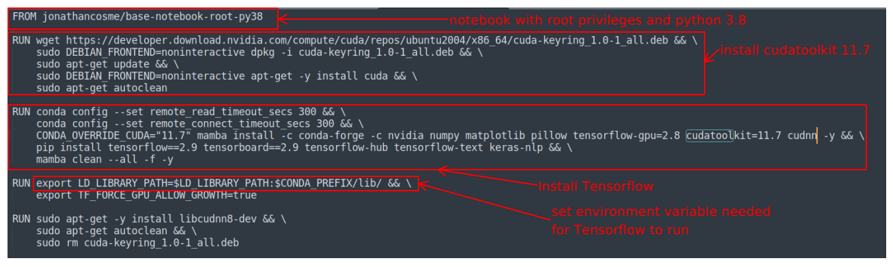  

## accessing the Tensorboard UI
Create a jupyter interactive job with:  
  
+ image jonathancosme/tensorboard-iu
+ mounted NFS folder (with 'tensorboard_logs' folder) in default jupyter work directory
  
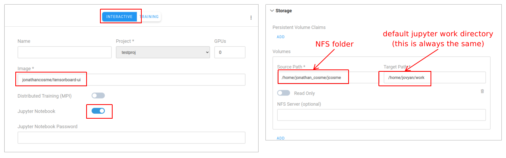  
  
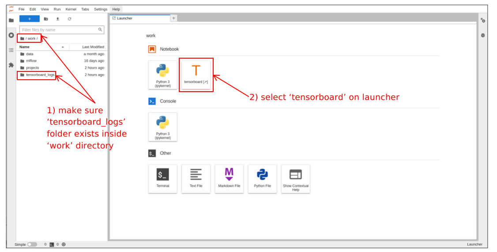  
  
A new tab should appear with the Tensorboard UI  
  
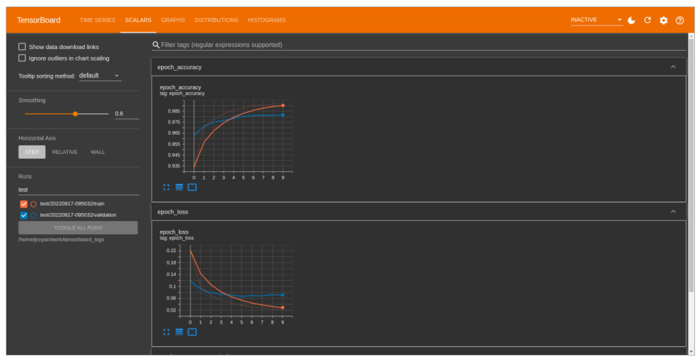  
  
Select ‘Reload data’ under settings.  
  
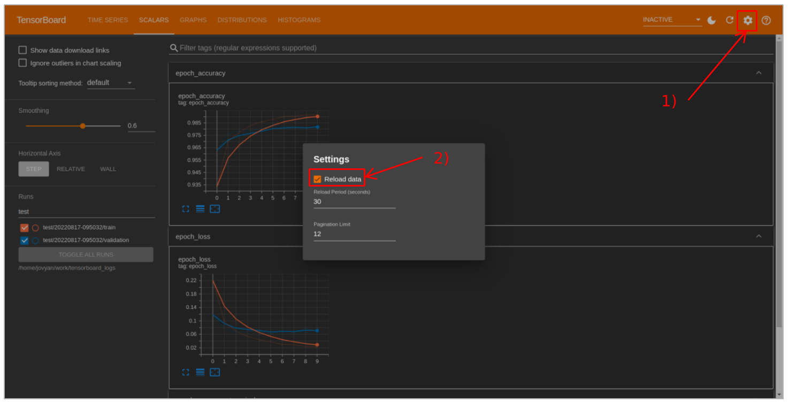  
  
**Note:** The first time you access the UI, there will be no data available  
  
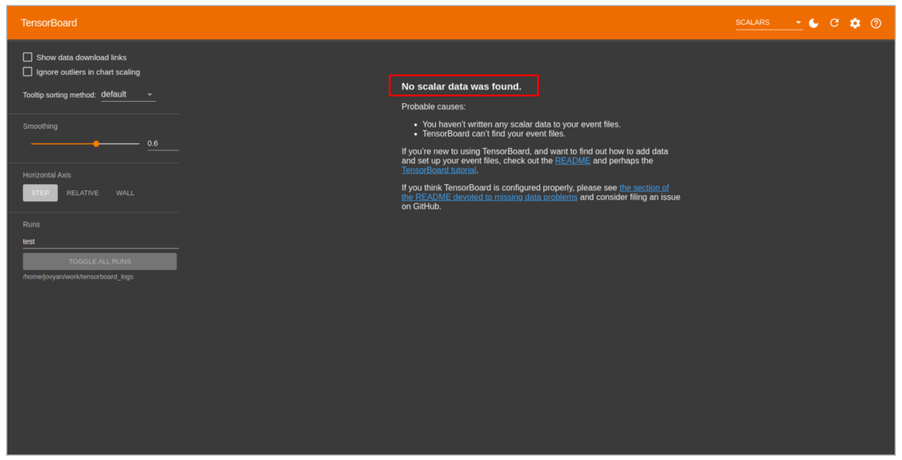  
  
## running Tensorflow ResNet experiments experiments with run:ai
### python scripts  

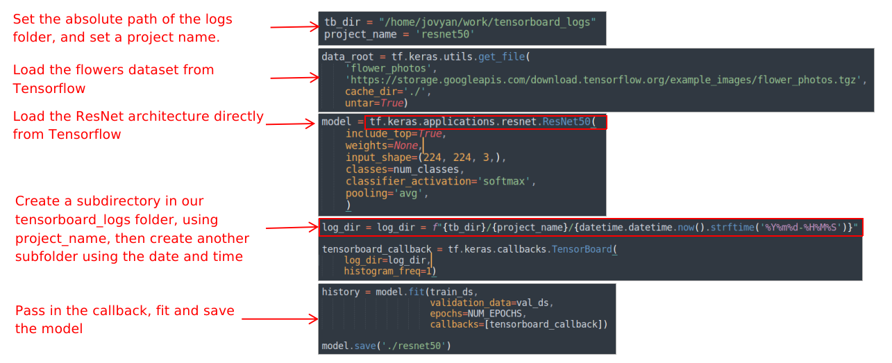  
  
### CLI submission
Our example scrips are located here:  
  
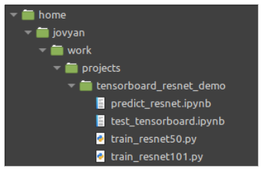  
  
so our CLI command would look like this:  
  
~~~bash
runai submit \
    --project testproj \
    --gpu 1 \
    --job-name-prefix tb-renset-demo \
    --image jonathancosme/keras-nb \
    --volume /home/jonathan_cosme/jcosme:/home/jovyan/work \
    -- python work/projects/tensorboard_resnet_demo/train_resnet50.py
~~~  
  
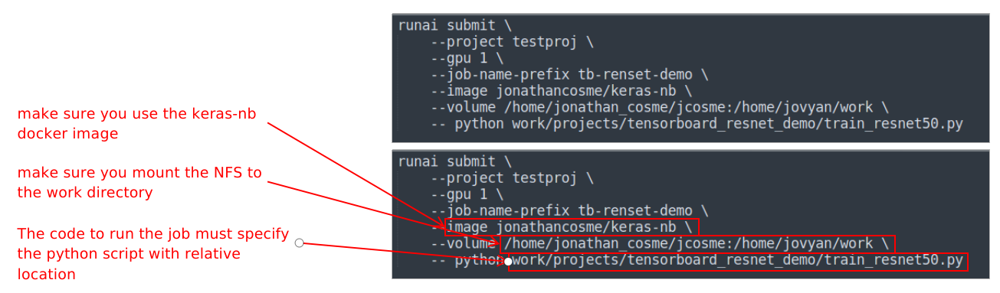 
  
### Example job submission

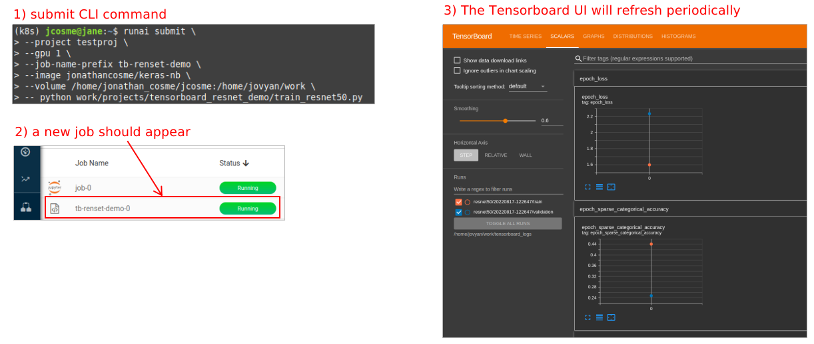 

