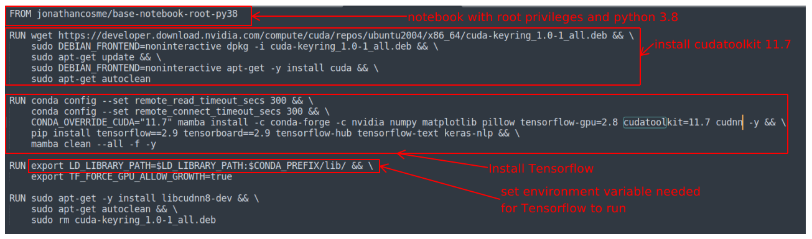

# Jupyter notebook with tensorflow and keras installed (python 3.8) and root privileges 

This uses the base image [jonathancosme/root-jpy-prox](https://hub.docker.com/repository/docker/jonathancosme/root-jpy-prox).  
The github repo for the image can be found [here](https://github.com/jonathancosme/root-jpy-prox)

This image is publicly available here:  
[jonathancosme/keras-nb](https://hub.docker.com/repository/docker/jonathancosme/keras-nb)  

Here is the explanation for the **Dockerfile** file:  
 
