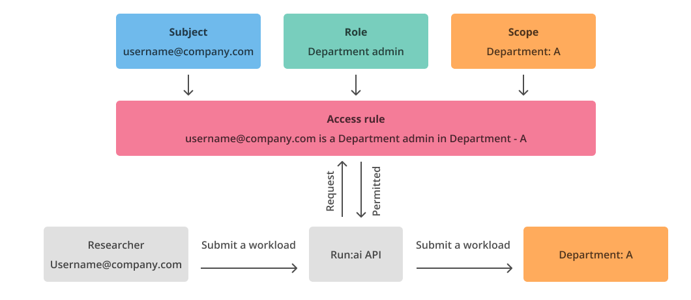

# Authentication and authorization

Run:ai authentication and authorization enables a streamlined experience for the user with precise controls covering the data each user can see and the actions each user can perform in the Run:ai platform.

Authentication verifies user identity during login, and authorization assigns the user with specific permissions according to the assigned [access rules](../../self-hosted/authentication-and-authorization/accessrules.md).

Authenticated access is required to use all aspects of the Run:ai interfaces, including the Run:ai platform, the Run:ai Command Line Interface (CLI) and APIs.

## Authentication

There are multiple methods to authenticate and access Run:ai.

### Single Sign-On (SSO)





Run:ai supports three methods to set up SSO:

* [SAML](../../self-hosted/authentication-and-authorization/sso/saml.md)
* [OpenID Connect (OIDC)](../../self-hosted/authentication-and-authorization/sso/openidconnect.md)
* [OpenShift](../../self-hosted/authentication-and-authorization/sso/openshift.md)

When using SSO, it is highly recommended to manage at least one local user, as a breakglass account (an emergency account), in case access to SSO is not possible.

### Username and password

Username and password access can be used when SSO integration is not possible.

### Secret key (for Application programmatic access)

Secret is the authentication method for [Applications](../../self-hosted/authentication-and-authorization/applications.md). Applications use the Run:ai APIs to perform automated tasks including scripts and pipelines based on their assigned [access rules](../../self-hosted/authentication-and-authorization/accessrules.md).

## Authorization

The Run:ai platform uses Role Base Access Control (RBAC) to manage authorization.

Once a user or an application is authenticated, they can perform actions according to their assigned access rules.

### Role Based Access Control (RBAC) in Run:ai

While Kubernetes RBAC is limited to a single cluster, Run:ai expands the scope of Kubernetes RBAC, making it easy for administrators to manage access rules across multiple clusters.

RBAC at Run:ai is configured using access rules.

An access rule is the assignment of a [role](../../self-hosted/authentication-and-authorization/roles.md) to a subject in a [scope](broken-reference/): `<Subject>` is a `<Role>` in a `<Scope>`.

* **Subject**
  * A user, a group, or an application assigned with the role
* **Role**
  * A set of permissions that can be assigned to subjects
  * A permission is a set of actions (view, edit, create and delete) over a Run:ai entity (e.g. projects, workloads, users)
    * For example, a role might allow a user to create and read Projects, but not update or delete them
    * Roles at Run:ai are system defined and cannot be created, edited or deleted
* **Scope**
  * A scope is part of an organization in which a set of permissions (roles) is effective. Scopes include Projects, Departments, Clusters, Account (all clusters).

Below is an example of an access rule: **username@company.com** is a **Department admin** in **Department: A**

