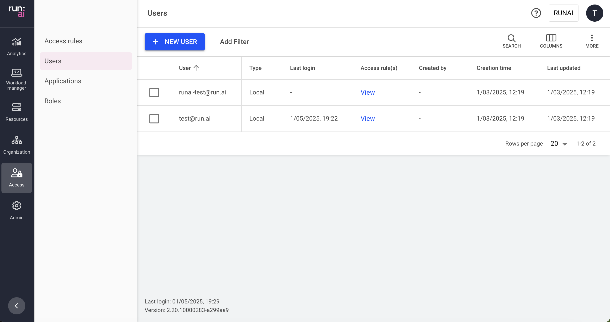

# Users

This article explains the procedure to manage users and their permissions.

Users can be managed locally, or via the Identity provider, while assigned with [access rules](accessrules.md) to manage its permissions.

For example, user **user@domain.com** is a **department admin** in **department A**.

## Users table

The Users table can be found under **Access** in the Run:ai platform.

The users table provides a list of all the users in the platform.\
You can manage local users and manage user permissions (access rules) for both local and [SSO users](authentication-and-authorization.md#single-sign-on-sso).


**Single Sign-On users**\
SSO users are managed by the identity provider and appear once they have signed in to Run:ai.


The Users table consists of the following columns:

| Column         | Description                                        |
| -------------- | -------------------------------------------------- |
| User           | The unique identity of the user (email address)    |
| Type           | The type of the user - SSO / local                 |
| Last login     | The timestamp for the last time the user signed in |
| Access rule(s) | The access rule assigned to the user               |
| Created By     | The user who created the user                      |
| Creation time  | The timestamp for when the user was created        |
| Last updated   | The last time the user was updated                 |

### Customizing the table view

* Filter - Click ADD FILTER, select the column to filter by, and enter the filter values
* Search - Click SEARCH and type the value to search by
* Sort - Click each column header to sort by
* Column selection - Click COLUMNS and select the columns to display in the table
* Download table - Click MORE and then Click Download as CSV. Export to CSV is limited to 20,000 rows.

## Creating a local user

To create a local user:

1. Click **+NEW LOCAL USER**
2. Enter the user’s **Email address**
3. Click **CREATE**
4. Review and copy the user’s credentials:
   * **User Email**
   * **Temporary password** to be used on first sign-in
5. Click **DONE**

!!! Note The temporary password is visible only at the time of user’s creation, and must be changed after the first sign-in

## Adding an access rule to a user

To create an access rule:

1. Select the user you want to add an access rule for
2. Click **ACCESS RULES**
3. Click **+ACCESS RULE**
4. Select a role
5. Select a scope
6. Click **SAVE RULE**
7. Click **CLOSE**

## Deleting user’s access rule

To delete an access rule:

1. Select the user you want to remove an access rule from
2. Click **ACCESS RULES**
3. Find the access rule assigned to the user you would like to delete
4. Click on the trash icon
5. Click **CLOSE**

## Resetting a user password

To reset a user’s password:

1. Select the user you want to reset it’s password
2. Click **RESET PASSWORD**
3. Click **RESET**
4. Review and copy the user’s credentials:
   * **User Email**
   * **Temporary password** to be used on next sign-in
5. Click **DONE**

## Deleting a user

1. Select the user you want to delete
2. Click **DELETE**
3. In the dialog, click **DELETE** to confirm the deletion

!!!Note To ensure administrative operations are always available, at least one local user with System Administrator role should exist.

## Using API

Go to the [Users](https://app.run.ai/api/docs#tag/Users), [Access rules](https://app.run.ai/api/docs#tag/Access-rules) API reference to view the available actions
