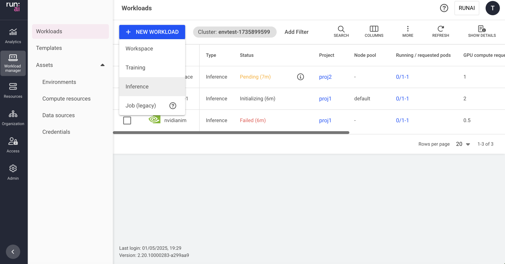

# Deploy inference workloads from Hugging Face

This article explains how to create an inference workload via the Run:ai UI using Hugging Face inference models.

An inference workload provides the setup and configuration needed to deploy your trained model for real-time or batch predictions. It includes specifications for the container image, data sets, network settings, and resource requests required to serve your models.

The inference workload is assigned to a project and is affected by the project’s quota.

To learn more about the inference workload type in Run:ai and determine that it is the most suitable workload type for your goals, see [Workload types](../workloads-in-runai/workload-types.md).

## Creating a Hugging Face inference workload

Before you start, make sure you have a project.

To add a new inference workload:

1. Go to the Workload manager → Workloads
2. Click **+NEW WORKLOAD** and select **Inference**\
   Within the new inference form:
3. Select under which **cluster** to create the inference workload
4. Select the **project** in which your inference will run
5. Select **Hugging Face** from **Inference type**
6. Enter a unique **name** for the inference workload (if the name already exists in the project, you will be requested to submit a different name)
7. Click **CONTINUE**\
   In the next step:
8. Set the **model** and how to access
   * Set the **model name** as displayed in Hugging Face. The model must be supported by [vLLM version 0.6.4](https://github.com/vllm-project/vllm/blob/v0.6.4/docs/source/models/supported_models.rst).
     * Enter a **name**
   * Set how to **access** Hugging Face
     * **Provide a token**
       * **Access token**
         * Enter a token
     * **Select credential**
       * Select an **existing credential**. Make sure the existing credential contains an **HF\_TOKEN** key
       *   Add a new credential with an HF\_TOKEN

           Within the new credential form:

           * Enter a **name** for the credential. The name must be unique.
           * Optional: Provide a **description** of the credential
           * Set how the credential is created
             *   **Existing secret** (in the cluster)

                 This option applies when the purpose is to create the credential based on an existing secret

                 * Select a secret from the list (the list is empty if no secrets were [created in advance](../workloads-in-runai/workload-assets/credentials.md#creating-secrets-in-advance))
             *   **New secret**

                 A new secret is created together with the credential. New secrets are not added to the list of existing secrets.

                 * Enter a **key**
                 * Enter the HF\_TOKEN as the **value**
   * Optional: Modify who can access the inference **serving endpoint**
     *   **Public (default)**

         Everyone within the network can access the endpoint with no authentication
     *   **All authenticated users**

         Everyone within the organization’s account that can log in (to Run:ai or SSO)
     * **Specific group(s)**
       * Click **+GROUP**
       * Enter **group names** as they appear in your identity provider. You must be a member of one of the groups listed to have access to the endpoint.
     * **Specific user(s)**
       * Click **+USER**
       * Enter a valid email address or username. If you remove yourself, you will lose access to the endpoint.
9. Select the **compute resource** for your inference workload
   * Select a compute resource or click **+NEW COMPUTE RESOURCE** to add a new compute resource to the gallery.\
     For a step-by-step guide on adding compute resources to the gallery, see [compute resources](../workloads-in-runai/workload-assets/compute-resources.md). Once created, the new compute resource will be automatically selected.
   * Optional: Set the **minimum and maximum** number of replicas to be scaled up and down to meet the changing demands of inference services.
   * If the number of minimum and maximum replicas are different, autoscaling will be triggered and you'll need to set **conditions for creating a new replica**. A replica will be created every time a condition is met. When a condition is no longer met after a replica was created, the replica will be automatically deleted to save resources.
     * Select a **variable** - The variable's values will be monitored via the container's port.
       * **Latency (milliseconds)**
       * **Throughput (Requests/sec)**
       * **Concurrency (Requests)**
     * Set a **value** - This value is the threshold at which autoscaling is triggered.
   * Optional: Set when the replicas should be automatically **scaled down to zero**. This allows the compute resources to be freed up when the model is inactive (i.e., there are no requests being sent) When automatic scaling to zero is enabled, the minimum number of replicas set in the previous step, automatically changes to 0
   * Optional: Set the **order of priority** for the **node pools** on which the scheduler tries to run the workload.\
     When a workload is created, the scheduler will try to run it on the first node pool on the list. If the node pool doesn't have free resources, the scheduler will move on to the next one until it finds one that is available.
     * Drag and drop them to change the order, remove unwanted ones, or reset to the default order defined in the project.
     * Click **+NODE POOL** to add a new node pool from the list of node pools that were defined on the cluster.\
       To configure a new node pool and for additional information, see [node pools](../manage-ai-initiatives/managing-your-resources/node-pools.md).
   * Select a **node affinity** to schedule the workload on a specific node type.\
     If the administrator added a ‘[node type (affinity)](../policies/scheduling-rules.md#node-type-affinity)’ scheduling rule to the project/department, then this field is mandatory.\
     Otherwise, entering a node type (affinity) is optional. [Nodes must be tagged](../policies/scheduling-rules.md#labelling-nodes-for-node-types-grouping) with a label that matches the node type key and value.
   *   Optional: Set toleration(s) to allow the workload to be scheduled on a node with a matching taint

       
       Tolerations are disabled, by default. If you cannot see Tolerations in the menu, then it must be enabled by your Administrator, under **General settings** → Workloads → Tolerations
       

       * Click **TOLERATION**
       * Enter a **key**
       * Select the **operator**
         * **Exists** - If the key exists on the node, the effect will be applied.
         * **Equals** - if the key and the value set below matches to the value on the node, the effect will be applied
           * Enter a **value** matching the value on the node
       * Select the effect for the toleration&#x20;
         * **NoExecute** - Pods that do not tolerate this taint are evicted immediately.&#x20;
         * **NoSchedule**- No new pods will be scheduled on the tainted node unless they have a matching toleration. Pods currently running on the node will not be evicted.
         * **PreferNoSchedule** - The control plane will try to avoid placing a pod that does not tolerate the taint on the node, but it is not guaranteed.&#x20;
         * **Any** - All effects above match.
10. Optional: Select **data sources** for your workspace - Select a data source or click **+NEW DATA SOURCE** to add a new data source to the gallery. If there are issues with the connectivity to the cluster, or issues while creating the data source, the data source won't be available for selection. For a step-by-step guide on adding data sources to the gallery, see [data sources](../workloads-in-runai/workload-assets/datasources.md). Once created, the new data source will be automatically selected.&#x20;
    * Optional: Modify the data target location for the selected data source(s).&#x20;
11. **Optional - General settings**:&#x20;
    * Set the **timeframe for auto-deletion** after workload completion or failure. The time after which a completed or failed workload is deleted; if this field is set to 0 seconds, the workload will be deleted automatically.&#x20;
    * Set **annotations(s)**\
      Kubernetes annotations are key-value pairs attached to the workload. They are used for storing additional descriptive metadata to enable documentation, monitoring and automation.&#x20;
      * Click **+ANNOTATION**&#x20;
      * Enter a **name**&#x20;
      * Enter a **value**&#x20;
    * Set **labels(s)**\
      Kubernetes labels are key-value pairs attached to the workload. They are used for categorizing to enable querying. To add labels:&#x20;
      * Click **+LABEL**
      * Enter a **name**&#x20;
      * Enter a **value**&#x20;
12. Click **CREATE INFERENCE**

## Managing and monitoring

After the inference workload is created, it is added to the [Workloads](../workloads-in-runai/workloads.md) table, where it can be managed and monitored.
