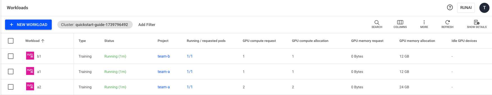
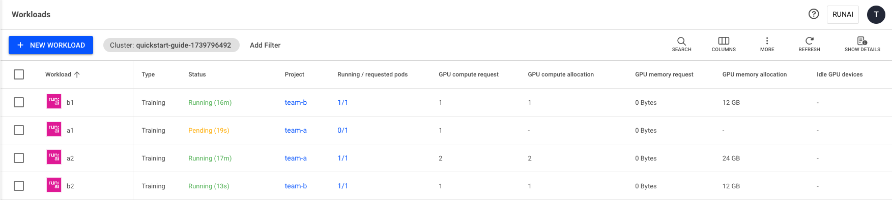

# Over quota, fairness and preemption, bin-packing

The goal of this Quickstart is to explain the concepts of over-quota and bin-packing (consolidation) and how they help in maximizing cluster utilization:

* Show the simplicity of resource provisioning, and how resources are abstracted from users.
* Show how the system eliminates compute bottlenecks by allowing teams/users to go over their resource quota if there are free GPUs in the cluster.

## **Prerequisites** <a href="#xnw9sqaanj15" id="xnw9sqaanj15"></a>

* You have created two [projects](../../../../manage-ai-initiatives/managing-your-organization/projects.md) - team-a and team-b - or have them created for you.
* Each project has an assigned quota of 2 GPUs.

## **Step 1: Logging in** <a href="#a13adq7eth7w" id="a13adq7eth7w"></a>



## **Step 2: Over-quota** <a href="#i3c9jpfzerlq" id="i3c9jpfzerlq"></a>

* Project “team-a” has 3 GPUs allocated and is over quota by 1 GPU. The system allows this over-quota as long as there are available resources.
* The system is at full capacity with all GPUs utilized.&#x20;



1. Go to the Workload Manager → Workloads
2. Click **+NEW WORKLOAD** and select **Training**
3. Select under which **cluster** to create the workload
4. Select the **project** in which your workload will run
5. Select a preconfigured [template ](../../../../workloads-in-runai/workload-templates/workspace-templates.md)or select the **Start from scratch** to launch a new training quickly
6. Enter a name for the training (if the name already exists in the project, you will be requested to submit a different name)
7. Click **CONTINUE**\
   In the next step:
8.  Create a new environment:

    * Click **+NEW ENVIRONMENT**
    * Select under which cluster to create the environment
    * Select a[ ](https://run-ai.document360.io/preview/saas/en/c961ca3e-2216-4e78-a222-f958e1a1a31c/6#scope-of-usage)scope
    * Enter a **name** for the environment. The name must be unique.
    * Enter the training **Image URL** - `runai.jfrog.io/demo/quickstart`
    * Click **CREATE ENVIRONMENT**

    The newly created environment will be selected automatically.
9. Select the **‘one-gpu’/’two-gpus’** compute resource for your workload (**GPU devices**: 1 or 2)
   * If the **‘one-gpu’/’two-gpus’** are not displayed in the gallery, follow the step-by-step guide:
     * Click **+NEW COMPUTE RESOURCE**
     * Select under which cluster to create the compute resource
     * Select a scope
     * Enter a **name** for the compute resource. The name must be unique.
     * Set **GPU devices per pod:** 1
     * Set **GPU memory per device:**
       * Select **% (of device)**
       * Set the memory **Request** to - 100 (the workload will allocate 100% of the GPU memory)
     * Optional: set the **CPU compute per pod** - 0.1 cores (default)
     * Optional: set the **CPU memory per pod** - 100 MB (default)
     * Click **CREATE COMPUTE RESOURCE**
   * The newly created one-gpu compute resource will be selected automatically
10. Click **CREATE TRAINING**\
    After the workload is created, it is added to the [workloads](../../../../workloads-in-runai/workloads.md) table



```bash
runai submit a2 -i runai.jfrog.io/demo/quickstart -g 2 -p team-a
runai submit a1 -i runai.jfrog.io/demo/quickstart -g 1 -p team-a
runai submit b1 -i runai.jfrog.io/demo/quickstart -g 1 -p team-b
```



```bash
runai training submit a2 -i runai.jfrog.io/demo/quickstart -g 2 -p team-a
runai training submit a1 -i runai.jfrog.io/demo/quickstart -g 1 -p team-a
runai training submit b1 -i runai.jfrog.io/demo/quickstart -g 1 -p team-b
```



Copy the following command to your terminal. Make sure to update the below parameters according to the comments.

For more details, see[ Training API](https://api-docs.run.ai/latest/tag/Trainings#operation/create_training1).

1. Add “a1” workload with 2 GPUs:

```
curl --location 'https://<COMPANY-URL>/api/v1/workloads/trainings' \
--header 'Content-Type: application/json' \
--header 'Authorization: Bearer <TOKEN>' \ #<TOKEN> is the API access token obtained in Step 1. 
--data '{
  "name": "a1",
  "projectId": "<PROJECT-ID>", #The ID of the Project the workspace is running on. You can get the Project ID via the Get Projects API. 
  "clusterId": "<CLUSTER-UUID>",#<CLUSTER-UUID> is the unique identifier of the Cluster. You can get the Cluster UUID by adding the "Cluster ID" column to the Clusters view.
  "spec": {
    "image":"runai.jfrog.io/demo/quickstart",
    "compute": {
      "gpuDevicesRequest": 1
    }
  }
}'

```

2. Add “a2” workload with 2 GPUs:

```
curl --location 'https://<COMPANY-URL>/api/v1/workloads/trainings' \
--header 'Content-Type: application/json' \
--header 'Authorization: Bearer <TOKEN>' \ #<TOKEN> is the API access token obtained in Step 1. 
--data '{
  "name": "a2",
  "projectId": "<PROJECT-ID>", #The ID of the Project the workspace is running on. You can get the Project ID via the Get Projects API. 
  "clusterId": "<CLUSTER-UUID>",#<CLUSTER-UUID> is the unique identifier of the Cluster. You can get the Cluster UUID by adding the "Cluster ID" column to the Clusters view.
  "spec": {
    "image":"runai.jfrog.io/demo/quickstart",
    "compute": {
      "gpuDevicesRequest": 2
    }
  }
}'

```

3. Add “b1” workload with 1 GPU:

```
curl --location 'https://<COMPANY-URL>/api/v1/workloads/trainings' \
--header 'Content-Type: application/json' \
--header 'Authorization: Bearer <TOKEN>' \ #<TOKEN> is the API access token obtained in Step 1. 
--data '{
  "name": "b1",
  "projectId": "<PROJECT-ID>", #The ID of the Project the workspace is running on. You can get the Project ID via the Get Projects API. 
  "clusterId": "<CLUSTER-UUID>",#<CLUSTER-UUID> is the unique identifier of the Cluster. You can get the Cluster UUID by adding the "Cluster ID" column to the Clusters view.
  "spec": {
    "image":"runai.jfrog.io/demo/quickstart",
    "compute": {
      "gpuDevicesRequest": 1
    }
  }
}'

```



### **Over quota status**



System status after run:





System status after run:

```bash
~ runai list -A
Workload Type Status Project Running/Req. Pods GPU Alloc.
────────────────────────────────────────────────────────────────────────────
a2 Training Running team-a 1/1 2.00
b1 Training Running team-b 1/1 1.00
a1 Training Running team-a 1/1 1.00
```



System status after run:

```
~ runai workload list -A
Workload Type Status Project Running/Req. Pods GPU Alloc.
────────────────────────────────────────────────────────────────────────────
a2 Training Running team-a 1/1 2.00
b1 Training Running team-b 1/1 1.00
a1 Training Running team-a 1/1 1.00
```



System status after run:

```
curl --location 'https://<COMPANY-URL>/api/v1/workloads' \
--header 'Content-Type: application/json' \
--header 'Authorization: Bearer <TOKEN>' \ #<TOKEN> is the API access token obtained in Step 1.
--data ''
```



## **Step 3: Basic fairness via preemption** <a href="#ir39sufqwcdh" id="ir39sufqwcdh"></a>

* &#x20;team-b launched new b2 workload- with one gpu
* team-a can no longer remain in over quota - 3 GPU. Thus, one Workload must be preempted and moved out to allow team-b to grow.
* Run:ai Scheduler chooses to preempt Workload a1 (one GPU)



1. Go to the Workload Manager → Workloads
2. Click **+NEW WORKLOAD** and select **Training**\
   Within the New workspace form:
3. Select under which **cluster** to create the workload
4. Select the **project** in which your workspace will run&#x20;
5. Select a preconfigured template or select the **Start from scratch** to launch a new training quickly
6. Enter a name for the training (If the name already exists in the project, you will be requested to submit a different name)
7. Click **CONTINUE**\
   In the next step:
8. Create a new environment:
   * Click **+NEW ENVIRONMENT**
   * Select under which cluster to create the environment
   * Select a[ ](https://run-ai.document360.io/preview/saas/en/c961ca3e-2216-4e78-a222-f958e1a1a31c/6#scope-of-usage)scope
   * Enter a **name** for the environment. The name must be unique.
   * Enter the training **Image URL** - runai.jfrog.io/demo/quickstart
   * Click **CREATE ENVIRONMENT**
     *
       * The newly created environment will be selected automatically.
9. Select the **‘one-gpu’/’two-gpus’** compute resource for your workspace (**GPU devices**: 1 or 2)
   * If the **‘one-gpu’/’two-gpus’** are not displayed in the gallery, follow the step-by-step guide:\
     For example, create a **‘one-gpu’** compute resource:
     * Click **+NEW COMPUTE RESOURCE**
     * Select under which cluster to create the compute resource
     * Select a scope
     * Enter a **name** for the compute resource. The name must be unique.
     * Set **GPU devices per pod:** 1
     * Set **GPU memory per device:**
       * Select **% (of device)**
       * Set the memory **Request** to - 100 (the workload will allocate 100% of the GPU memory)
     * Optional: set the **CPU compute per pod** - 0.1 cores (default)
     * Optional: set the **CPU memory per pod** - 100 MB (default)
     * Click **CREATE COMPUTE RESOURCE**
   * The newly created one-gpu compute resource will be selected automatically
10. Click **CREATE WORKSPACE**\
    After the workspace is created, it is added to the workloads table



```
runai submit b2 -i runai.jfrog.io/demo/quickstart -g 1 -p team-b
```



```
runai training submit b2 -i runai.jfrog.io/demo/quickstart -g 1 -p team-b
```



Copy the following command to your terminal. Make sure to update the below parameters according to the comments.

For more details, see[ Training API](https://api-docs.run.ai/latest/tag/Trainings#operation/create_training1).

```
curl --location 'https://<COMPANY-URL>/api/v1/workloads/trainings' \
--header 'Content-Type: application/json' \
--header 'Authorization: Bearer <TOKEN>' \ #<TOKEN> is the API access token obtained in Step 1. 
--data '{
  "name": "b2",
  "projectId": "<PROJECT-ID>", #The ID of the Project the workspace is running on. You can get the Project ID via the Get Projects API. 
  "clusterId": "<CLUSTER-UUID>",#<CLUSTER-UUID> is the unique identifier of the Cluster. You can get the Cluster UUID by adding the "Cluster ID" column to the Clusters view.
  "spec": {
    "image":"runai.jfrog.io/demo/quickstart",
    "compute": {
      "gpuDevicesRequest": 1
    }
  }
}'

```



#### **Basic fairness via preemption status**



Workloads status after run:





Workloads status after run:

```
~ runai list -A
Workload Type Status Project Running/Req. Pods GPU Alloc.
────────────────────────────────────────────────────────────────────────────
a2 Training Running team-a 1/1 2.00
b1 Training Running team-b 1/1 1.00
b2 Training Running team-b 1/1 1.00
a1 Training Pending team-a 0/1 1.00
```



Workloads status after run:&#x20;

```
~ runai workload list -A
Workload Type Status Project Running/Req. Pods GPU Alloc.
────────────────────────────────────────────────────────────────────────────
a2 Training Running team-a 1/1 2.00
b1 Training Running team-b 1/1 1.00
b2 Training Running team-b 1/1 1.00
a1 Training Pending team-a 0/1 1.00
```



Workloads status after run:

```
curl --location 'https://<COMPANY-URL>/api/v1/workloads' \
--header 'Content-Type: application/json' \
--header 'Authorization: Bearer <TOKEN>' \ #<TOKEN> is the API access token obtained in Step 1.
--data ''
```



