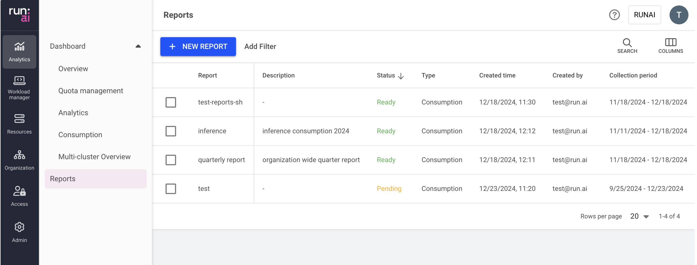

# Reports

This article explains the procedure of managing reports in Run:ai.

Reports allow users to access and organize large amounts of data in a clear, CSV-formatted layout. They enable users to monitor resource consumption, analyze trends, and make data-driven decisions to optimize their AI workloads effectively.

## Report types

Currently, only “Consumption Reports” are available, which provides insights into the consumption of resources such as GPU, CPU, and CPU memory across organizational units.

## Reports table

The Reports table can be found under **Analytics** in the Run:ai platform.

The Reports table provides a list of all the reports defined in the platform and allows you to manage them.

Users are able to access the reports they have generated themselves. Users with project viewing permissions throughout the tenant can access all reports within the tenant.

The Reports table comprises the following columns:

| Column            | Description                                                               |
| ----------------- | ------------------------------------------------------------------------- |
| Report            | The name of the report                                                    |
| Description       | The description of the report                                             |
| Status            | The different lifecycle phases and representation of the report condition |
| Type              | The type of the report – e.g., consumption                                |
| Created by        | The user who created the report                                           |
| Creation time     | The timestamp of when the report was created                              |
| Collection period | The period in which the data was collected                                |

### Reports status

The following table describes the reports' condition and whether they were created successfully:

| Status        | Description                                        |
| ------------- | -------------------------------------------------- |
| Ready         | Report is ready and can be downloaded as CSV       |
| Pending       | Report is in the queue and waiting to be processed |
| Failed        | The report couldn’t be created                     |
| Processing... | The report is being created                        |

### Customizing the table view

* Filter - Click ADD FILTER, select the column to filter by, and enter the filter values
* Search - Click SEARCH and type the value to search by
* Sort - Click each column header to sort by
* Column selection - Click COLUMNS and select the columns to display in the table

## Creating a new report

Before you start, make sure you have a project.

To create a new report:

1. Click **+NEW REPORT**
2. Enter a name for the report (if the name already exists, you will need to choose a different one)
3. Optional: Provide a description of the report
4. Set the report’s data collection period
   * Start date - The date at which the report data commenced
   * End date - The date at which the report data concluded
5. Set the report segmentation and filters&#x20;
   * &#x20;Filters - Filter by project or department name&#x20;
   * Segment by - Data is collected and aggregated based on the segment
6. Click **CREATE REPORT**

## Deleting a report

1. Select the report you want to delete
2. Click **DELETE**
3. On the dialog, click **DELETE** to confirm

## Downloading a report


To download, the report must be in status “Ready”.


1. Select the report you want to download
2. Click **DOWNLOAD CSV**

## Using API

To view the available actions, go to the [Reports](https://api-docs.run.ai/latest/tag/Reports/) API reference.
