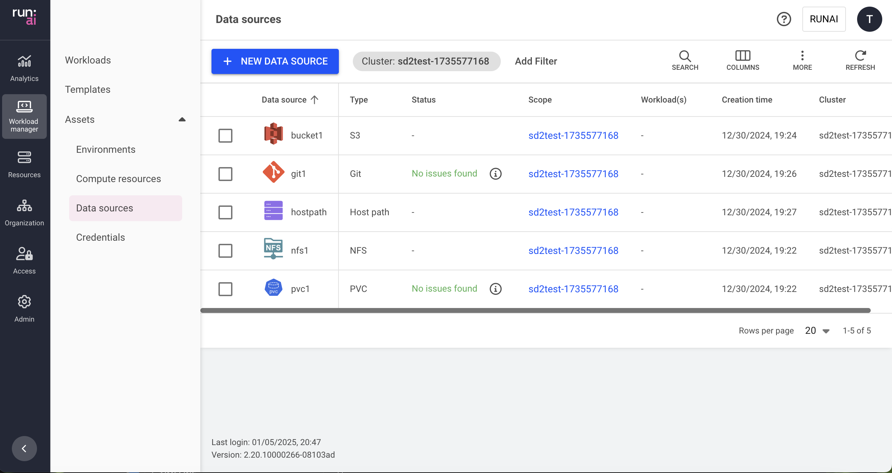

# Data sources

This article explains what data sources are and how to create and use them.

Data sources are a type of [workload asset](workload-assets.md) and represent a location where data is actually stored. They may represent a remote data location, such as NFS, Git, or S3, or a Kubernetes local resource, such as PVC, ConfigMap, HostPath, or Secret.

This configuration simplifies the mapping of the data into the workload’s file system and handles the mounting process during workload creation for reading and writing. These data sources are reusable and can be easily integrated and used by AI practitioners while submitting workloads across various scopes.

## Data sources table

The data sources table can be found under **Workload manager** in the Run:ai platform.

The data sources table provides a list of all the data sources defined in the platform and allows you to manage them.

The data sources table comprises the following columns:

| Column          | Description                                                                                                                                                 |
| --------------- | ----------------------------------------------------------------------------------------------------------------------------------------------------------- |
| Data source     | The name of the data source                                                                                                                                 |
| Description     | A description of the data source                                                                                                                            |
| Type            | The type of data source connected – e.g., S3 bucket, PVC, or others                                                                                         |
| Status          | The different lifecycle [phases](../workloads.md#workload-status) and representation of the data source condition                                           |
| Scope           | The [scope](workload-assets.md#asset-scope) of the data source within the organizational tree. Click the scope name to view the organizational tree diagram |
| Kubernetes name | The unique name of the data sources Kubernetes name as it appears in the cluster                                                                            |
| Workload(s)     | The list of existing workloads that use the data source                                                                                                     |
| Template(s)     | The list of workload templates that use the data source                                                                                                     |
| Created by      | The user who created the data source                                                                                                                        |
| Creation time   | The timestamp for when the data source was created                                                                                                          |
| Cluster         | The cluster that the data source is associated with                                                                                                         |

### Data sources status

The following table describes the data sources' condition and whether they were created successfully for the selected [scope](workload-assets.md#asset-scope).

| Status          | Description                                                                                                                                                                   |
| --------------- | ----------------------------------------------------------------------------------------------------------------------------------------------------------------------------- |
| No issues found | No issues were found while creating the data source                                                                                                                           |
| Issues found    | Issues were found while propagating the data source credentials                                                                                                               |
| Issues found    | The data source couldn’t be created at the cluster                                                                                                                            |
| Creating…       | The data source is being created                                                                                                                                              |
| No status / “-” | When the data source’s scope is an account, the current version of the cluster is not up to date, or the asset is not a cluster-syncing entity, the status can’t be displayed |

### Customizing the table view

* Filter - Click ADD FILTER, select the column to filter by, and enter the filter values
* Search - Click SEARCH and type the value to search by
* Sort - Click each column header to sort by
* Column selection - Click COLUMNS and select the columns to display in the table
* Download table - Click MORE and then click ‘Download as CSV’
* Refresh - Click REFRESH to update the table with the latest data

## Adding a new data source

To create a new data source:

1. Click **+NEW DATA SOURCE**
2. Select the data source type from the list. Follow the step-by-step guide for each data source type:

NFS

A Network File System ([NFS](https://kubernetes.io/docs/concepts/storage/volumes/#nfs)) is a Kubernetes concept used for sharing storage in the cluster among different pods. Like a PVC, the NFS volume’s content remains preserved, even outside the lifecycle of a single pod. However, unlike PVCs, which abstract storage management, NFS provides a method for network-based file sharing. The NFS volume can be pre-populated with data and can be mounted by multiple pod writers simultaneously. At Run:ai, an NFS-type data source is an abstraction that is mapped directly to a Kubernetes NFS volume. This integration allows multiple workloads under various scopes to mount and present the NFS data source.

1. Select the **cluster** under which to create this data source
2. Select a [**scope**](workload-assets.md#asset-scope)
3. Enter a name for the data source. The name must be unique.
4. Optional: Provide a **description** of the data source
5. Set the data origin
   * Enter the **NFS server** (host name or host IP)
   * Enter the **NFS path**
6. Set the data target location
   * **Container path**
7. Optional: Restrictions
   * **Prevent data modification** - When enabled, the data will be mounted with read-only permissions
8. Click **CREATE DATA SOURCE**

PVC

A Persistent Volume Claim ([PVC](https://kubernetes.io/docs/concepts/storage/persistent-volumes/)) is a Kubernetes concept used for managing storage in the cluster, which can be provisioned by an administrator or dynamically by Kubernetes using a StorageClass. PVCs allow users to request specific sizes and access modes (read/write once, read-only many).\
Run:ai ensures that data remains consistent and accessible across various scopes and workloads, beyond the lifecycle of individual pods, which is efficient while working with large datasets typically associated with AI projects.

1. Select the **cluster** under which to create this data source
2. Select a [**scope**](workload-assets.md#asset-scope)
3. Enter a **name** for the data source. The name must be unique.
4. Optional: Provide a **description** of the data source
5. Select PVC:
   *   **Existing PVC**

       This option is relevant when the purpose is to create a PVC-type data source based on an existing PVC in the cluster

       * Select a PVC from the list - (The list is empty if no existing PVCs were [created in advance](datasources.md#creating-pvcs-in-advance))
   *   **New PVC** - creates a new PVC in the cluster. New PVCs are not added to the Existing PVCs list.

       When creating a PVC-type data source and selecting the ‘New PVC’ option, the PVC is immediately created in the cluster (even if no workload has requested this PVC).
6. Select the **storage class**
   * **None -** Proceed without defining a storage class
   *   **Custom storage class** - This option applies when selecting a storage class based on existing storage classes.

       To add new storage classes to the storage class list, and for additional information, check [Kubernetes storage classes](../../infrastructure-procedures/shared-storage.md#kubernetes-storage-classes)
7. Select the **access mode(s)** (multiple modes can be selected)
   * **Read-write by one node** - The volume can be mounted as read-write by a single node.
   * **Read-only by many nodes** - The volume can be mounted as read-only by many nodes.
   * **Read-write by many nodes** - The volume can be mounted as read-write by many nodes.
8. Set the **claim size** and its **units**
9. Select the **volume mode**
   1. **File system** (default) - allows the volume to be mounted as a filesystem, enabling the usage of directories and files.
   2. **Block** - exposes the volume as a block storage, which can be formatted or used by applications directly without a filesystem.
10. Set the data target location
    * **container path**
11. Optional: **Prevent data modification** - When enabled, the data will be mounted with read-only permission.
12. Click **CREATE DATA SOURCE**

After the data source is created, check its status to monitor its proper creation across the selected scope.

S3 Bucket

The [S3 bucket](https://docs.aws.amazon.com/AWSCloudFormation/latest/UserGuide/aws-resource-s3-bucket.html) data source enables the mapping of a remote S3 bucket into the workload’s file system. Similar to a PVC, this mapping remains accessible across different workload executions, extending beyond the lifecycle of individual pods. However, unlike PVCs, data stored in an S3 bucket resides remotely, which may lead to decreased performance during the execution of heavy machine learning workloads. As part of the Run:ai connection to the S3 bucket, you can create [credentials](credentials.md) in order to access and map private buckets.

1. Select the **cluster** under which to create this data source
2. Select a [**scope**](workload-assets.md#asset-scope)
3. Enter a name for the data source. The name must be unique.
4. Optional: Provide a **description** of the data source
5. Set the data origin
   * Set the **S3 service URL**
   * Select the **credential**
     * **None** - for public buckets
     *   **Credential names** - This option is relevant for private buckets based on existing credentials that were created for the scope.

         To add new credentials to the credentials list, and for additional information, check the [Credentials](credentials.md) article.
   * Enter the **bucket name**
6. Set the data target location
   * **container path**
7. Click **CREATE DATA SOURCE**

After a private data source is created, check its status to monitor its proper creation across the selected scope.

Git

A Git-type data source is a Run:ai integration, that enables code to be copied from a Git branch into a dedicated folder in the container. It is mainly used to provide the workload with the latest code repository. As part of the integration with Git, in order to access private repositories, you can add predefined credentials to the data source mapping.

1. Select the **cluster** under which to create this data source
2. Select a [**scope**](workload-assets.md#asset-scope)
3. Enter a name for the data source. The name must be unique.
4. Optional: Provide a **description** of the data source
5. Set the data origin
   * Set the **Repository URL**
   * Set the **Revision** (branch, tag, or hash)- If left empty, it will use the 'HEAD' (latest)
   * Select the **credential**
     * **None** - for public repositories
     *   **Credential names** - This option applies to private repositories based on existing credentials that were created for the scope.

         To add new credentials to the credentials list, and for additional information, check the [Credentials](credentials.md) article.
6. Set the data target location
   * **container path**
7. Click **CREATE DATA SOURCE**

After a private data source is created, check its status to monitor its proper creation across the selected scope.

Host path

A [Host path](https://kubernetes.io/docs/concepts/storage/volumes/#hostpath) volume is a Kubernetes concept that enables mounting a host path file or a directory on the workload’s file system. Like a PVC, the host path volume’s data persists across workloads under various scopes. It also enables data serving from the hosting node.

1. Select the **cluster** under which to create this data source
2. Select a [**scope**](workload-assets.md#asset-scope)
3. Enter a name for the data source. The name must be unique.
4. Optional: Provide a **description** of the data source
5. Set the data origin
   * **host path**
6. Set the data target location
   * **container path**
7. Optional: **Prevent data modification** - When enabled, the data will be mounted with read-only permissions.
8. Click **CREATE DATA SOURCE**

ConfigMap

A [ConfigMap](https://kubernetes.io/docs/concepts/configuration/configmap/) data source is a Run:ai abstraction for the Kubernetes ConfigMap concept. The ConfigMap is used mainly for storage that can be mounted on the workload container for non-confidential data. It is usually represented in key-value pairs (e.g., environment variables, command-line arguments etc.). It allows you to decouple environment-specific system configurations from your container images, so that your applications are easily portable. ConfigMaps must be created on the cluster prior to being used within the Run:ai system.\\

1. Select the **cluster** under which to create this data source
2. Select a [**scope**](workload-assets.md#asset-scope)
3. Enter a name for the data source. The name must be unique.
4. Optional: Provide a **description** of the data source
5. Set the data origin
   * Select the **ConfigMap name** (The list is empty if no existing ConfigMaps were [created in advance](datasources.md#creating-configmaps-in-advance)).
6. Set the data target location
   * **container path**
7. Click **CREATE DATA SOURCE**

Secret

A secret-type data source enables the mapping of a credential into the workload’s file system. Credentials are a workload asset that simplify the complexities of Kubernetes [Secrets](https://kubernetes.io/docs/concepts/configuration/secret/). The credentials mask sensitive access information, such as passwords, tokens, and access keys, which are necessary for gaining access to various resources.

1. Select the **cluster** under which to create this data source
2. Select a [**scope**](workload-assets.md#asset-scope)
3. Enter a name for the data source. The name must be unique.
4. Optional: Provide a **description** of the data source
5. Set the data origin
   *   Select the **credential**

       To add new credentials, and for additional information, check the [Credentials](credentials.md) article.
6. Set the data target location
   * **container path**
7. Click **CREATE DATA SOURCE**

After the data source is created, check its status to monitor its proper creation across the selected scope.


It is also possible to add data sources directly when creating a specific [workspace](../../experiment-using-workspaces/), [training](../../train-models-using-training/) or [inference](../../deploy-models-using-inference/) workload.


## Editing a data source

To edit a data source:

1. Select the data source from the table
2. Click **Rename** to provide it with a new name
3. Click **Copy & Edit** to make any changes to the data source

## Deleting a data source

To delete a data source:

1. Select the data source you want to delete
2. Click **DELETE**
3. Confirm you want to delete the data source


It is not possible to delete an environment being used by an existing workload or template.


## Creating PVCs in advance

Add PVCs in advance to be used when creating a PVC-type data source via the Run:ai UI.

The actions taken by the admin are based on the scope (cluster, department or project) that the admin wants for data source of type PVC. Follow the steps below for each required scope:

### **Cluster scope**

1. Locate the PVC in the Run:ai namespace (`runai`)
2. Provide Run:ai with visibility and authorization to share the PVC to your selected scope by implementing the following label: `run.ai/cluster-wide: "true”`


This step is also relevant for creating the data source of type PVC via API


The PVC is now displayed for that scope in the list of existing PVCs.

### **Department scope**

1. Locate the PVC in the Run:ai namespace (`runai`)
2.  To authorize Run:ai to use the PVC, label it: `run.ai/department: "id"`

    The PVC is now displayed for that scope in the list of existing PVCs.**Project scope**
3. Locate the PVC in the project’s namespace
4. The PVC is now displayed for that scope in the list of existing PVCs.

## Creating ConfigMaps in advance

Add ConfigMaps in advance to be used when creating a ConfigMap-type data source via the Run:ai UI.

### **Cluster scope**

1. Locate the ConfigMap in the Run:ai namespace (`runai`)
2. To authorize Run:ai to use the ConfigMap, label it: `run.ai/cluster-wide: "true”`
3.  The ConfigMap must have a label of `run.ai/resource: <resource-name>`

    The ConfigMap is now displayed for that scope in the list of existing ConfigMaps.

### **Department scope**

1. Locate the ConfigMap in the Run:ai namespace (`runai`)
2. To authorize Run:ai to use the ConfigMap, label it: `run.ai/department: "<department-id>"`
3.  The ConfigMap must have a label of `run.ai/resource: <resource-name>`

    The ConfigMap is now displayed for that scope in the list of existing ConfigMaps.

### **Project scope**

1. Locate the ConfigMap in the project’s namespace
2.  The ConfigMap must have a label of `run.ai/resource: <resource-name>`

    The ConfigMap is now displayed for that scope in the list of existing ConfigMaps.

## Using API

To view the available actions, go to the [Data sources](https://app.run.ai/api/docs#tag/Datasources) API reference.
