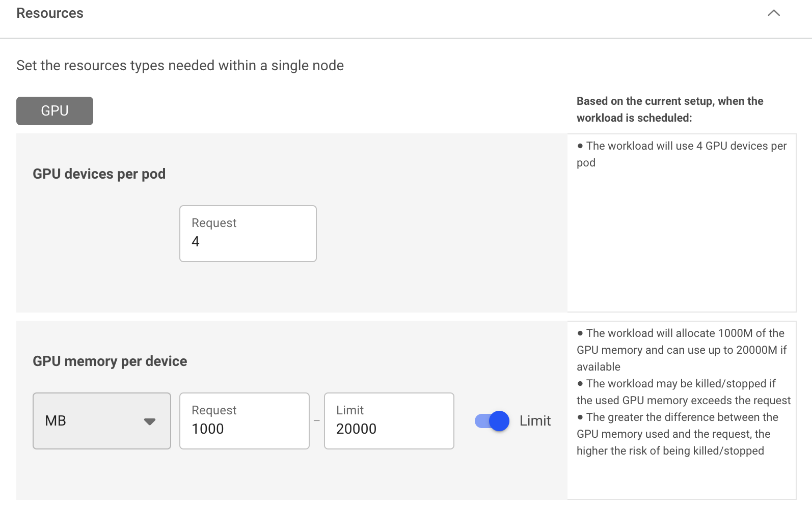
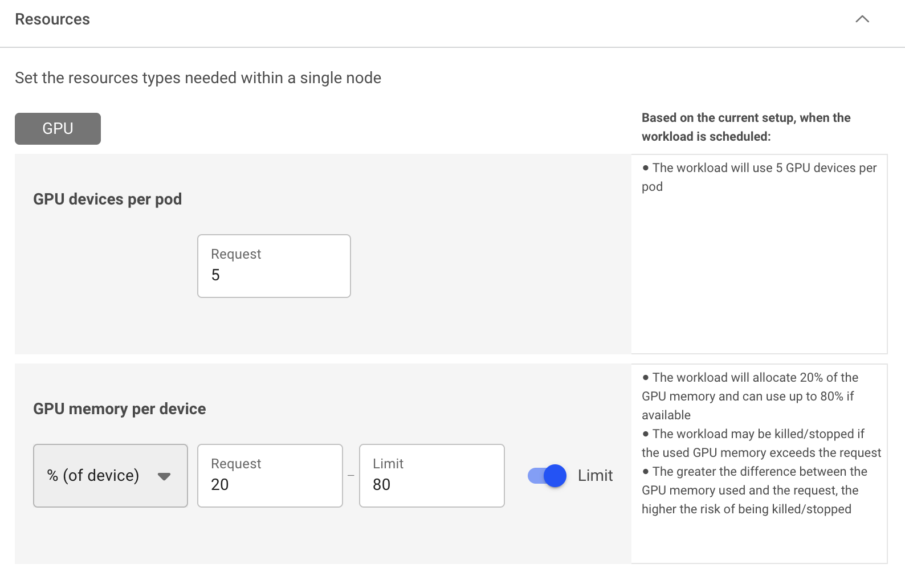

# Dynamic GPU fractions

Many workloads utilize GPU resources intermittently, with long periods of inactivity. These workloads typically need GPU resources when they are running AI applications or debugging a model in development. Other workloads such as inference may utilize GPUs at lower rates than requested, but may demand higher resource usage during peak utilization. The disparity between resource request and actual resource utilization often leads to inefficient utilization of GPUs. This usually occurs when multiple workloads request resources based on their peak demand, despite operating below those peaks for the majority of their runtime.

To address this challenge, Run:ai has introduced dynamic GPU fractions. This feature optimizes GPU utilization by enabling workloads to dynamically adjust their resource usage. It allows users to specify a guaranteed fraction of GPU memory and compute resources with a higher limit that can be dynamically utilized when additional resources are requested. 

## How dynamic GPU fractions work

With dynamic GPU fractions, users can [submit workloads](../workloads-in-runai/workloads.md) using GPU fraction Request and Limit which is achieved by leveraging the Kubernetes Request and Limit notations. You can either:

* Request a GPU fraction (portion) using a percentage of a GPU and a specify a Limit
* Request a GPU memory size (GB, MB) and specify a Limit

When setting a GPU memory limit either as GPU fraction or GPU memory size, the Limit must be equal to or greater than the GPU fractional memory request. Both GPU fraction and GPU memory are translated into the actual requested memory size of the Request (guaranteed resources) and the Limit (burstable resources - non guaranteed).

For example, a user can specify a workload with a GPU fraction request of 0.25 GPU, and add a limit of up to 0.80 GPU. The Run:ai Scheduler schedules the workload to a node that can provide the GPU fraction request (0.25), and then assigns the workload to a GPU. The GPU scheduler monitors the workload and allows it to occupy memory between 0 to 0.80 of the GPU memory (based on the Limit), where only 0.25 of the GPU memory is guaranteed to that workload. The rest of the memory (from 0.25 to 0.8) is “loaned” to the workload, as long as it is not needed by other workloads.

Run:ai automatically manages the state changes between Request and Limit as well as the reverse (when the balance need to be "returned"), updating the the workloads’ utilization vs. Request and Limit parameters in the [metrics pane for each workload]((../workloads-in-runai/workloads.md)).

To guarantee fair quality of service between different workloads using the same GPU, Run:ai developed an extendable GPUOOMKiller (Out Of Memory Killer) component that guarantees the quality of service using Kubernetes semantics for resources of Request and Limit.

The OOMKiller capability requires adding CAP_KILL capabilities to the dynamic GPU fractions and to the Run:ai core scheduling module (toolkit daemon). This capability is enabled by default. 

Dynamic GPU fractions is enabled by default in the cluster. Disabling dynamic GPU fractions in `runaiconfig` removes the CAP_KILL capability. 

```
spec: 
   global: 
     core: 
       dynamicFraction: 
         enabled: true # Boolean field default is true
```

## Multi-GPU dynamic fractions

Run:ai also supports workload submission using multi-GPU dynamic fractions. Multi-GPU dynamic fractions work similarly to dynamic fractions on a single GPU workload, however, instead of a single GPU device, the Run:ai Scheduler allocates the same dynamic fraction pair (Request and Limit) on multiple GPU devices within the same node.  For example, if practitioners develop a new model that uses 8 GPUs and requires 40GB of memory per GPU, but may want to burst out and consume up to the full GPU memory, they can allocate 8×40GB with multi-GPU fractions and a limit of 80GB (e.g. H100 GPU) instead of reserving the full memory of each GPU (e.g. 80GB). This leaves 40GB of GPU memory available on each of the 8 GPUs for other workloads within that node.This is useful during model development, where memory requirements are usually lower due to experimentation with smaller model or configurations.

This approach significantly improves GPU utilization and availability, enabling more precise and often smaller quota requirements for the end user. Time sharing where single GPUs can serve multiple workloads with dynamic fractions remains unchanged, only now, it serves multiple workloads using multi-GPUs per workload.

## Setting dynamic GPU fractions

!!! Note
    Dynamic GPU fractions is disabled by default in the Run:ai UI. To use dynamic GPU fractions, it must be enabled by your Administrator, under General Settings → Resources → GPU resource optimization. 

Using the [compute resources](../workloads-in-runai/workload-assets/compute-resources.md) asset, you can define the compute requirements by specifying your requested GPU portion or GPU memory, and set a Limit. You can then use the compute resource with any of the [Run:ai workload types](../workloads-in-runai/workload-types.md) for single and multi-GPU dynamic fractions. In addition, you will be able to view the workloads’ utilization vs. Request and Limit parameters in the [metrics pane for each workload](../workloads-in-runai/workloads.md).

* **Single dynamic GPU fractions** - Define the compute requirement to run 1 GPU device, by specifying either a fraction (percentage) of the overall memory or specifying the memory request (GB, MB) with a Limit. The limit must be equal to or greater than the GPU fractional memory request.
* **Multi-GPU dynamic fractions** - Define the compute requirement to run multiple GPU devices, by specifying either a fraction (percentage) of the overall memory or specifying the memory request (GB, MB) with a Limit. The limit must be equal to or greater than the GPU fractional memory request.





!!! Note
    When setting a workload with dynamic GPU fractions, (for example, when using it with GPU Request or GPU memory Limits), you practically make the workload burstable. This means it can use memory that is not guaranteed for that workload and is susceptible to an ‘OOM Kill’ signal if the actual owner of that memory requires it back. This applies to non-preemptive workloads as well. For that reason, its recommended that you use dynamic GPU fractions with Interactive workloads running Notebooks. Notebook pods are not evicted when their GPU process is OOM Kill’ed. This behavior is the same as standard Kubernetes burstable CPU workloads.

## Using CLI

To view the available actions, go to the CLI v2 reference and run according to your workload.

## Using API

To view the available actions, go to the [API reference](https://api-docs.run.ai/) and run according to your workload.