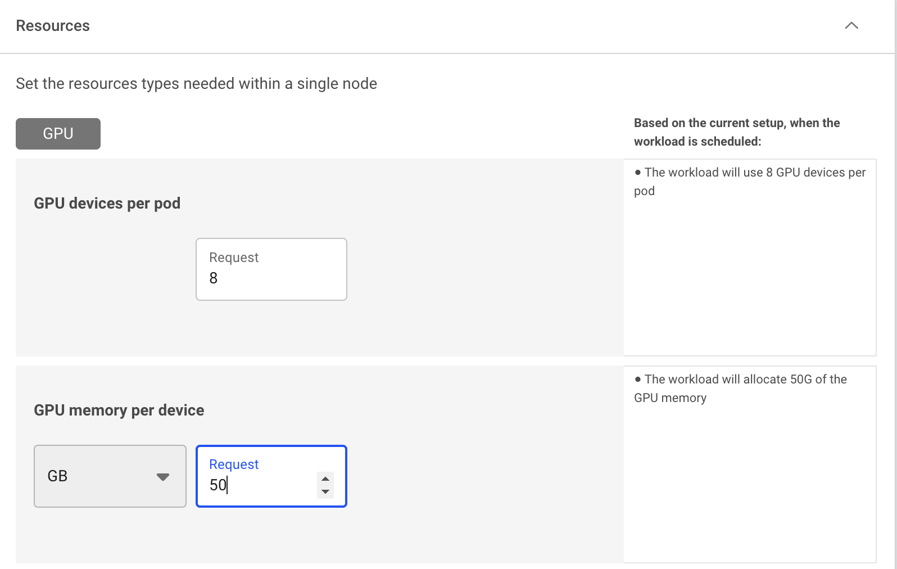

# GPU fractions

To submit a [workload](../workloads-in-runai/workloads.md) with GPU resources in Kubernetes, you typically need to specify an integer number of GPUs. However, workloads often require diverse GPU memory and compute requirements or even use GPUs intermittently depending on the application (such as inference workloads, training workloads or notebooks at the model-creation phase).  Additionally, GPUs are becoming increasingly powerful, offering more processing power and larger memory capacity for applications. Despite the increasing model sizes, the increasing capabilities of GPUs allow them to be effectively shared among multiple users or applications.

Run:ai’s GPU fractions provides an agile and easy-to-use method to share a GPU or multiple GPUs across workloads. With GPU fractions, you can divide the GPU/s memory into smaller chunks and share the GPU/s compute resources between different workloads and users, resulting in higher GPU utilization and more efficient resource allocation.

## Benefits of GPU fractions

Utilizing GPU fractions to share GPU resources among multiple workloads provides numerous advantages for both platform administrators and practitioners, including improved efficiency, resource optimization, and enhanced user experience.

* For the AI practitioner:
  * **Reduced wait time** - Workloads with smaller GPU requests are more likely to be scheduled quickly, minimizing delays in accessing resources.
  * **Increased workload capacity** - More workloads can be run using the same admin-defined GPU [quota](../scheduling-and-resource-optimization/runai-scheduler-concepts-and-principles.md#quota) and available unused resources ([over quota](../scheduling-and-resource-optimization/runai-scheduler-concepts-and-principles.md#over quota)).

* For the platform administrator:
  * **Improved GPU utilization** -  Sharing GPUs across workloads increases the utilization of individual GPUs, resulting in better overall platform efficiency.
  * **Higher resource availability** - More users gain access to GPU resources, ensuring better distribution.
  * **Enhanced workload throughput** -  More workloads can be served per GPU, ensuring maximum output from existing hardware.
  * **Optimized scheduling** - Smaller and dynamic resource allocations gives the [Scheduler](../scheduling-and-resource-optimization/runai-scheduler-concepts-and-principles.md) a higher chance of finding GPU resources for incoming workloads.

## Quota planning with GPU fractions

When planning the quota distribution for your [projects](../manage-ai-initiatives/managing-your-organization/projects.md) and [departments](../manage-ai-initiatives/managing-your-organization/departments.md), using fractions gives the platform administrator the ability to allocate more precise quota per project and department, assuming the usage of GPU fractions or enforcing it with [pre-defined policies](../policies/policy-yaml-reference.md) or [compute resource](../workloads-in-runai/workload-assets/compute-resources.md) templates. 

For example, in an organization with a department budgeted for **two nodes of 8×H100 GPUs** and a team of 32 researchers:
* Allocating 0.5 GPU per researcher ensures all researchers have access to GPU resources. 
* Using fractions enables researchers to run smaller workloads intermittently within their quota or go over their quota by using temporary over quota resources with higher resource demanding workloads.
* Using GPUs for notebook-based model development, where GPUs are not continuously active and can be shared among multiple users.

For more details on mapping your organization and resources, see [Adapting AI initiatives to your organization](../manage-ai-initiatives/adapting-ai-initiatives.md).

## How GPU fractions work

When a workload is submitted, the Scheduler finds a node with a GPU that can satisfy the requested GPU portion or GPU memory, then it schedules the pod to that node. The Run:ai GPU fractions logic, running locally on each Run:ai worker node, allocates the requested memory size on the selected GPU. **Each pod uses a its own separated virtual memory address space.** Run:ai’s GPU fractions logic enforces the requested memory size, so no workload can use more than requested, and no workload can run over another workload’s memory. This gives users the experience of a ‘logical GPU’ per workload. 

While [MIG](../manage-ai-initiatives/managing-your-resources/configuring-mig-profiles.md) requires administrative work to configure every MIG slice, where a slice is a fixed chunk of memory, GPU fractions allow dynamic and fully flexible allocation of GPU memory chunks. By default, GPU fractions use NVIDIA’s time-slicing to share the GPU compute runtime. You can also use the [Run:ai GPU time-slicing](./gpu-time-slicing.md) which allows dynamic and fully flexible splitting of the GPU compute time. 

Run:ai GPU fractions are agile and dynamic allowing a user to allocate and free GPU fractions during the runtime of system, at any size between zero to the maximum GPU portion (100%) or memory size (up to the maximum memory size of a GPU).

The Run:ai Scheduler can work alongside other schedulers. In order to avoid collisions with other schedulers, the Run:ai Scheduler creates special reservation pods. Once a workload is submitted requesting a fraction of a GPU, Run:ai will create a pod in a dedicated runai-reservation namespace with the full GPU as a resource, allowing other schedulers to understand that the GPU is reserved.

!!! Notes
    * Splitting a GPU into fractions may generate some fragmentation of the GPU memory. The [Scheduler](../scheduling-and-resource-optimization/how-the-scheduler-works.md) will try to consolidate GPU resources where feasible (i.e. preemptible workloads).
    * Using [bin-pack](../manage-ai-initiatives/managing-your-resources/node-pools.md#adding-a-new-node-pool) as a scheduling placement strategy can also reduce GPU fragmentation.
    * Using [dynamic GPU fractions](./dynamic-gpu-fractions.md) ensures that even small unused fragments of GPU memory are utilized by workloads. 

## Multi-GPU fractions

Run:ai also supports workload submission using multi-GPU fractions. Multi-GPU fractions work similarly to single-GPU fractions, however, the Run:ai Scheduler allocates the same fraction size on multiple GPU devices within the same node. For example, if practitioners  develop a new model that uses 8 GPUs and requires 40GB of memory per GPU, they can allocate 8×40GB with multi-GPU fractions instead of reserving the full memory of each GPU (e.g. 80GB). This leaves 40GB of GPU memory available on each of the 8 GPUs for other workloads within that node. 

Time sharing where single GPUs can serve multiple workloads with fractions remains unchanged, only now, it serves multiple workloads using multi-GPUs per workload, single-GPU per workload, or a mix of both.

## Deployment considerations

* Selecting a GPU portion using percentages as units does not guarantee the exact memory size. This mean 50% of an A-100-40GB is 20GB while 50% of an A-100-80 is 40GB. To have better control over the exact allocated memory, specify the exact memory size i.e. 40GB.
* Using Run:ai GPU fractions controls the memory split (i.e. 0.5 GPU means 50% of the GPU memory) but not the compute (processing time). To split the compute time, see [Run:ai’s GPU time slicing](./gpu-time-slicing.md).
* Run:ai GPU fractions and [MIG mode](../manage-ai-initiatives/managing-your-resources/configuring-mig-profiles.md) cannot be used on the same node.

## Setting GPU fractions

Using the [compute resources](../workloads-in-runai/workload-assets/compute-resources.md) asset, you can define the compute requirements by specifying your requested GPU portion or GPU memory, and use it with any of the [Run:ai workload types](../workloads-in-runai/workload-types.md) for single GPU and multi-GPU fractions.

* **Single-GPU fractions** - Define the compute requirement to run 1 GPU device, by specifying either a fraction (percentage) of the overall memory or specifying the memory request (GB, MB).
* **Multi-GPU fractions** - Define the compute requirement to run multiple GPU devices, by specifying either a fraction (percentage) of the overall memory or specifying the memory request (GB, MB). 

## Using CLI

To view the available actions, go to the [CLI v2] or the CLI v1 reference and run according to your workload.

## Using API

To view the available actions, go to the [API reference](https://api-docs.run.ai/) and run according to your workload.