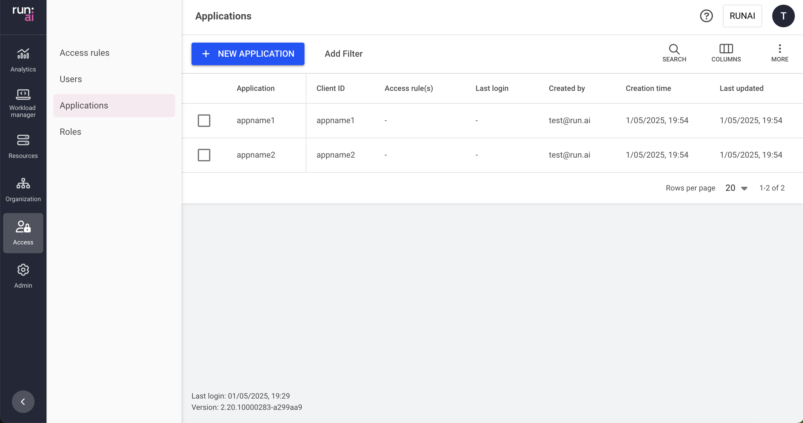

# Applications

This article explains the procedure to manage your organization's applications.

Applications are used for API integrations with Run:ai. An application contains a client ID and a client secret. With the client credentials, you can obtain a token as detailed in [API authentication](../../saas/api-reference/rest-auth.md) and use it within subsequent API calls.

Applications are assigned with [access rules ](accessrules.md)to manage permissions. For example, application **ci-pipeline-prod** is assigned with a **Researcher** role in **Cluster: A**.

## Applications table

The Applications table can be found under **Access** in the Run:ai platform.

The Applications table provides a list of all the applications defined in the platform, and allows you to manage them.

The Applications table consists of the following columns:

| Column         | Description                                        |
| -------------- | -------------------------------------------------- |
| Application    | The name of the application                        |
| Client ID      | The client ID of the application                   |
| Access rule(s) | The access rules assigned to the application       |
| Last login     | The timestamp for the last time the user signed in |
| Created by     | The user who created the application               |
| Creation time  | The timestamp for when the application was created |
| Last updated   | The last time the application was updated          |

### Customizing the table view

* Filter - Click ADD FILTER, select the column to filter by, and enter the filter values
* Search - Click SEARCH and type the value to search by
* Sort - Click each column header to sort by
* Column selection - Click COLUMNS and select the columns to display in the table
* Download table - Click MORE and then Click Download as CSV. Export to CSV is limited to 20,000 rows.

## Creating an application

To create an application:

1. Click **+NEW APPLICATION**
2. Enter the application’s **name**
3. Click **CREATE**
4. Copy the **Client ID** and **Client secret** and store them securely
5. Click **DONE**


The client secret is visible only at the time of creation. It cannot be recovered but can be regenerated.


## Adding an access rule to an application

To create an access rule:

1. Select the application you want to add an access rule for
2. Click **ACCESS RULES**
3. Click **+ACCESS RULE**
4. Select a role
5. Select a scope
6. Click **SAVE RULE**
7. Click **CLOSE**

## Deleting an access rule from an application

To delete an access rule:

1. Select the application you want to remove an access rule from
2. Click **ACCESS RULES**
3. Find the access rule assigned to the user you would like to delete
4. Click on the trash icon
5. Click **CLOSE**

## Regenerating client secret

To regenerate a client secret:

1. Locate the application you want to regenerate its client secret
2. Click **REGENERATE CLIENT SECRET**
3. Click **REGENERATE**
4. Copy the **New client secret** and store it securely
5. Click **DONE**


Regenerating a client secret revokes the previous one.


## Deleting an application

1. Select the application you want to delete
2. Click **DELETE**
3. On the dialog, click **DELETE** to confirm

## Using API

Go to the [Applications](https://app.run.ai/api/docs#tag/Applications), [Access rules](https://app.run.ai/api/docs#tag/Access-rules) API reference to view the available actions
