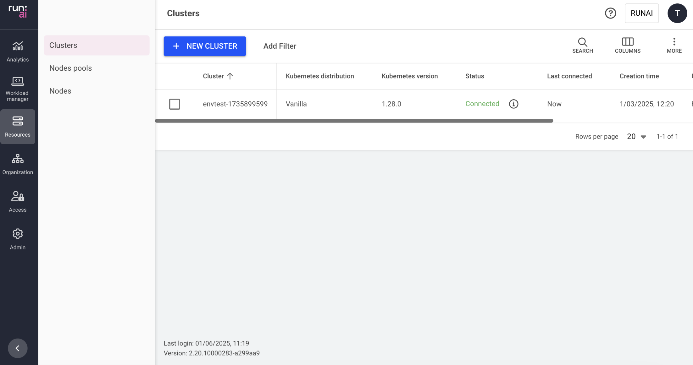

# Clusters

This article explains the procedure to view and manage Clusters.

The Cluster table provides a quick and easy way to see the status of your cluster.

## Clusters table

The Clusters table can be found under **Resources** in the Run:ai platform.

The clusters table provides a list of the clusters added to Run:ai platform, along with their status.

<figure><figcaption></figcaption></figure>

The clusters table consists of the following columns:

| Column                  | Description                                                                                                                                                                             |
| ----------------------- | --------------------------------------------------------------------------------------------------------------------------------------------------------------------------------------- |
| Cluster                 | The name of the cluster                                                                                                                                                                 |
| Status                  | The status of the cluster. For more information see the [table below](clusters.md#cluster-status). Hover over the information icon for a short description and links to troubleshooting |
| Creation time           | The timestamp when the cluster was created                                                                                                                                              |
| URL                     | The URL that was given to the cluster                                                                                                                                                   |
| Run:ai cluster version  | The Run:ai version installed on the cluster                                                                                                                                             |
| Kubernetes distribution | The flavor of Kubernetes distribution                                                                                                                                                   |
| Kubernetes version      | The version of Kubernetes installed                                                                                                                                                     |
| Run:ai cluster UUID     | The unique ID of the cluster                                                                                                                                                            |

### Customizing the table view

* Filter - Click ADD FILTER, select the column to filter by, and enter the filter values
* Search - Click SEARCH and type the value to search by
* Sort - Click each column header to sort by
* Column selection - Click COLUMNS and select the columns to display in the table
* Download table - Click MORE and then Click Download as CSV. Export to CSV is limited to 20,000 rows.

### Cluster status

| Status                | Description                                                                                                                                                                                          |
| --------------------- | ---------------------------------------------------------------------------------------------------------------------------------------------------------------------------------------------------- |
| Waiting to connect    | The cluster has never been connected.                                                                                                                                                                |
| Disconnected          | There is no communication from the cluster to the Control plane. This may be due to a network issue. [See troubleshooting scenarios.](clusters.md#troubleshooting-scenarios)                         |
| Missing prerequisites | Some prerequisites are missing from the cluster. As a result, some features may be impacted. [See troubleshooting scenarios.](clusters.md#troubleshooting-scenarios)                                 |
| Service issues        | At least one of the services is not working properly. You can view the list of nonfunctioning services for more information. [See troubleshooting scenarios.](clusters.md#troubleshooting-scenarios) |
| Connected             | The Run:ai cluster is connected, and all Run:ai services are running.                                                                                                                                |

## Adding a new cluster

To add a new cluster, see the [installation guide](../../saas/cluster-installation/install-using-helm.md).

## Removing a cluster

1. Select the cluster you want to remove
2. Click **REMOVE**
3. A dialog appears: Make sure to carefully read the message before removing
4. Click **REMOVE** to confirm the removal.

### Using the API

Go to the [Clusters](https://app.run.ai/api/docs#tag/Clusters) API reference to view the available actions

## Troubleshooting

Before starting, make sure you have access to the Kubernetes cluster where Run:ai is deployed with the necessary permissions

### Troubleshooting scenarios

<details>

<summary>Cluster disconnected</summary>

**Description:** When the cluster's status is ‘disconnected’, there is no communication from the cluster services reaching the Run:ai Platform. This may be due to networking issues or issues with Run:ai services.

**Mitigation:**

1. Check Run:ai’s services status:
   1. Open your terminal
   2. Make sure you have access to the Kubernetes cluster with permissions to view pods
   3.  Copy and paste the following command to verify that Run:ai’s services are running:

       ```bash
       kubectl get pods -n runai | grep -E 'runai-agent|cluster-sync|assets-sync'
       ```
   4. If any of the services are not running, see the ‘cluster has service issues’ scenario.
2. **Check the network connection**
   1. Open your terminal
   2. Make sure you have access to the Kubernetes cluster with permissions to create pods
   3.  Copy and paste the following command to create a connectivity check pod:

       ```bash
       kubectl run control-plane-connectivity-check -n runai --image=wbitt/network-multitool --command -- /bin/sh -c 'curl -sSf <control-plane-endpoint> > /dev/null && echo "Connection Successful" || echo "Failed connecting to the Control Plane"'
       ```
   4. Replace `<control-plane-endpoint>` with the URL of the Control Plane in your environment. If the pod fails to connect to the Control Plane, check for potential network policies
3. **Check and modify the network policies**
   1. Open your terminal
   2.  Copy and paste the following command to check the existence of network policies:

       ```bash
       kubectl get networkpolicies -n runai
       ```
   3.  Review the policies to ensure that they allow traffic from the Run:ai namespace to the Control Plane. If necessary, update the policies to allow the required traffic

       Example of allowing traffic:

       ```yaml
       apiVersion: networking.k8s.io/v1
       kind: NetworkPolicy
       metadata:
         name: allow-control-plane-traffic
         namespace: runai
       spec:
         podSelector:
           matchLabels:
             app: runai
         policyTypes:
           - Ingress
           - Egress
         egress:
           - to:
               - ipBlock:
                   cidr: <control-plane-ip-range>
             ports:
               - protocol: TCP
                 port: <control-plane-port>
         ingress:
           - from:
               - ipBlock:
                   cidr: <control-plane-ip-range>
             ports:
               - protocol: TCP
                 port: <control-plane-port>
       ```
   4. Check infrastructure-level configurations:
      * Ensure that firewall rules and security groups allow traffic between your Kubernetes cluster and the Control Plane
      * Verify required ports and protocols:
        * Ensure that the necessary ports and protocols for Run:ai’s services are not blocked by any firewalls or security groups
4. **Check Run:ai services logs**
   1. Open your terminal
   2. Make sure you have access to the Kubernetes cluster with permissions to view logs
   3.  Copy and paste the following commands to view the logs of the Run:ai services:

       ```bash
       kubectl logs deployment/runai-agent -n runai
       kubectl logs deployment/cluster-sync -n runai
       kubectl logs deployment/assets-sync -n runai
       ```
   4. Try to identify the problem from the logs. If you cannot resolve the issue, continue to the next step.
5.  **Diagnosing internal network issues:**\
    Run:ai operates on Kubernetes, which uses its internal subnet and DNS services for communication between pods and services. If you find connectivity issues in the logs, the problem might be related to Kubernetes' internal networking.

    To diagnose DNS or connectivity issues, you can start a debugging \{{glossary.Pod\}} with networking utilities:

    1.  Copy the following command to your terminal, to start a pod with networking tools:

        ```bash
        kubectl run -i --tty netutils --image=dersimn/netutils -- bash
        ```

        This command creates an interactive pod (`netutils`) where you can use networking commands like `ping`, `curl`, `nslookup`, etc., to troubleshoot network issues.
    2. Use this pod to perform network resolution tests and other diagnostics to identify any DNS or connectivity problems within your Kubernetes \{{glossary.Cluster\}}.
6. **Contact Run:ai’s support**
   * If the issue persists, [contact Run:ai’s support](https://runai.my.salesforce-sites.com/casesupport/CreateCaseForm?email=test@run.ai) for assistance.

</details>

<details>

<summary>Cluster has service issues</summary>

**Description:** When a cluster's status is ‘Has service issues\`, it means that one or more Run:ai services running in the cluster are not available.

**Mitigation:**

1. **Verify non-functioning services**
   1. Open your terminal
   2. Make sure you have access to the Kubernetes cluster with permissions to view the `runaiconfig` resource
   3.  Copy and paste the following command to determine which services are not functioning:

       ```bash
       kubectl get runaiconfig -n runai runai -ojson | jq -r '.status.conditions | map(select(.type == "Available"))'
       ```
2. **Check for Kubernetes events**
   1. Open your terminal
   2. Make sure you have access to the Kubernetes cluster with permissions to view events
   3. Copy and paste the following command to get all [Kubernetes events](https://kubernetes.io/docs/reference/kubernetes-api/cluster-resources/event-v1/):
3. **Inspect resource details**
   1. Open your terminal
   2. Make sure you have access to the Kubernetes cluster with permissions to describe resources
   3.  Copy and paste the following command to check the details of the required resource:

       ```bash
       kubectl describe <resource_type> <name>
       ```
4. **Contact Run:ai’s Support**
   * If the issue persists, contact [contact Run:ai’s support](https://runai.my.salesforce-sites.com/casesupport/CreateCaseForm?email=test@run.ai) for assistance.

</details>

<details>

<summary>Cluster is waiting to connect</summary>

**Description:** When the cluster's status is ‘waiting to connect’, it means that no communication from the cluster services reaches the Run:ai Platform. This may be due to networking issues or issues with Run:ai services.

**Mitigation:**

1. **Check Run:ai’s services status**
   1. Open your terminal
   2. Make sure you have access to the Kubernetes cluster with permissions to view pods
   3.  Copy and paste the following command to verify that Run:ai’s services are running:

       ```bash
       kubectl get pods -n runai | grep -E 'runai-agent|cluster-sync|assets-sync'
       ```
   4. If any of the services are not running, see the ‘cluster has service issues’ scenario.
2. **Check the network connection**
   1. Open your terminal
   2. Make sure you have access to the Kubernetes cluster with permissions to create pods
   3.  Copy and paste the following command to create a connectivity check pod:

       ```bash
       kubectl run control-plane-connectivity-check -n runai --image=wbitt/network-multitool --command -- /bin/sh -c 'curl -sSf <control-plane-endpoint> > /dev/null && echo "Connection Successful" || echo "Failed connecting to the Control Plane"'
       ```
   4. Replace `<control-plane-endpoint>` with the URL of the Control Plane in your environment. If the pod fails to connect to the Control Plane, check for potential network policies:
3. **Check and modify the network policies**
   1. Open your terminal
   2.  Copy and paste the following command to check the existence of network policies:

       ```bash
       kubectl get networkpolicies -n runai
       ```
   3. Review the policies to ensure that they allow traffic from the Run:ai namespace to the Control Plane. If necessary, update the policies to allow the required traffic
   4.  Example of allowing traffic:

       ```yaml
       apiVersion: networking.k8s.io/v1
       kind: NetworkPolicy
       metadata:
         name: allow-control-plane-traffic
         namespace: runai
       spec:
         podSelector:
           matchLabels:
             app: runai
         policyTypes:
           - Ingress
           - Egress
         egress:
           - to:
               - ipBlock:
                   cidr: <control-plane-ip-range>
             ports:
               - protocol: TCP
                 port: <control-plane-port>
         ingress:
           - from:
               - ipBlock:
                   cidr: <control-plane-ip-range>
             ports:
               - protocol: TCP
                 port: <control-plane-port>
       ```
   5. Check infrastructure-level configurations:
   6. Ensure that firewall rules and security groups allow traffic between your Kubernetes cluster and the Control Plane
   7. Verify required ports and protocols:
      * Ensure that the necessary ports and protocols for Run:ai’s services are not blocked by any firewalls or security groups
4. **Check Run:ai services logs**
   1. Open your terminal
   2. Make sure you have access to the Kubernetes cluster with permissions to view logs
   3.  Copy and paste the following commands to view the logs of the Run:ai services:

       ```bash
       kubectl logs deployment/runai-agent -n runai
       kubectl logs deployment/cluster-sync -n runai
       kubectl logs deployment/assets-sync -n runai
       ```
   4. Try to identify the problem from the logs. If you cannot resolve the issue, continue to the next step
5. **Contact Run:ai’s support**
   * If the issue persists, [contact Run:ai’s support](https://runai.my.salesforce-sites.com/casesupport/CreateCaseForm?email=test@run.ai) for assistance

</details>

<details>

<summary>Cluster is missing prerequisites</summary>

**Description:** When a cluster's status displays Missing prerequisites, it indicates that at least one of the Mandatory Prerequisites has not been fulfilled. In such cases, Run:ai services may not function properly.

**Mitigation:**

If you have ensured that all prerequisites are installed and the status still shows _missing prerequisites_, follow these steps:

1. Check the message in the Run:ai platform for further details regarding the missing prerequisites.
2. **Inspect the** `runai-public` ConfigMap:
   1.  Open your terminal. In the terminal, type the following command to list all ConfigMaps in the `runai-public` namespace:

       ```bash
       kubectl get configmap -n runai-public
       ```
3. **Describe the ConfigMap**
   1. Locate the ConfigMap named `runai-public` from the list
   2.  To view the detailed contents of this ConfigMap, type the following command:

       ```bash
       kubectl describe configmap runai-public -n runai-public
       ```
4. **Find Missing Prerequisites**
   1. In the output displayed, look for a section labeled `dependencies.required`
   2. This section provides detailed information about any missing resources or prerequisites. Review this information to identify what is needed
5. **Contact Run:ai’s support**
   * If the issue persists, [contact Run:ai’s support](https://runai.my.salesforce-sites.com/casesupport/CreateCaseForm?email=test@run.ai) for assistance

</details>
