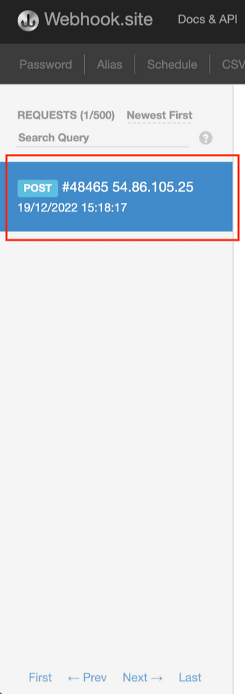

# Run:ai system monitoring

This article explains how to configure Run:ai to generate health alerts and to connect these alerts to alert-management systems within your organization. Alerts are generated for Run:ai clusters.

## Alert infrastructure

Run:ai uses Prometheus for externalizing metrics and providing visibility to end-users. The Run:ai Cluster installation includes Prometheus or can connect to an existing Prometheus instance used in your organization. The alerts are based on the Prometheus AlertManager. Once installed, it is enabled by default.

This document explains how to:

* Configure alert destinations - triggered alerts send data to specified destinations
* Understand the out-of-the-box cluster alerts, provided by Run:ai
* Add additional custom alerts

## Prerequisites

* A Kubernetes cluster with the necessary permissions
* Up and running Run:ai environment, including Prometheus Operator
* [kubectl](https://kubernetes.io/docs/reference/kubectl/) command-line tool installed and configured to interact with the cluster

## Set up

Use the steps below to set up monitoring alerts.

### Validating Prometheus operator installed

1. Verify that the Prometheus Operator Deployment is running. Copy the following command and paste it in your terminal, where you have access to the Kubernetes cluster:

```bash
kubectl get deployment kube-prometheus-stack-operator -n monitoring
```

In your terminal, you can see an output indicating the deployment's status, including the number of replicas and their current state.

2. Verify that Prometheus instances are running. Copy the following command and paste it in your terminal:

```bash
kubectl get prometheus -n runai
```

You can see the Prometheus instance(s) listed along with their status.

### Enabling Prometheus AlertManager

In each of the steps in this section, copy the content of the code snippet to a new YAML file (e.g., `step1.yaml`).

1. Copy the following command to your terminal, to apply the YAML file to the cluster:

```bash
kubectl apply -f step1.yaml 
```

2. Copy the following command to your terminal to create the AlertManager CustomResource, to enable AlertManager:

```yaml
apiVersion: monitoring.coreos.com/v1  
kind: Alertmanager  
metadata:  
   name: runai  
   namespace: runai  
spec:  
   replicas: 1  
   alertmanagerConfigSelector:  
      matchLabels:
         alertmanagerConfig: runai 
```

3. Copy the following command to your terminal to validate that the AlertManager instance has started:

```bash
kubectl get alertmanager -n runai
```

4. Copy the following command to your terminal to validate that the Prometheus operator has created a Service for AlertManager:

```bash
kubectl get svc alertmanager-operated -n runai
```

### Configuring Prometheus to send alerts

1. Open the terminal on your local machine or another machine that has access to your Kubernetes cluster
2. Copy and paste the following command in your terminal to edit the Prometheus configuration for the `runai` Namespace:

```bash
kubectl edit prometheus runai -n runai
```

This command opens the Prometheus configuration file in your default text editor (usually `vi` or `nano`).

3. Copy and paste the following text to your terminal to change the configuration file:

```yaml
alerting:  
   alertmanagers:  
      - namespace: runai  
        name: alertmanager-operated  
        port: web
```

4. Save the changes and exit the text editor.


To save changes using `vi`, type `:wq` and press Enter.\
The changes are applied to the Prometheus configuration in the cluster.


## Alert destinations

Set out below are the various alert destinations.

### Configuring AlertManager for custom email alerts

In each step, copy the contents of the code snippets to a new file and apply it to the cluster using `kubectl apply -f`.

1. Add your smtp password as a secret:

```yaml
apiVersion: v1  
kind: Secret  
metadata:  
   name: alertmanager-smtp-password  
   namespace: runai  
stringData:
   password: "your_smtp_password"
```

2. Replace the relevant smtp details with your own, then apply the `alertmanagerconfig` using `kubectl apply`.

```yaml
 apiVersion: monitoring.coreos.com/v1alpha1  
 kind: AlertmanagerConfig  
 metadata:  
   name: runai  
   namespace: runai  
 labels:  
    alertmanagerConfig: runai  
 spec:  
    route:  
       continue: true  
       groupBy:   
       - alertname

       groupWait: 30s  
       groupInterval: 5m  
       repeatInterval: 1h

    matchers:  
    - matchType: =~  
      name: alertname  
      value: Runai.*

    receiver: email

 receivers:  
 - name: 'email'  
   emailConfigs:  
   - to: '<destination_email_address>'  
     from: '<from_email_address>'  
     smarthost: 'smtp.gmail.com:587'  
     authUsername: '<smtp_server_user_name>'  
     authPassword:  
       name: alertmanager-smtp-password
         key: password  
```

3. Save and exit the editor. The configuration is automatically reloaded.

### Third party alert destinations

Prometheus AlertManager provides a structured way to connect to alert-management systems. There are built-in plugins for popular systems such as PagerDuty and OpsGenie, including a generic Webhook.

#### Example: Integrating Run:ai with a Webhook

1. Use [webhook.site](https://webhook.site/) to get a unique URL.
2. Use the upgrade cluster instructions to modify the values file:\
   Edit the values file to add the following, and replace `<WEB-HOOK-URL>` with the URL from [webhook.site](http://webhook.site):

```yaml
codekube-prometheus-stack:  
  ...  
  alertmanager:  
    enabled: true  
    config:  
      global:  
        resolve_timeout: 5m  
      receivers:  
      - name: "null"  
      - name: webhook-notifications  
        webhook_configs:  
          - url: <WEB-HOOK-URL>  
            send_resolved: true  
      route:  
        group_by:  
        - alertname  
        group_interval: 5m  
        group_wait: 30s  
        receiver: 'null'  
        repeat_interval: 10m  
        routes:  
        - receiver: webhook-notifications
```

3. Verify that you are receiving alerts on the [webhook.site](https://webhook.site/), in the left pane:



### Built-in alerts

A Run:ai cluster comes with several built-in alerts. Each alert notifies on a specific functionality of a Run:ai’s entity. There is also a single, inclusive alert: `Run:ai Critical Problems`, which aggregates all component-based alerts into a single cluster health test.

#### Runai agent cluster info push rate low

| **Meaning**                    | The `cluster-sync` Pod in the `runai` namespace might not be functioning properly                                                                                                                                                                                                                                                                                                                                                                                                                                                                                                                                                                                                                                                                                                                                                                                                                                                                                                                                                                                                                                                  |
| ------------------------------ | ---------------------------------------------------------------------------------------------------------------------------------------------------------------------------------------------------------------------------------------------------------------------------------------------------------------------------------------------------------------------------------------------------------------------------------------------------------------------------------------------------------------------------------------------------------------------------------------------------------------------------------------------------------------------------------------------------------------------------------------------------------------------------------------------------------------------------------------------------------------------------------------------------------------------------------------------------------------------------------------------------------------------------------------------------------------------------------------------------------------------------------- |
| **Impact**                     | Possible impact - no info/partial info from the cluster is being synced back to the control-plane                                                                                                                                                                                                                                                                                                                                                                                                                                                                                                                                                                                                                                                                                                                                                                                                                                                                                                                                                                                                                                  |
| **Severity**                   | Critical                                                                                                                                                                                                                                                                                                                                                                                                                                                                                                                                                                                                                                                                                                                                                                                                                                                                                                                                                                                                                                                                                                                           |
| **Diagnosis**                  | `kubectl get pod -n runai` to see if the `cluster-sync` pod is running                                                                                                                                                                                                                                                                                                                                                                                                                                                                                                                                                                                                                                                                                                                                                                                                                                                                                                                                                                                                                                                             |
| **Troubleshooting/Mitigation** | <p>To diagnose issues with the <code>cluster-sync</code> pod, follow these steps:</p><ol><li><strong>Paste the following command to your terminal, to receive detailed information about the</strong> <code>cluster-sync</code> deployment:<code>kubectl describe deployment cluster-sync -n runai</code></li><li><strong>Check the Logs</strong>: Use the following command to view the logs of the <code>cluster-sync</code> deployment:<code>kubectl logs deployment/cluster-sync -n runai</code></li><li><strong>Analyze the Logs and Pod Details</strong>: From the information provided by the logs and the deployment details, attempt to identify the reason why the <code>cluster-sync</code> pod is not functioning correctly</li><li><strong>Check Connectivity</strong>: Ensure there is a stable network connection between the cluster and the Run:ai Control Plane. A connectivity issue may be the root cause of the problem.</li><li><strong>Contact Support</strong>: If the network connection is stable and you are still unable to resolve the issue, contact Run:ai support for further assistance</li></ol> |

#### Runai agent pull rate low

| **Meaning**                    | The `runai-agent` pod may be too loaded, is slow in processing data (possible in very big clusters), or the `runai-agent` pod itself in the `runai` namespace may not be functioning properly.                                                                                                                                                                                                                                                                                                                                                                                                                                                                                                                                                                                                                                                                                                                                                                                                                                                                                                                                                                                                                                                                                                                                                                                                                                                                                                                                                                                                                                                                                                                                            |
| ------------------------------ | ----------------------------------------------------------------------------------------------------------------------------------------------------------------------------------------------------------------------------------------------------------------------------------------------------------------------------------------------------------------------------------------------------------------------------------------------------------------------------------------------------------------------------------------------------------------------------------------------------------------------------------------------------------------------------------------------------------------------------------------------------------------------------------------------------------------------------------------------------------------------------------------------------------------------------------------------------------------------------------------------------------------------------------------------------------------------------------------------------------------------------------------------------------------------------------------------------------------------------------------------------------------------------------------------------------------------------------------------------------------------------------------------------------------------------------------------------------------------------------------------------------------------------------------------------------------------------------------------------------------------------------------------------------------------------------------------------------------------------------------- |
| **Impact**                     | Possible impact - no info/partial info from the control-plane is being synced in the cluster                                                                                                                                                                                                                                                                                                                                                                                                                                                                                                                                                                                                                                                                                                                                                                                                                                                                                                                                                                                                                                                                                                                                                                                                                                                                                                                                                                                                                                                                                                                                                                                                                                              |
| **Severity**                   | Critical                                                                                                                                                                                                                                                                                                                                                                                                                                                                                                                                                                                                                                                                                                                                                                                                                                                                                                                                                                                                                                                                                                                                                                                                                                                                                                                                                                                                                                                                                                                                                                                                                                                                                                                                  |
| **Diagnosis**                  | Run: `kubectl get pod -n runai` And see if the `runai-agent` pod is running.                                                                                                                                                                                                                                                                                                                                                                                                                                                                                                                                                                                                                                                                                                                                                                                                                                                                                                                                                                                                                                                                                                                                                                                                                                                                                                                                                                                                                                                                                                                                                                                                                                                              |
| **Troubleshooting/Mitigation** | <p>To diagnose issues with the <code>runai-agent</code> pod, follow these steps:</p><ol><li><strong>Describe the Deployment</strong>: Run the following command to get detailed information about the <code>runai-agent</code> deployment:<code>kubectl describe deployment runai-agent -n runai</code></li><li><strong>Check the Logs</strong>: Use the following command to view the logs of the <code>runai-agent</code> deployment:<code>kubectl logs deployment/runai-agent -n runai</code></li><li><strong>Analyze the Logs and Pod Details</strong>: From the information provided by the logs and the deployment details, attempt to identify the reason why the <code>runai-agent</code> pod is not functioning correctly. There may be a connectivity issue with the control plane.</li><li><strong>Check Connectivity</strong>: Ensure there is a stable network connection between the <code>runai-agent</code> and the control plane. A connectivity issue may be the root cause of the problem.</li><li><strong>Consider Cluster Load</strong>: If the <code>runai-agent</code> appears to be functioning properly but the cluster is very large and heavily loaded, it may take more time for the agent to process data from the control plane.</li><li><strong>Adjust Alert Threshold</strong>: If the cluster load is causing the alert to fire, you can adjust the threshold at which the alert triggers. The default value is 0.05. You can try changing it to a lower value (e.g., 0.045 or 0.04).To edit the value, paste the following in your terminal:<code>kubectl edit runaiconfig -n runai/</code> In the editor, navigate to:</li></ol><pre class="language-yaml"><code class="lang-yaml">spec:
</code></pre> |
| prometheus:                    |                                                                                                                                                                                                                                                                                                                                                                                                                                                                                                                                                                                                                                                                                                                                                                                                                                                                                                                                                                                                                                                                                                                                                                                                                                                                                                                                                                                                                                                                                                                                                                                                                                                                                                                                           |

```
agentPullPushRateMinForAlert: &#x3C;new_value>
```

If the `agentPullPushRateMinForAlert` value does not exist, add it under `spec -> prometheus`

|

#### Runai container memory usage critical

| **Meaning**                    | `Runai` container is using more than 90% of its Memory limit                                                                              |
| ------------------------------ | ----------------------------------------------------------------------------------------------------------------------------------------- |
| **Impact**                     | The container might run out of memory and crash.                                                                                          |
| **Severity**                   | Critical                                                                                                                                  |
| **Diagnosis**                  | Calculate the memory usage, this is performed by pasting the following to your terminal: `container_memory_usage_bytes{namespace=~"runai` |
| **Troubleshooting/Mitigation** | Add more memory resources to the container. If the issue persists, contact Run:ai                                                         |

#### Runai container memory usage warning

| **Meaning**                    | Runai container is using more than 80% of its memory limit                                                                               |
| ------------------------------ | ---------------------------------------------------------------------------------------------------------------------------------------- |
| **Impact**                     | The container might run out of memory and crash                                                                                          |
| **Severity**                   | Warning                                                                                                                                  |
| **Diagnosis**                  | Calculate the memory usage, this can be done by pasting the following to your terminal: `container_memory_usage_bytes{namespace=~"runai` |
| **Troubleshooting/Mitigation** | Add more memory resources to the container. If the issue persists, contact Run:ai                                                        |

#### Runai container restarting

| **Meaning**                    | `Runai` container has restarted more than twice in the last 10 min                                                                                                                                                                                                                                           |
| ------------------------------ | ------------------------------------------------------------------------------------------------------------------------------------------------------------------------------------------------------------------------------------------------------------------------------------------------------------ |
| **Impact**                     | The container might become unavailable and impact the Run:ai system                                                                                                                                                                                                                                          |
| **Severity**                   | Warning                                                                                                                                                                                                                                                                                                      |
| **Diagnosis**                  | To diagnose the issue and identify the problematic pods, paste this into your terminal: `kubectl get pods -n runai kubectl get pods -n runai-backend`One or more of the pods have a restart count >= 2.                                                                                                      |
| **Troubleshooting/Mitigation** | Paste this into your terminal:`kubectl logs -n NAMESPACE POD_NAME`Replace `NAMESPACE` and `POD_NAME` with the relevant pod information from the previous step. Check the logs for any standout issues and verify that the container has sufficient resources. If you need further assistance, contact Run:ai |

#### Runai CPU usage warning

| **Meaning**                    | `runai` container is using more than 80% of its CPU limit                                                                                  |
| ------------------------------ | ------------------------------------------------------------------------------------------------------------------------------------------ |
| **Impact**                     | This might cause slowness in the operation of certain Run:ai features.                                                                     |
| **Severity**                   | Warning                                                                                                                                    |
| **Diagnosis**                  | Paste the following query to your terminal in order to calculate the CPU usage: `rate(container_cpu_usage_seconds_total{namespace=~"runai` |
| **Troubleshooting/Mitigation** | Add more CPU resources to the container. If the issue persists, please contact Run:ai.                                                     |

#### Runai critical problem

| **Meaning**   | One of the critical Run:ai alerts is currently active                    |
| ------------- | ------------------------------------------------------------------------ |
| **Impact**    | Impact is based on the active alert                                      |
| **Severity**  | Critical                                                                 |
| **Diagnosis** | Check Run:ai alerts in Prometheus to identify any active critical alerts |

Unknown state alert for a node

| **Meaning**   | The Kubernetes node hosting GPU workloads is in an unknown state, and its health and readiness cannot be determined.                                                                                                                                                                                                                                                         |
| ------------- | ---------------------------------------------------------------------------------------------------------------------------------------------------------------------------------------------------------------------------------------------------------------------------------------------------------------------------------------------------------------------------- |
| **Impact**    | This may interrupt GPU workload scheduling and execution.                                                                                                                                                                                                                                                                                                                    |
| **Severity**  | <p><strong>Critical</strong> - Node is either unschedulable or has unknown status. The node is in one of the following states:</p><ul><li><code>Ready=Unknown</code>: The control plane cannot communicate with the node.</li><li><code>Ready=False</code>: The node is not healthy.</li><li><code>Unschedulable=True</code>: The node is marked as unschedulable.</li></ul> |
| **Diagnosis** | Check the node's status using kubectl describe node, verify Kubernetes API server connectivity, and inspect system logs for GPU-specific or node-level errors.                                                                                                                                                                                                               |

#### Low Memory Node Alert

| **Meaning**   | The Kubernetes node hosting GPU workloads has insufficient memory to support current or upcoming workloads.                                            |
| ------------- | ------------------------------------------------------------------------------------------------------------------------------------------------------ |
| **Impact**    | GPU workloads may fail to schedule, experience degraded performance, or crash due to memory shortages, disrupting dependent applications.              |
| **Severity**  | <p><strong>Critical</strong> - Node is using more than 90% of its memory.<br><strong>Warning</strong> - Node is using more than 80% of its memory.</p> |
| **Diagnosis** | Use `kubectl` top node to assess memory usage, identify memory-intensive pods, consider resizing the node or optimizing memory usage in affected pods. |

#### Runai daemonSet rollout stuck / Runai DaemonSet unavailable on nodes

| **Meaning**                    | There are currently 0 available pods for the `runai` daemonset on the relevant node                                                                                                                                                                                                                                                                                                                                                                                                                                                                                                                                                                                                                                                                                         |
| ------------------------------ | --------------------------------------------------------------------------------------------------------------------------------------------------------------------------------------------------------------------------------------------------------------------------------------------------------------------------------------------------------------------------------------------------------------------------------------------------------------------------------------------------------------------------------------------------------------------------------------------------------------------------------------------------------------------------------------------------------------------------------------------------------------------------- |
| **Impact**                     | No fractional GPU workloads support                                                                                                                                                                                                                                                                                                                                                                                                                                                                                                                                                                                                                                                                                                                                         |
| **Severity**                   | Critical                                                                                                                                                                                                                                                                                                                                                                                                                                                                                                                                                                                                                                                                                                                                                                    |
| **Diagnosis**                  | Paste the following command to your terminal: `kubectl get daemonset -n runai-backend` In the result of this command, identify the daemonset(s) that don’t have any running pods                                                                                                                                                                                                                                                                                                                                                                                                                                                                                                                                                                                            |
| **Troubleshooting/Mitigation** | <p>Paste the following command to your terminal, where <code>daemonsetX</code> is the problematic daemonset from the pervious step: <code>kubectl describe daemonsetX -n runai</code> on the relevant deamonset(s) from the previous step. The next step is to look for the specific error which prevents it from creating pods. Possible reasons might be:</p><ul><li><strong>Node Resource Constraints</strong>: The nodes in the cluster may lack sufficient resources (CPU, memory, etc.) to accommodate new pods from the daemonset.</li><li><strong>Node Selector or Affinity Rules</strong>: The daemonset may have node selector or affinity rules that are not matching with any nodes currently available in the cluster, thus preventing pod creation.</li></ul> |

#### Runai deployment insufficient replicas / Runai deployment no available replicas /RunaiDeploymentUnavailableReplicas

| **Meaning**                    | `Runai` deployment has one or more unavailable pods                                                                                                                                                                                                                                                                                                                                                                                                                                                                                                                                                                                                                                                                                                                                                                                                                                                                                                                                                                                                                                                                                                                                                                                                          |
| ------------------------------ | ------------------------------------------------------------------------------------------------------------------------------------------------------------------------------------------------------------------------------------------------------------------------------------------------------------------------------------------------------------------------------------------------------------------------------------------------------------------------------------------------------------------------------------------------------------------------------------------------------------------------------------------------------------------------------------------------------------------------------------------------------------------------------------------------------------------------------------------------------------------------------------------------------------------------------------------------------------------------------------------------------------------------------------------------------------------------------------------------------------------------------------------------------------------------------------------------------------------------------------------------------------ |
| **Impact**                     | When this happens, there may be scale issues. Additionally, new versions cannot be deployed, potentially resulting in missing features.                                                                                                                                                                                                                                                                                                                                                                                                                                                                                                                                                                                                                                                                                                                                                                                                                                                                                                                                                                                                                                                                                                                      |
| **Severity**                   | Critical                                                                                                                                                                                                                                                                                                                                                                                                                                                                                                                                                                                                                                                                                                                                                                                                                                                                                                                                                                                                                                                                                                                                                                                                                                                     |
| **Diagnosis**                  | Paste the following commands to your terminal, in order to get the status of the deployments in the `runai` and `runai-backend` namespaces:`kubectl get deployment -n runai kubectl get deployment -n runai-backend`Identify any deployments that have missing pods. Look for discrepancies in the `DESIRED` and `AVAILABLE` columns. If the number of `AVAILABLE` pods is less than the `DESIRED` pods, it indicates that there are missing pods.                                                                                                                                                                                                                                                                                                                                                                                                                                                                                                                                                                                                                                                                                                                                                                                                           |
| **Troubleshooting/Mitigation** | <ul><li>Paste the following commands to your terminal, to receive detailed information about the problematic deployment:<code>kubectl describe deployment &#x3C;DEPLOYMENT_NAME> -n runai kubectl describe deployment &#x3C;DEPLOYMENT_NAME> -n runai-backend</code></li><li>Paste the following commands to your terminal, to check the replicaset details associated with the deployment:<code>kubectl describe replicaset &#x3C;REPLICASET_NAME> -n runai kubectl describe replicaset &#x3C;REPLICASET_NAME> -n runai-backend</code></li><li>Paste the following commands to your terminal to retrieve the logs for the deployment to identify any errors or issues:<code>kubectl logs deployment/&#x3C;DEPLOYMENT_NAME> -n runai kubectl logs deployment/&#x3C;DEPLOYMENT_NAME> -n runai-backend</code></li><li><p>From the logs and the detailed information provided by the <code>describe</code> commands, analyze the reasons why the deployment is unable to create pods. Look for common issues such as:</p><ul><li>Resource constraints (CPU, memory)</li><li>Misconfigured deployment settings or replicasets</li><li>Node selector or affinity rules preventing pod scheduling</li></ul><p>If the issue persists, contact Run:ai.</p></li></ul> |

#### Runai project controller reconcile failure

| Meaning                        | The `project-controller` in `runai` namespace had errors while reconciling projects                                                                                                                                                                                                                                                                                                                                                                                                                                                                                                                                                                                                                                                                                                                     |
| ------------------------------ | ------------------------------------------------------------------------------------------------------------------------------------------------------------------------------------------------------------------------------------------------------------------------------------------------------------------------------------------------------------------------------------------------------------------------------------------------------------------------------------------------------------------------------------------------------------------------------------------------------------------------------------------------------------------------------------------------------------------------------------------------------------------------------------------------------- |
| **Impact**                     | Some projects might not be in the “Ready” state. This means that they are not fully operational and may not have all the necessary components running or configured correctly.                                                                                                                                                                                                                                                                                                                                                                                                                                                                                                                                                                                                                          |
| **Severity**                   | Critical                                                                                                                                                                                                                                                                                                                                                                                                                                                                                                                                                                                                                                                                                                                                                                                                |
| **Diagnosis**                  | Retrieve the logs for the `project-controller` deployment by pasting the following command in your terminal:`kubectl logs deployment/project-controller -n runai` Carefully examine the logs for any errors or warning messages. These logs help you understand what might be going wrong with the project controller.                                                                                                                                                                                                                                                                                                                                                                                                                                                                                  |
| **Troubleshooting/Mitigation** | <p>Once errors in the log have been identified, follow these steps to mitigate the issue: The error messages in the logs should provide detailed information about the problem.</p><ol><li>Read through them to understand the nature of the issue. If the logs indicate which project failed to reconcile, you can further investigate by checking the status of that specific project.</li><li>Run the following command, replacing <code>&#x3C;PROJECT_NAME></code> with the name of the problematic project:<code>kubectl get project &#x3C;PROJECT_NAME> -o yaml</code></li><li>Review the status section in the YAML output. This section describes the current state of the project and provide insights into what might be causing the failure.If the issue persists, contact Run:ai.</li></ol> |

#### Runai StatefulSet insufficient replicas / Runai StatefulSet no available replicas

| Meaning                        | `Runai` statefulset has no available pods                                                                                                                                                                                                                                                                                                                                                                                                                                                                                                                                                                                             |
| ------------------------------ | ------------------------------------------------------------------------------------------------------------------------------------------------------------------------------------------------------------------------------------------------------------------------------------------------------------------------------------------------------------------------------------------------------------------------------------------------------------------------------------------------------------------------------------------------------------------------------------------------------------------------------------- |
| **Impact**                     | Absence of Metrics Database Unavailability                                                                                                                                                                                                                                                                                                                                                                                                                                                                                                                                                                                            |
| **Severity**                   | Critical                                                                                                                                                                                                                                                                                                                                                                                                                                                                                                                                                                                                                              |
| **Diagnosis**                  | <p>To diagnose the issue, follow these steps:</p><ol><li>Check the status of the stateful sets in the <code>runai-backend</code> namespace by running the following command:<code>kubectl get statefulset -n runai-backend</code></li><li>Identify any stateful sets that have no running pods. These are the ones that might be causing the problem.</li></ol>                                                                                                                                                                                                                                                                       |
| **Troubleshooting/Mitigation** | <p>Once you've identified the problematic stateful sets, follow these steps to mitigate the issue:</p><ol><li>Describe the stateful set to get detailed information on why it cannot create pods. Replace <code>X</code> with the name of the stateful set:<code>kubectl describe statefulset X -n runai-backend</code></li><li>Review the description output to understand the root cause of the issue. Look for events or error messages that explain why the pods are not being created.</li><li>If you're unable to resolve the issue based on the information gathered, contact Run:ai support for further assistance.</li></ol> |

### Adding a custom alert

You can add additional alerts from Run:ai. Alerts are triggered by using the Prometheus query language with any Run:ai metric.

To create an alert, follow these steps using Prometheus query language with Run:ai Metrics:

* **Modify Values File:** Use the upgrade cluster instructions to modify the values file.
* **Add Alert Structure:** Incorporate alerts according to the structure outlined below. Replace placeholders `<ALERT-NAME>`, `<ALERT-SUMMARY-TEXT>`, `<PROMQL-EXPRESSION>`, `<optional: duration s/m/h>`, and `<critical/warning>` with appropriate values for your alert, as described below.

```yaml
kube-prometheus-stack:  
   additionalPrometheusRulesMap:  
     custom-runai:  
       groups:  
       - name: custom-runai-rules  
         rules:  
         - alert: <ALERT-NAME>  
           annotations:  
             summary: <ALERT-SUMMARY-TEXT>  
           expr:  <PROMQL-EXPRESSION>  
           for: <optional: duration s/m/h>  
           labels:  
             severity: <critical/warning>
```

* `<ALERT-NAME>`: Choose a descriptive name for your alert, such as `HighCPUUsage` or `LowMemory`.
* `<ALERT-SUMMARY-TEXT>`: Provide a brief summary of what the alert signifies, for example, `High CPU usage detected` or `Memory usage below threshold`.
* `<PROMQL-EXPRESSION>`: Construct a Prometheus query (PROMQL) that defines the conditions under which the alert should trigger. This query should evaluate to a boolean value (`1` for alert, `0` for no alert).
* `<optional: duration s/m/h>`: Optionally, specify a duration in seconds (`s`), minutes (`m`), or hours (`h`) that the alert condition should persist before triggering an alert. If not specified, the alert triggers as soon as the condition is met.
* `<critical/warning>`: Assign a severity level to the alert, indicating its importance. Choose between `critical` for severe issues requiring immediate attention, or `warning` for less critical issues that still need monitoring.

You can find an example in the [Prometheus documentation](https://prometheus.io/docs/prometheus/latest/querying/examples/).
