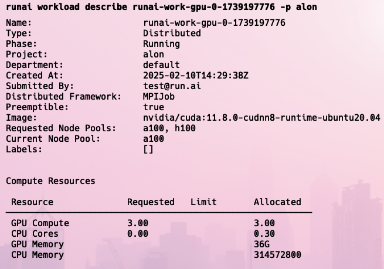
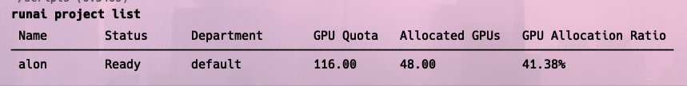

# Before you start

Run:ai provides [metrics and telemetry](metrics-api.md) for both physical cluster entities such as clusters, nodes, and node pools and application organization entities such as departments and projects. Metrics represent over-time data while telemetry represents current analytics data. This data is essential for monitoring and analyzing the performance and health of your platform.

## Consuming metrics and telemetry data

Users can consume the data based on their permissions:

1. **API**: Access the data programmatically through the [Run:ai API](../api-reference/admin-rest-api/overview.md).
2. **CLI**: Use the Run:ai [Command Line Interface](../cli-reference/) to query and manage the data.
3. **UI**: Visualize the data through the Run:ai user interface.

### **API**

* **Metrics API**: Access over-time detailed analytics data programmatically.
* **Telemetry API:** Access current analytics data programmatically.

Refer to [metrics and telemetry](metrics-api.md) to see the full list of supported metrics and telemetry APIs.

### **CLI**

Use the `list` an `describe` commands to fetch and manage the data. See [CLI reference](../cli-reference/runai.md) for more details.

<figure><figcaption>
Describe a specific workload telemetry
</figcaption></figure>

<figure><figcaption>
List projects and view their telemetry and metrics
</figcaption></figure>

### **UI Views**

Refer to [metrics and telemetry](metrics-api.md) to see the full list of supported metrics and telemetry.

* **Overview dashboard** - Provides a high-level summary of the cluster's health and performance, including key metrics such as GPU utilization, memory usage, and node status. Allows administrators to quickly identify any potential issues or areas for optimization. Offers advanced analytics capabilities for analyzing GPU usage patterns and identifying trends. Helps administrators optimize resource allocation and improve cluster efficiency.
* **Quota management** - Enables administrators to monitor and manage GPU quotas across the cluster. Includes features for setting and adjusting quotas, tracking usage, and receiving alerts when quotas are exceeded.
* **Workload visualizations** - Provides detailed insights into the resource usage and utilization of each GPU in the cluster. Includes metrics such as GPU memory utilization, core utilization, and power consumption. Allows administrators to identify GPUs that are under-utilized and overloaded.
* **Node and node pool visualizations** - Similar to workload visualizations, but focused on the resource usage and utilization of each GPU within a specific node or node pool. Helps administrators identify potential issues or bottlenecks at the node level.
* **Advanced NVIDIA metrics** - Provides access to a range of advanced NVIDIA metrics, such as GPU temperature, fan speed, and voltage. Enables administrators to monitor the health and performance of GPUs in greater detail. This data is available at the node and workload level. To enable these metrics, contact Run:ai customer support.
