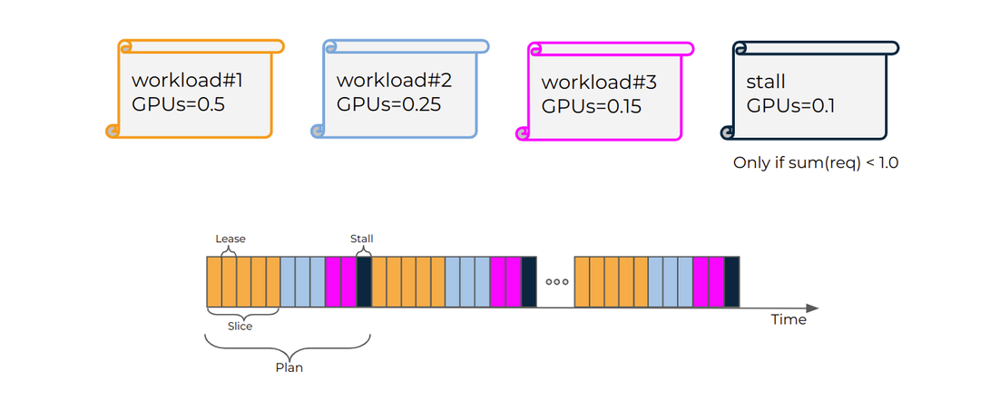
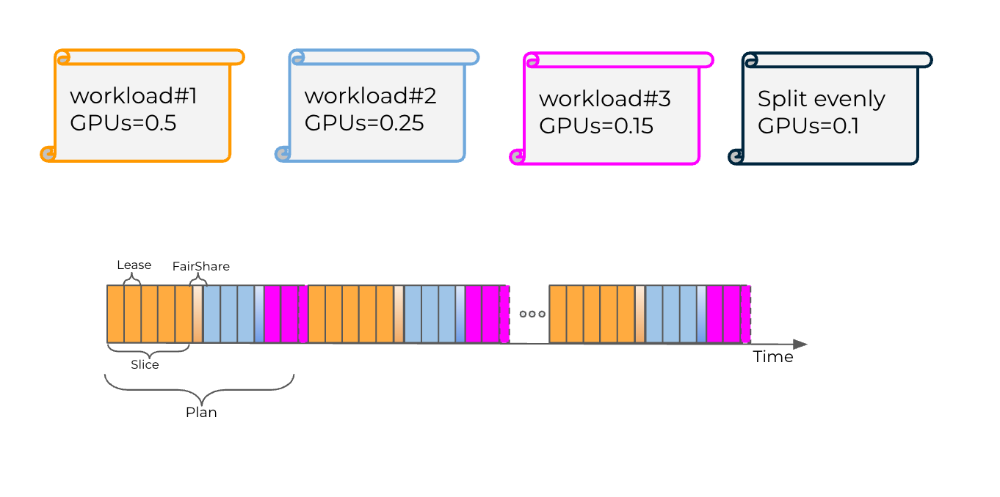

# GPU time-slicing

Run:ai supports simultaneous submission of multiple workloads to single or multi-GPUs when using [GPU fractions](gpu-fractions.md). This is achieved by slicing the GPU memory between the different workloads according to the requested GPU fraction, and by using NVIDIA’s GPU time-slicing to share the GPU compute runtime. Run:ai ensures each workload receives the exact share of the GPU memory (= gpu\_memory \* requested), while the NVIDIA GPU time-slicing splits the GPU runtime evenly between the different workloads running on that GPU.

To provide customers with predictable and accurate GPU compute resources scheduling, Run:ai’s GPU time-slicing adds **fractional compute** capabilities on top of Run:ai GPU fraction capabilities.

## How GPU time-slicing works

While the default NVIDIA GPU time-slicing allows for sharing the GPU compute runtime evenly without splitting or limiting the runtime of each workload, Run:ai’s GPU time-slicing mechanism gives each workload exclusive access to the full GPU for a **limited** amount of time, **lease time**, in each scheduling cycle, **plan time**. This cycle repeats itself for the lifetime of the workload. Using the GPU runtime this way guarantees a workload is granted its requested GPU compute resources proportionally to its requested GPU fraction, but also allows to split GPU unused compute time up to a requested Limit.

For example, when there are 2 workloads running on the same GPU, with NVIDIA’s default GPU time slicing, each workload will get 50% of the GPU compute runtime, even if one workload requests 25% of the GPU memory, and the other workload requests 75% of the GPU memory. With the Run:ai GPU time-slicing, the first workload will get 25% of the GPU compute time and the second will get 75%. If one of the workloads does not use its deserved GPU compute time, the others can split that time evenly between them. As shown in the example, if one of the workloads does not request the GPU for some time, the other will get the full GPU compute time.

### GPU time-slicing modes

Run:ai offers two GPU time-slicing modes:

* **Strict** - Each workload gets its **precise** GPU compute fraction, which equals to its requested GPU (memory) fraction. In terms of official Kubernetes resource specification, this means:

```sh
gpu-compute-request = gpu-compute-limit = gpu-(memory-)fraction
```

* **Fair** - Each workload is guaranteed at least its GPU compute fraction, but at the same time can also use additional GPU runtime compute slices that are not used by other idle workloads. Those excess time slices are divided equally between all workloads running on that GPU (after each got at least its requested GPU compute fraction). In terms of official Kubernetes resource specification, this means:

```sh
gpu-compute-request = gpu-(memory-)fraction
gpu-compute-limit = 1.0
```

The figure below illustrates how **Strict** time-slicing mode uses the GPU from Lease (slice) and Plan (cycle) perspective:



The figure below illustrates how **Fair** time-slicing mode uses the GPU from Lease (slice) and Plan (cycle) perspective:



## Time-slicing plan and lease times

Each GPU scheduling cycle is a **plan**. The plan is determined by the lease time and granularity (precision). By default, basic lease time is 250ms with 5% granularity (precision), which means the plan (cycle) time is: 250 / 0.05 = 5000ms (5 Sec). Using these values, a workload that requests gpu-fraction=0.5 gets 2.5s runtime out of the 5s cycle time.

Different workloads requires different SLA and precision, so it also possible to tune the lease time and precision for customizing the time-slicing capabilities to your cluster.


Decreasing the lease time makes time-slicing less accurate. Increasing the lease time make the system more accurate, but each workload is less responsive.


Once timeSlicing is enabled in the `runaiconfig`, all submitted GPU fractions or GPU memory workloads will have their gpu-compute-request/limit set automatically by the system, depending on the annotation used on the time-slicing mode:

* Strict compute resources:

| **Annotation** | **Value** | **GPU Compute Request** | **GPU Compute Limit** |
| -------------- | --------- | ----------------------- | --------------------- |
| `gpu-fraction` | x         | x                       | x                     |
| `gpu-memory`   | x         | 0                       | 1.0                   |

* Fair compute resources:

| **Annotation** | **Value** | **GPU Compute Request** | **GPU Compute Limit** |
| -------------- | --------- | ----------------------- | --------------------- |
| `gpu-fraction` | x         | x                       | 1.0                   |
| `gpu-memory`   | x         | 0                       | 1.0                   |


The above tables show that when submitting a workload using gpu-memory annotation, the system will split the GPU compute time between the different workloads running on that GPU. This means the workload can get anything from very little compute time (>0) to full GPU compute time (1.0).


## Enabling GPU time-slicing

Run:ai’s GPU time-slicing is a cluster flag which changes the default NVIDIA time-slicing used by GPU fractions. For more details, see [Advanced cluster configurations](../../advanced-setup/advanced-cluster-configurations.md).

Enable GPU time-slicing by setting the following cluster flag in the `runaiconfig` file:

```yaml
global: 
 core: 
        timeSlicing: 
            mode: fair/strict
```

If the `timeSlicing` flag is not set, the system continues to use the default NVIDIA GPU time-slicing to maintain backward compatibility.
