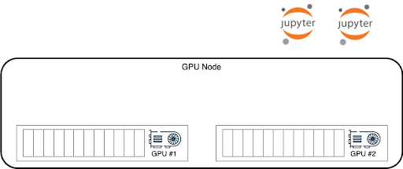

# Optimize performance with Node Level Scheduler

The Node Level Scheduler optimizes the performance of your pods and maximizes the utilization of GPUs by making optimal local decisions on GPU allocation to your pods. While the [Run:ai Scheduler](../scheduling/how-the-scheduler-works.md) chooses the specific node for a pod, it has no visibility to the node’s GPUs internal state. The Node Level Scheduler is aware of the local GPUs states and makes optimal local decisions such that it can optimize both the GPU utilization and pods’ performance running on the node’s GPUs.

This guide provides an overview of the best use cases for the Node Level Scheduler and instructions for configuring it to maximize GPU performance and pod efficiency.

## Deployment considerations

* While the Node Level Scheduler applies to all [workload types](../../workloads-in-runai/workload-types.md), it will best optimize the performance of burstable workloads. Burstable workloads are workloads which use [dynamic GPU fractions](dynamic-gpu-fractions.md), giving those more GPU memory than requested and up to the Limit specified.
* Burstable workloads are always susceptible to an OOM Kill signal if the owner of the excess memory requires it back. This means that using the Node Level Scheduler with inference or training workloads may cause pod preemption.
* Using interactive workloads with notebooks is the best use case for burstable workloads and Node Level Scheduler. These workloads behave differently since the OOM Kill signal will cause the notebooks' GPU process to exit but not the notebook itself. This keeps the interactive pod running and retrying to attach a GPU again.

## Interactive notebooks use case

This use case is one scenario that shows how Node Level Scheduler locally optimizes and maximizes GPU utilization and pods’ performance.

1. The below shows a node with 2 GPUs and 2 interactive pods that are submitted, requesting GPU resources:



2. The Scheduler instructs the node to put the 2 pods on a single GPU, [bin-packing](../../manage-ai-initiatives/managing-your-resources/node-pools.md#adding-a-new-node-pool) a single GPU and leaving the other free for a workload that might want a full GPU or more than half a GPU. This means GPU#2 is idle while the two notebooks can only use up to half a GPU, even if they temporarily need more:


3. With the Node Level Scheduler enabled, the local decision will be to spread those 2 pods on 2 GPUs and allow them to maximize both pods’ performance and GPUs’ utilization by bursting out up to the full GPU memory and GPU compute resources:


4. The Run:ai Scheduler still sees a node with one a full empty GPU and one fully occupied GPU. When a 3rd pod is scheduled, and it requires a full GPU (or more than 0.5 GPU), the Scheduler will send it to that node, and the Node Level Scheduler will move one of the interactive workloads to run with the other pod in GPU#1, as was the Scheduler’s initial plan. Moving the Jupyter notebook from GPU#1 back to GPU#2 maintains the pod running while the GPU process within the Jupyter notebook is killed and re-established on GPU#2, continuing to serve the Jupyter notebook.


## Using Node Level Scheduler

The Node Level Scheduler can be enabled per node pool. To use Node Level Scheduler, follow the below steps.

### Enable on your cluster

1. Enable the Node Level Scheduler at the cluster level (per cluster) by:
   1.  Editing the `runaiconfig` as follows. For more details, see [Advanced cluster configurations](../../advanced-setup/advanced-cluster-configurations.md):

       ```yaml
       spec: 
       global: 
               core: 
                 nodeScheduler:
                   enabled: true
       ```
   2.  Or, using the following kubectl patch command:

       ```bash
       kubectl patch -n runai runaiconfigs.run.ai/runai --type='merge' --patch '{"spec":{"global":{"core":{"nodeScheduler":{"enabled": true}}}}}'
       ```

### Enable on a node pool


GPU resource optimization is disabled by default. It must be enabled by your Administrator, under **General Settings** → Resources → GPU resource optimization.


Enable Node Level Scheduler on any of the node pools:

1. Select Resources → Node pools
2. [Create a new node pool](../../manage-ai-initiatives/managing-your-resources/node-pools.md#adding-a-new-node-pool) or [edit an existing node pool](../../manage-ai-initiatives/managing-your-resources/node-pools.md#editing-a-node-pool)
3. Under **Resource Utilization Optimization** tab, change the **number of workloads on each GPU** to any value other than **Not Enforced** (i.e. 2, 3, 4, 5)

The Node Level Scheduler is now ready to be used on that node pool.

### Submit a workload

In order for a workload to be considered by the Node Level Scheduler for rerouting, it must be submitted with a GPU Request and Limit where the Limit is larger than the Request:

* Enable and set [dynamic GPU fractions](dynamic-gpu-fractions.md)
* [Submit a workload](../../workloads-in-runai/workloads.md) using dynamic GPU fractions
