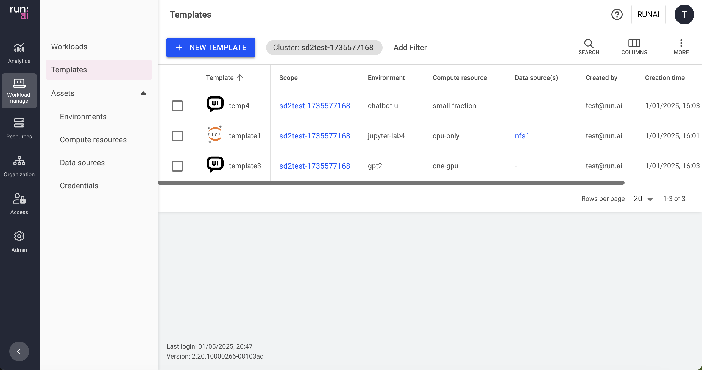

# Workspace templates

This article explains the procedure to manage templates.

A template is a pre-set configuration that is used to quickly configure and submit workloads using existing assets. A template consists of all the assets a workload needs, allowing researchers to submit a workload in a single click, or make subtle adjustments to differentiate them from each other.

## Workspace templates table

The Templates table can be found under **Workload manager** in the Run:ai User interface.

The Templates table provides a list of all the templates defined in the platform, and allows you to manage them.


**Flexible Management**

It is also possible to manage templates directly for a specific [user](../../authentication-and-authorization/users.md), [application](../../authentication-and-authorization/applications.md), [project](../../manage-ai-initiatives/managing-your-organization/projects.md), or [department](../../manage-ai-initiatives/managing-your-organization/departments.md).


The Templates table consists of the following columns:

| Column           | Description                                                                                                  |
| ---------------- | ------------------------------------------------------------------------------------------------------------ |
| Scope            | The scope to which the subject has access. Click the name of the scope to see the scope and its subordinates |
| Environment      | The name of the environment related to the workspace template                                                |
| Compute resource | The name of the compute resource connected to the workspace template                                         |
| Data source(s)   | The name of the data source(s) connected to the workspace template                                           |
| Created by       | The subject that created the template                                                                        |
| Creation time    | The timestamp for when the template was created                                                              |
| Cluster          | The cluster name containing the template                                                                     |

### Customizing the table view

* Filter - Click **ADD FILTER**, select the column to filter by, and enter the filter values
* Search - Click **SEARCH** and type the value to search by
* Sort - Click each column header to sort by
* Column selection - Click **COLUMNS** and select the columns to display in the table
* Download table - Click **MORE** and then click Download as CSV. Export to CSV is limited to 20,000 rows.
* Refresh (optional) - Click **REFRESH** to update the table with the latest data
* Show/Hide details (optional) - Click to view additional information on the selected row

## Adding a new workspace template

To add a new template:

1. Click **+NEW TEMPLATE**
2. Set the scope for the template
3. Enter a name for the template
4. Select the environment for your workload
5. Select the node resources needed to run your workload\
   \- or -\
   Click **+NEW COMPUTE RESOURCE**
6. Set the volume needed for your workload
7. Create a new data source
8. Set auto-deletion, annotations and labels, as required
9. Click **CREATE TEMPLATE**

## Editing a template

To edit a template:

1. Select the template from the table
2. Click **Rename** to provide it with a new name
3. Click **Copy & Edit** to make any changes to the template

## Deleting a template

To delete a template:

1. Select the template you want to delete
2. Click **DELETE**
3. Confirm you want to delete the template

## Using API

Go to the [Workload template](https://app.run.ai/api/docs#tag/Template) API reference to view the available actions
