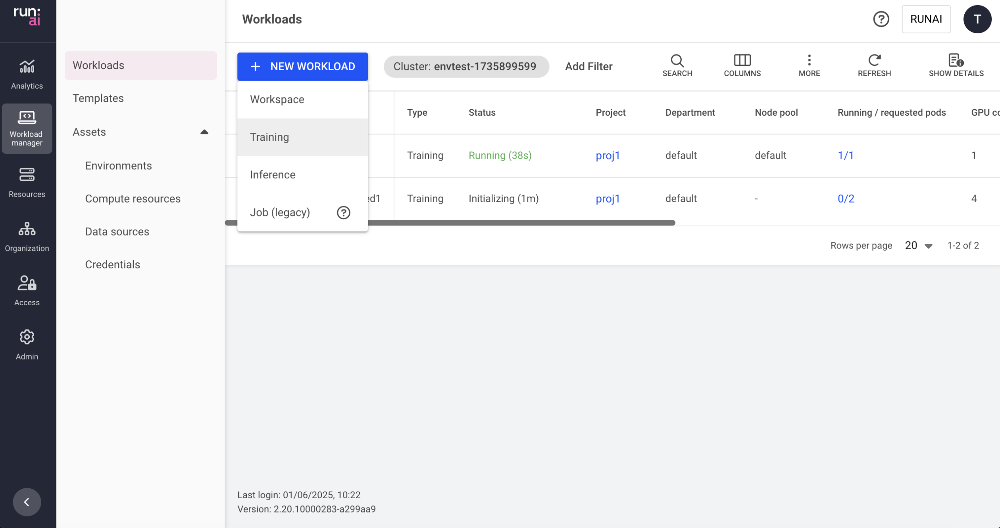

# Train models using a standard training workload

This article explains how to create a standard training workload via the Run:ai UI.

A training workload contains the setup and configuration needed for building your model, including the container, images, data sets, and resource requests, as well as the required tools for the research, all in a single place.

The training workload is assigned to a project and is affected by the project’s quota.

To learn more about the training workload type in Run:ai and determine that it is the most suitable workload type for your goals, see [Workload types](../../workloads-in-runai/workload-types.md).

## Creating a standard training workload

Before you start, make sure you have a project.

To add a new training workload:

1. Go to the Workload manager → Workloads
2. Click **+NEW WORKLOAD** and select **Training**\
   Within the new training form:
3. Select under which **cluster** to create the training workload
4. Select the **project** in which your training will run
5. Set the training workload architecture as **standard**, which consists of a single main running process. This workload uses environments that support standard training workloads only.
6. Select a **preconfigured** [**template**](../../workloads-in-runai/workload-templates/workspace-templates.md) or select **Start from scratch** to launch a new training workload quickly
7. Enter a unique **name** for the training workload (if the name already exists in the project, you will be requested to submit a different name)
8. Click **CONTINUE**\
   In the next step:
9. Select the **environment** for your training workload
   * Select an environment or click **+NEW ENVIRONMENT** to add a new environment to the gallery.\
     For a step-by-step guide on adding environments to the gallery, see [Environments](../../workloads-in-runai/workload-assets/environments.md). Once created, the new environment will be automatically selected.
   * Set the connection for your **tool(s)**. The tools are configured as part of the environment.
     * **External URL**
       * **Custom URL**
         * Set the URL
       * Optional: Modify who can **access** the tool:
         * **All authenticated users** (default)\
           Everyone within the organization’s account
         * **Specific group(s)**
           * Click **+GROUP**
           * Enter **group names** as they appear in your identity provider. You must be a member of one of the groups listed to have access to the tool.
         * **Specific user(s)**
           * Click **+USER**
           * Enter a valid email address or username. If you remove yourself, you will lose access to the tool.
     * **Node port**
       * **Custom port**
         * Set the node port (enter a port between 30000 and 32767; if the node port is already in use, the workload will fail and display an error message)
   * Set the User ID (UID), Group ID (GID) and the supplementary groups that can run commands in the container
     * Enter **UID**
     * Enter **GID**
     * Add **Supplementary groups** (multiple groups can be added, separated by commas).
   * Optional: Set the **command and arguments** for the container running the workload\
     When If no command is added, the container will use the image’s default command (entry-point).
     * Modify the existing command or click **+COMMAND & ARGUMENTS** to add a new command.
     * Set multiple arguments separated by spaces, using the following format (e.g.: `--arg1=val1`).
   * Set the **environment variable(s)**
     * Modify the existing environment variable(s). The existing environment variables may include **instructions** to guide you with entering the correct values.
     * (Optional) Add new variables
       * Click **+ENVIRONMENT VARIABLE**
       * Enter a **name**
       * Select the **source** for the environment variable
         * **Custom**
           * Enter a value according to the provided instructions
         * **Credentials** - Select existing credentials as the environment variable
           * Select a **credential name** To add new credentials to the credentials list, and for additional information, see [Credentials](../../workloads-in-runai/workload-assets/credentials.md).
           * Select a **secret key**
10. Select the **compute resource** for your training workload \* Select a compute resource or click **+NEW COMPUTE RESOURCE** to add a new compute resource to the gallery.\
    For a step-by-step guide on adding compute resources to the gallery, see [compute resources](../../workloads-in-runai/workload-assets/compute-resources.md). Once created, the new compute resource will be automatically selected. \* Optional: Set the **order of priority** for the **node pools** on which the scheduler tries to run the workload.\
    When a workload is created, the scheduler will try to run it on the first node pool on the list. If the node pool doesn't have free resources, the scheduler will move on to the next one until it finds one that is available.

    * Drag and drop them to change the order, remove unwanted ones, or reset to the default order defined in the project.
    * Click **+NODE POOL** to add a new node pool from the list of node pools that were defined on the cluster.\
      To configure a new node pool and for additional information, see [node pools](../../platform-admin/aiinitiatives/resources/node-pools.md). \* Select a **node affinity** to schedule the workload on a specific node type.\
      If the administrator added a ‘[node type (affinity)](../../platform-admin/aiinitiatives/org/scheduling-rules.md#node-type-affinity)’ scheduling rule to the project/department, then this field is mandatory.\
      Otherwise, entering a node type (affinity) is optional. [Nodes must be tagged](../../platform-admin/aiinitiatives/org/scheduling-rules.md#labelling-nodes-for-node-types-grouping) with a label that matches the node type key and value.\
      \* Optional: Set toleration(s) to allow the workload to be scheduled on a node with a matching taint

    !!! Note Tolerations are disabled, by default. If you cannot see Tolerations in the menu, then it must be enabled by your Administrator, under General settings → Workloads → Tolerations

    * Click **+TOLERATION**
    * Enter a **key**
    * Select the operator
      * **Exists** - If the key exists on the node, the effect will be applied.
      * **Equals** - if the key and the value set below matches to the value on the node, the effect will be applied
        * Enter a **value** matching the value on the node
    * Select the effect for the toleration
      * **NoExecute** - Pods that do not tolerate this taint are evicted immediately.
      * **NoSchedule** - No new pods will be scheduled on the tainted node unless they have a matching toleration. Pods currently running on the node will not be evicted.
      * **PreferNoSchedule** - The control plane will try to avoid placing a pod that does not tolerate the taint on the node, but it is not guaranteed.
      * **Any** - All effects above match.
11. Optional: Set the volume needed for your workload\
    A volume allocates storage space to your workload that is persistent across restarts.
    * Click **+VOLUME**
    * Select the **storage class**
      * **None** - Proceed without defining a storage class.
      * **Custom storage class** - This option applies when selecting a storage class based on existing storage classes.\
        To add new storage classes to the storage class list, and for additional information, see [Kubernetes storage classes](../../infrastructure-procedures/shared-storage.md).
    * Select the **access mode(s)** (multiple modes can be selected)
      * **Read-write by one node** - The volume can be mounted as read-write by a single node.
      * **Read-only by many nodes** - The volume can be mounted as read-only by many nodes.
      * **Read-write by many nodes** - The volume can be mounted as read-write by many nodes.
    * Set the **claim size** and its **units**
    * Select the **volume mode**
      * **File system** (default) - This allows the volume to be mounted as a file system, enabling the usage of directories and files.
      * **Block** - This exposes the volume as a block storage, which can be formatted or used directly by applications without a file system.
    * Set the **Container path** with the volume target location
    * Set the volume persistency
      * **Persistent** - The volume and its data will be deleted only when the workload is deleted.
      * **Ephemeral** - The volume and its data will be deleted every time the workload’s status changes to “Stopped.”
12. Optional: Select **data sources** for your training workload

    Select a data source or click **+NEW DATA SOURCE** to add a new data source to the gallery. If there are issues with the connectivity to the cluster, or issues while creating the data source, the data source won't be available for selection.\
    For a step-by-step guide on adding data sources to the gallery, see [data sources](../../workloads-in-runai/workload-assets/datasources.md).\
    Once created, the new data source will be automatically selected.

    * Optional: Modify the data target location for the selected data source(s).
13. **Optional - General settings**: \* Set the **grace period** for workload preemption. This is a buffer that allows a preempted workload to reach a safe checkpoint before it is forcibly preempted. Enter a timeframe between 0 sec and 5 min. \* Set the **number of runs** the workload must finish to be considered complete. Multiple runs enhance the reliability and validity of the training results. \* If the number of runs is above 1, enter a value under **Parallelism** to specify how many runs may be scheduled in **parallel**. The value must be less than or equal to the number of runs. \* Set the **backoff limit** before workload failure. The backoff limit is the maximum number of retry attempts for failed workloads. After reaching the limit, the workload status will change to "Failed." Enter a value between 1 and 100. \* Set the **timeframe for auto-deletion** after workload completion or failure. The time after which a completed or failed workload is deleted; if this field is set to 0 seconds, the workload will be deleted automatically. \* Set **annotations(s)**\
    Kubernetes annotations are key-value pairs attached to the workload. They are used for storing additional descriptive metadata to enable documentation, monitoring and automation.
    * Click **+ANNOTATION**
    * Enter a **name**
    * Enter a **value** \* Set **labels(s)**\
      Kubernetes labels are key-value pairs attached to the workload. They are used for categorizing to enable querying.
    * Enter a **name**
    * Enter a **value**
14. Click **CREATE TRAINING**

## Workload Policies

When creating a new workload, fields and assets may have limitations or defaults. These rules and defaults are derived from a policy your administrator set.

Policies allow you to control, standardize, and simplify the workload submission process. For additional information, see [Workload Policies and Rules](../../policies/policies-and-rules.md).

The effects of the policy are reflected in the training creation form:

* Defaults derived from the policy will be displayed automatically for specific fields.
* Disabled actions or values must be within a certain range.
* Rules and defaults for entire sections (such as environments, compute resources, or data sources) may prevent selection and will appear on the entire library card with an option for additional information via an external modal.

## Managing and monitoring

After the training workload is created, it is added to the [Workloads](../../workloads-in-runai/workloads.md) table, where it can be managed and monitored.

## Using CLI

To view the available actions, see the training workload [CLI v2 reference](../../cli-reference/new-cli/runai_training_submit.md) or the [CLI v1 reference](../../cli-reference/runai-submit.md).

## Using API

To view the available actions, see the [Trainings workload](https://api-docs.run.ai/latest/tag/Trainings/) API reference.
