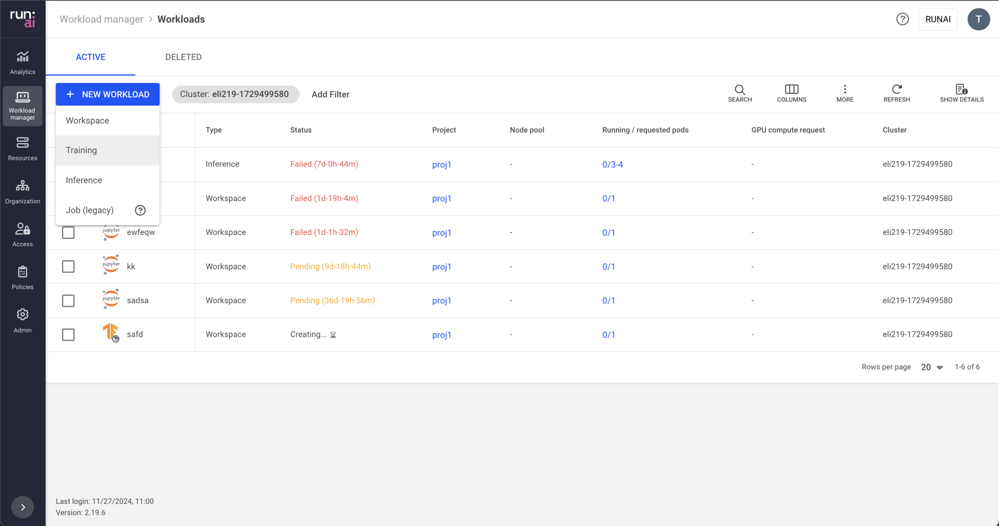

# Workloads

This article explains the procedure for managing workloads.

## Workloads table

The Workloads table can be found under **Workload manager** in the Run:ai platform.

The workloads table provides a list of all the workloads scheduled on the run:ai [Scheduler](../scheduling-and-resource-optimization/scheduling/runai-scheduler-concepts-and-principles.md), and allows you to manage them.

The Workloads table consists of the following columns:

| Column                 | Description                                                                                                                                                                                                                                                                                                  |
| ---------------------- | ------------------------------------------------------------------------------------------------------------------------------------------------------------------------------------------------------------------------------------------------------------------------------------------------------------ |
| Workload               | The name of the workload                                                                                                                                                                                                                                                                                     |
| Type                   | The workload type                                                                                                                                                                                                                                                                                            |
| Preemptible            | Is the workload [preemptible](../scheduling-and-resource-optimization/scheduling/runai-scheduler-concepts-and-principles.md#priority-and-preemption)                                                                                                                                                         |
| Status                 | The different [phases](workloads.md#workload-status) in a workload life cycle.                                                                                                                                                                                                                               |
| Project                | The project in which the workload runs.                                                                                                                                                                                                                                                                      |
| Department             | The department that the workload is associated with. this column is visible only if the department toggle is enabled by your administrator.                                                                                                                                                                  |
| Created by             | The user who created the workload                                                                                                                                                                                                                                                                            |
| Running/requested pods | The number of running pods out of the requested                                                                                                                                                                                                                                                              |
| Creation time          | The timestamp for when the workload was created                                                                                                                                                                                                                                                              |
| Completion time        | The timestamp the workload reached a terminal state (failed/completed)                                                                                                                                                                                                                                       |
| Connection(s)          | The method by which you can access and interact with the running workload. It's essentially the "doorway" through which you can reach and use the tools the workload provide. (E.g node port, external URL, etc). Click one of the values in the column to view the list of connections and their parameters |
| Data source(s)         | Data resources used by the workload                                                                                                                                                                                                                                                                          |
| Environment            | The environment used by the workload                                                                                                                                                                                                                                                                         |
| Workload architecture  | Standard or distributed. A standard workload consists of a single process. A distributed workload consists of multiple processes working together. These processes can run on different nodes.                                                                                                               |
| GPU compute request    | Amount of GPU devices requested                                                                                                                                                                                                                                                                              |
| GPU compute allocation | Amount of GPU devices allocated                                                                                                                                                                                                                                                                              |
| GPU memory request     | Amount of GPU memory Requested                                                                                                                                                                                                                                                                               |
| GPU memory allocation  | Amount of GPU memory allocated                                                                                                                                                                                                                                                                               |
| Idle GPU devices       | The number of allocated GPU devices that have been idle for more than 5 minutes                                                                                                                                                                                                                              |
| CPU compute request    | Amount of CPU cores requested                                                                                                                                                                                                                                                                                |
| CPU compute allocation | Amount of CPU cores allocated                                                                                                                                                                                                                                                                                |
| CPU memory request     | Amount of CPU memory requested                                                                                                                                                                                                                                                                               |
| CPU memory allocation  | Amount of CPU memory allocated                                                                                                                                                                                                                                                                               |
| Cluster                | The cluster that the workload is associated with                                                                                                                                                                                                                                                             |

### Workload status

The following table describes the different phases in a workload life cycle. The UI provides additional details for some of the below workload statuses which can be viewed by clicking the icon next to the status.

| Status       | Description                                                                                                                                                | Entry Condition                                                                                        | Exit Condition                                                                                                                                   |
| ------------ | ---------------------------------------------------------------------------------------------------------------------------------------------------------- | ------------------------------------------------------------------------------------------------------ | ------------------------------------------------------------------------------------------------------------------------------------------------ |
| Creating     | Workload setup is initiated in the cluster. Resources and pods are now provisioning.                                                                       | A workload is submitted.                                                                               | A multi-pod group is created.                                                                                                                    |
| Pending      | Workload is queued and awaiting resource allocation.                                                                                                       | A pod group exists.                                                                                    | All pods are scheduled.                                                                                                                          |
| Initializing | Workload is retrieving images, starting containers, and preparing pods.                                                                                    | All pods are scheduled.                                                                                | All pods are initialized or a failure to initialize is detected.                                                                                 |
| Running      | Workload is currently in progress with all pods operational.                                                                                               | All pods initialized (all containers in pods are ready).                                               | Workload completion or failure.                                                                                                                  |
| Degraded     | Pods may not align with specifications, network services might be incomplete, or persistent volumes may be detached. Check your logs for specific details. | **Pending** - All pods are running but have issues. **Running** - All pods are running with no issues. | **Running** - All resources are OK. **Completed** - Workload finished with fewer resources. **Failed** - Workload failure or user-defined rules. |
| Deleting     | Workload and its associated resources are being decommissioned from the cluster.                                                                           | Deleting the workload.                                                                                 | Resources are fully deleted.                                                                                                                     |
| Stopped      | Workload is on hold and resources are intact but inactive.                                                                                                 | Stopping the workload without deleting resources.                                                      | Transitioning back to the initializing phase or proceeding to deleting the workload.                                                             |
| Failed       | Image retrieval failed or containers experienced a crash. Check your logs for specific details.                                                            | An error occurs preventing the successful completion of the workload.                                  | Terminal state.                                                                                                                                  |
| Completed    | Workload has successfully finished its execution.                                                                                                          | The workload has finished processing without errors.                                                   | Terminal state.                                                                                                                                  |

### Pods Associated with Workload

Click one of the values in the Running/requested pods column, to view the list of pods and their parameters.

| Column                 | Description                                                                   |
| ---------------------- | ----------------------------------------------------------------------------- |
| Pod                    | Pod name                                                                      |
| Status                 | Pod lifecycle stages                                                          |
| Node                   | The node on which the pod resides                                             |
| Node pool              | The node pool in which the pod resides (applicable if node pools are enabled) |
| Image                  | The pod’s main image                                                          |
| GPU compute allocation | Amount of GPU devices allocated for the pod                                   |
| GPU memory allocation  | Amount of GPU memory allocated for the pod                                    |

### Connections Associated with Workload

A connection refers to the method by which you can access and interact with the running workloads. It is essentially the "doorway" through which you can reach and use the applications (tools) these workloads provide.

Click one of the values in the Connection(s) column, to view the list of connections and their parameters. Connections are network interfaces that communicate with the application running in the workload. Connections are either the URL the application exposes or the IP and the port of the node that the workload is running on.

| Column          | Description                                                                |
| --------------- | -------------------------------------------------------------------------- |
| Name            | The name of the application running on the workload                        |
| Connection type | The network connection type selected for the workload                      |
| Access          | Who is authorized to use this connection (everyone, specific groups/users) |
| Address         | The connection URL                                                         |
| Copy button     | Copy URL to clipboard                                                      |
| Connect button  | Enabled only for supported tools                                           |

### Data Sources Associated with Workload

Click one of the values in the Data source(s) column, to view the list of data sources and their parameters.

| Column      | Description                                            |
| ----------- | ------------------------------------------------------ |
| Data source | The name of the data source mounted to the workload    |
| Type        | The [data source type](workload-assets/datasources.md) |

### Customizing the table view

* Filter - Click ADD FILTER, select the column to filter by, and enter the filter values
* Search - Click SEARCH and type the value to search by
* Sort - Click each column header to sort by
* Column selection - Click COLUMNS and select the columns to display in the table
* Download table - Click MORE and then Click Download as CSV. Export to CSV is limited to 20,000 rows.
* Refresh - Click REFRESH to update the table with the latest data
* Show/Hide details - Click to view additional information on the selected row

### Show/Hide details

Click a row in the Workloads table and then click the SHOW DETAILS button at the upper-right side of the action bar. The details pane appears, presenting the following tabs:

#### Event History

Displays the workload status over time. It displays events describing the workload lifecycle and alerts on notable events. Use the filter to search through the history for specific events.

#### Metrics

* **GPU utilization**\
  Per GPU graph and an average of all GPUs graph, all on the same chart, along an adjustable period allows you to see the trends of all GPUs compute utilization (percentage of GPU compute) in this node.
* **GPU memory utilization**\
  Per GPU graph and an average of all GPUs graph, all on the same chart, along an adjustable period allows you to see the trends of all GPUs memory usage (percentage of the GPU memory) in this node.
* **CPU compute utilization**\
  The average of all CPUs’ cores compute utilization graph, along an adjustable period allows you to see the trends of CPU compute utilization (percentage of CPU compute) in this node.
* **CPU memory utilization**\
  The utilization of all CPUs memory in a single graph, along an adjustable period allows you to see the trends of CPU memory utilization (percentage of CPU memory) in this node.
* **CPU memory usage**\
  The usage of all CPUs memory in a single graph, along an adjustable period allows you to see the trends of CPU memory usage (in GB or MB of CPU memory) in this node.
* For GPUs charts - Click the GPU legend on the right-hand side of the chart, to activate or deactivate any of the GPU lines.
* You can click the date picker to change the presented period
* You can use your mouse to mark a sub-period in the graph for zooming in, and use **Reset zoom** to go back to the preset period
* Changes in the period affect all graphs on this screen.

#### Logs

Workload events are ordered in chronological order. The logs contain events from the workload’s lifecycle to help monitor and debug issues.

## Adding new workload

Before starting, make sure you have created a project or have one created for you to work with workloads.

To create a new workload:

1. Click **+NEW WORKLOAD**
2. Select a workload type - Follow the links below to view the step-by-step guide for each workload type:
   * [Workspace](../experiment-using-workspaces/running-workspace.md) - Used for data preparation and model-building tasks.
   * [Training](../train-models-using-training/standard-training/train-models.md) - Used for standard training tasks of all sorts
   * [Distributed Training](../train-models-using-training/distributed-training/distributed-training-models.md) - Used for distributed tasks of all sorts
   * [Inference](../deploy-models-using-inference/custom-inference.md) - Used for inference and serving tasks
   * Job (legacy). This type is displayed only if enabled by your Administrator, under **General settings** → Workloads → Workload policies
3. Click **CREATE WORKLOAD**

## Stopping a workload

Stopping a workload kills the workload pods and releases the workload resources.

1. Select the workload you want to stop
2. Click **STOP**

## Running a workload

Running a workload spins up new pods and resumes the workload work after it was stopped.

1. Select the workload you want to run again
2. Click **RUN**

## Connecting to a workload

To connect to an application running in the workload (for example, Jupyter Notebook)

1. Select the workload you want to connect
2. Click **CONNECT**
3. Select the tool from the drop-down list
4. The selected tool is opened in a new tab on your browser

## Deleting a workload

1. Select the workload you want to delete
2. Click **DELETE**
3. On the dialog, click **DELETE** to confirm the deletion


Once a workload is deleted you can view it in the Deleted tab in the workloads view. This tab is displayed only if enabled by your Administrator, under **General settings** → Workloads → Deleted workloads


## Copy & Edit a workload

1. Select the workload you want to copy and edit
2. Click **COPY & EDIT**
3. Update the workload and click **CREATE WORKLOAD**

## Using API

Go to the [Workloads](https://app.run.ai/api/docs#tag/Workloads) API reference to view the available actions

## Troubleshooting

To understand the condition of the workload, review the workload status in the Workload table. For more information, see check the [workload’s event history](../infrastructure-procedures/event-history.md).

Listed below are a number of known issues when working with workloads and how to fix them:

| Issue                                                                                            | Mediation                                                                                                                                                                                                                                                                                                                                    |
| ------------------------------------------------------------------------------------------------ | -------------------------------------------------------------------------------------------------------------------------------------------------------------------------------------------------------------------------------------------------------------------------------------------------------------------------------------------- |
| Cluster connectivity issues (there are issues with your connection to the cluster error message) | <ul><li>Verify that you are on a network that has been granted access to the cluster.</li><li>Reach out to your cluster admin for instructions on verifying this.</li><li>If you are an admin, see the <a href="../infrastructure-procedures/clusters.md#troubleshooting">troubleshooting</a> section in the cluster documentation</li></ul> |
| Workload in “Initializing” status for some time                                                  | <ul><li>Check that you have access to the Container image registry.</li><li>Check the statuses of the pods in the <a href="workloads.md#pods-associated-with-workload">pods’ dialog</a>.</li><li>Check the event history for more details</li></ul>                                                                                          |
| Workload has been pending for some time                                                          | <ul><li>Check that you have the required quota.</li><li>Check the project’s available quota in the project dialog.</li><li>Check that all services needed to run are bound to the workload.</li><li>Check the event history for more details.</li></ul>                                                                                      |
| PVCs created using the K8s API or `kubectl` are not visible or mountable in Run:ai               | 
This is by design.
<ol><li>Create a new data source of type PVC in the Run:ai UI</li><li>In the Data mount section, select Existing PVC</li><li>Select the PVC you created via the K8S API</li></ol>
You are now able to select and mount this PVC in your Run:ai submitted workloads.
                                           |
| Workload is not visible in the UI                                                                | <ul><li>Check that the workload hasn’t been deleted.</li><li>See the <a href="workloads.md#deleting-a-workload">“Deleted” tab</a> in the workloads view</li></ul>                                                                                                                                                                            |
